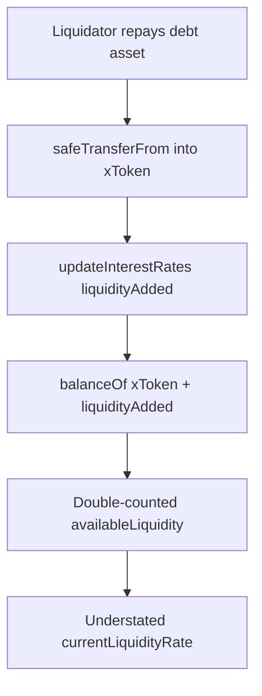

# ParaSpace — [H-03] Interest rates are incorrect on Liquidation

> **Vulnerability classes:** vuln/logic/liquidation-logic · genome/liquidation-logic · genome/variant

> **Reproduction:** self-contained Foundry PoC with **only `forge-std`** — no fork.
> Full trace: [output.txt](output.txt). PoC:
> [test/15976-h-03-interest-rates-are-incorrect-on-liquidation-code4rena-p_exp.sol](test/15976-h-03-interest-rates-are-incorrect-on-liquidation-code4rena-p_exp.sol).

<!-- non-defihacklabs -->
<!-- source-auditvault: https://github.com/Auditware/AuditVault/blob/main/findings/15976-h-03-interest-rates-are-incorrect-on-liquidation-code4rena-p.md -->
<!-- date: 2022-11 -->

**AuditVault taxonomy:** `lang/solidity` · `platform/code4rena` · `has/github` · `has/poc` · `severity/high` · `sector/lending` · genome: `liquidation-logic` · `variant` · `data-corruption/price-manipulation` · `liquidation-underwater`

---

## Key info

| | |
|---|---|
| **Impact** | **HIGH** — every liquidation double-counts repaid liquidity and understates `currentLiquidityRate` |
| **Protocol** | [ParaSpace](https://code4rena.com/reports/2022-11-paraspace) |
| **Vulnerable code** | `LiquidationLogic._burnDebtTokens` — transfer before `updateInterestRates` |
| **Bug class** | Incorrect interest-rate accounting on liquidation |
| **Finding** | Code4rena 2022-11-paraspace · #15976 (H-03) · reporter **csanuragjain** |
| **Report** | [2022-11-paraspace](https://code4rena.com/reports/2022-11-paraspace) |
| **Source** | [AuditVault](https://github.com/Auditware/AuditVault/blob/main/findings/15976-h-03-interest-rates-are-incorrect-on-liquidation-code4rena-p.md) |
| **Compiler** | `^0.8.24` (PoC) |

---

## TL;DR

1. `_burnDebtTokens` `safeTransferFrom`s the repayment into the xToken, then calls `updateInterestRates(liquidityAdded)`.
2. `calculateInterestRates` does `balanceOf(xToken) + liquidityAdded`, but the balance already includes the repayment.
3. Available liquidity is too high → utilization and liquidity rate are understated after every liquidation.

---

## The vulnerable code

```solidity
// Transfers the debt asset being repaid to the xToken, where the liquidity is kept
debtAsset.transferFrom(payer, xToken, actualLiquidationAmount); // @> VULN: transfer BEFORE rates
// FIX: updateInterestRates first, then transferFrom
```

---

## Root cause

Interest-rate strategy assumes `liquidityAdded` has **not** yet hit the xToken balance. Liquidation transfers first, so the same amount is counted twice.

---

## Preconditions

- A liquidation that repays variable debt and calls `_burnDebtTokens` with `liquidityAdded > 0`.

---

## Attack walkthrough

1. xToken holds 100; total variable debt 100; liquidator repays 50.
2. Buggy path: transfer then rates → availableLiquidity = (100+50)+50 = 200.
3. Correct path: rates then transfer → availableLiquidity = 100+50 = 150.
4. Buggy liquidity rate is strictly lower than the correct rate.

---

## Diagrams



---

## Impact

Protocol interest rates after liquidations are systematically wrong (liquidity rate too low), distorting supply/borrow incentives and reserve accounting.

## Remediation

Transfer the debt asset **after** `updateInterestRates`, matching the non-liquidation repay path.

## Sources

- [AuditVault finding #15976](https://github.com/Auditware/AuditVault/blob/main/findings/15976-h-03-interest-rates-are-incorrect-on-liquidation-code4rena-p.md)
- [Code4rena report 2022-11-paraspace](https://code4rena.com/reports/2022-11-paraspace)
- Vulnerable source: `code-423n4/2022-11-paraspace@c6820a2` `paraspace-core/contracts/protocol/libraries/logic/LiquidationLogic.sol`
