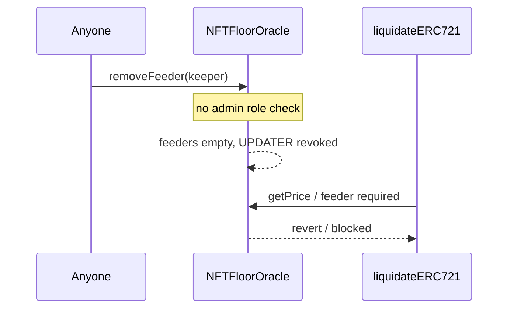

# ParaSpace — [H-04] Anyone can prevent themselves from being liquidated

> **Vulnerability classes:** genome/liquidation-logic · genome/oracle-freshness · missing access control

> **Reproduction:** self-contained Foundry PoC with **only `forge-std`** — no fork.
> Full trace: [output.txt](output.txt).

<!-- non-defihacklabs -->
<!-- source-auditvault: https://github.com/Auditware/AuditVault/blob/main/findings/15977-h-04-anyone-can-prevent-themselves-from-being-liquidated-as.md -->
<!-- date: 2022-11 -->

**AuditVault taxonomy:** `lang/solidity` · `platform/code4rena` · `severity/high` · `sector/lending` · `sector/nft` · `sector/oracle` · genome: `liquidation-logic` · `oracle-freshness` · `reentrancy-guard`

---

## Key info

| | |
|---|---|
| **Impact** | **HIGH** — permissionless `removeFeeder` strips keepers; NFT liquidations DoS |
| **Protocol** | [ParaSpace](https://code4rena.com/reports/2022-11-paraspace) |
| **Vulnerable code** | `NFTFloorOracle.removeFeeder` — no `onlyRole(DEFAULT_ADMIN_ROLE)` |
| **Bug class** | Missing access control on privileged oracle admin |
| **Finding** | Code4rena 2022-11-paraspace · #15977 (H-04) · reporter **xiaoming90** |
| **Report** | [2022-11-paraspace](https://code4rena.com/reports/2022-11-paraspace) |
| **Compiler** | `^0.8.24` (PoC) |

---

## TL;DR

1. Comment says owner-only; modifier is only `onlyWhenFeederExisted`.
2. Anyone removes all feeders → no one can `setPrice` (UPDATER_ROLE revoked).
3. Liquidations that need a live floor TWAP fail — underwater NFT debt stays open.

---

## The vulnerable code

```solidity
function removeFeeder(address _feeder) external onlyWhenFeederExisted(_feeder) {
    _removeFeeder(_feeder); // @> VULN: missing onlyRole(DEFAULT_ADMIN_ROLE)
    // FIX: onlyRole(DEFAULT_ADMIN_ROLE) on removeFeeder
}
```

---

## Root cause

Existence check is not authorization. Feeder removal is a privileged configuration change left open to the world.

---

## Diagrams



---

## Impact

A borrower near liquidation (or a competitor) can repeatedly strip feeders, blocking `liquidateERC721` until admins re-add keepers — free option on recovery / protocol insolvency risk.

## Remediation

`onlyRole(DEFAULT_ADMIN_ROLE)` on `removeFeeder`.

## Sources

- [AuditVault #15977](https://github.com/Auditware/AuditVault/blob/main/findings/15977-h-04-anyone-can-prevent-themselves-from-being-liquidated-as.md)
- [Code4rena 2022-11-paraspace](https://code4rena.com/reports/2022-11-paraspace)
- `code-423n4/2022-11-paraspace@c6820a2` `paraspace-core/contracts/misc/NFTFloorOracle.sol`
