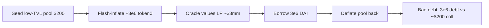

# ParaSpace — [H-05] Attacker can manipulate low-TVL Uniswap V3 pool to borrow

> **Vulnerability classes:** oracle manipulation · low-liquidity · direct drain / bad debt

> **Reproduction:** self-contained Foundry PoC with **only `forge-std`** — no fork.
> Full trace: [output.txt](output.txt).

<!-- non-defihacklabs -->
<!-- source-auditvault: https://github.com/Auditware/AuditVault/blob/main/findings/15978-h-05-attacker-can-manipulate-low-tvl-uniswap-v3-pool-to-borr.md -->
<!-- date: 2022-11 -->

**AuditVault taxonomy:** `lang/solidity` · `platform/code4rena` · `severity/high` · `sector/dex` · `sector/lending` · `sector/oracle` · genome: `decimal-mismatch` · `trigger/low-liquidity` · `direct-drain` · `oracle-manipulation-resistance`

---

## Key info

| | |
|---|---|
| **Impact** | **HIGH** — borrow against inflated low-TVL UniV3 LP; leave protocol with bad debt |
| **Protocol** | [ParaSpace](https://code4rena.com/reports/2022-11-paraspace) |
| **Vulnerable code** | `UniswapV3OracleWrapper.getTokenPrice` — external prices × LP amounts, no TVL whitelist |
| **Bug class** | Manipulable collateral oracle (spot amounts × external prices) |
| **Finding** | Code4rena 2022-11-paraspace · #15978 (H-05) · reporter **minhquanym** |
| **Compiler** | `^0.8.24` (PoC) |

---

## TL;DR

1. Any UniV3 position whose tokens are listed can be collateral.
2. Value = token amounts in the position × external oracle prices (no pool TVL check).
3. Attacker owns a thin pool, flash-inflates amounts, borrows max, deflates → keeps loan, leaves ~dust collateral.

---

## The vulnerable code

```solidity
return ((liquidityAmount0 * price0) / (10 ** dec0)) // @> VULN: external spot x amounts, no TVL/whitelist
    + ((liquidityAmount1 * price1) / (10 ** dec1));
```

---

## Diagrams



---

## Impact

PoC harm: **3,000,000 DAI** borrowed against an attacker-controlled LP that returns to ~$200 value.

## Remediation

Whitelist UniV3 pools with sufficient TVL; reject thin/attacker-owned pools as collateral.

## Sources

- [AuditVault #15978](https://github.com/Auditware/AuditVault/blob/main/findings/15978-h-05-attacker-can-manipulate-low-tvl-uniswap-v3-pool-to-borr.md)
- [Code4rena 2022-11-paraspace](https://code4rena.com/reports/2022-11-paraspace)
- `code-423n4/2022-11-paraspace@c6820a2` `paraspace-core/contracts/misc/UniswapV3OracleWrapper.sol`
