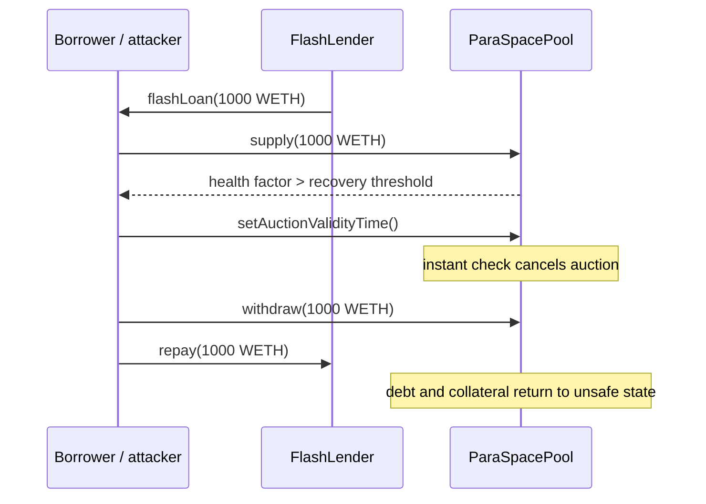

# ParaSpace — flash-loan bypass of the auction recovery health check

> **Vulnerability classes:** vuln/reentrancy/single-function · vuln/logic/missing-validation · vuln/dos/lockup

> **Reproduction:** local, self-contained synthetic (no fork or RPC). The exact trace is in [output.txt](output.txt); the source and Foundry test are in [test/15980-h-07-user-can-pass-auction-recovery-health-check-easily-with.sol](test/15980-h-07-user-can-pass-auction-recovery-health-check-easily-with.sol) and [test/15980-h-07-user-can-pass-auction-recovery-health-check-easily-with_exp.sol](test/15980-h-07-user-can-pass-auction-recovery-health-check-easily-with_exp.sol).

<!-- non-defihacklabs -->
<!-- source-auditvault: https://github.com/Auditware/AuditVault/blob/main/findings/15980-h-07-user-can-pass-auction-recovery-health-check-easily-with.md -->
<!-- date: 2022-11 -->

**AuditVault taxonomy:** `lang/solidity` · `platform/code4rena` · `severity/high` · `sector/lending` · `sector/nft-lending` · `vuln/reentrancy/single-function`

## Key info

| | |
|---|---|
| **Loss** | Auction recovery can be cancelled while the borrower has no lasting recovery collateral; liquidation is delayed and NFT debt can become undercollateralized. |
| **Vulnerable contract** | `ParaSpacePool.setAuctionValidityTime()` (reduced from ParaSpace `PoolParameters.sol`). |
| **Attacker EOA** | The permissionless caller of `Exploit.run()`; no privileged role is required. |
| **Attack contract** | `Exploit` → `FlashLender` → `ParaSpacePool`. |
| **Attack tx** | One transaction: flash-loan, supply, cancel auction, withdraw, repay. |
| **Chain / block / date** | Local synthetic chain · block `0x1181d03` · report 2022-11. |
| **Compiler** | `solc 0.8.24` (Forge uses 0.8.35 compatible compiler). |
| **Bug class** | Missing persistence/delay in an instantaneous recovery health check. |

## TL;DR

ParaSpace checks that the NFT account is above the recovery threshold only at the instant `setAuctionValidityTime()` executes. A borrower can flash-borrow 1,000 WETH, supply it as collateral, pass the check, cancel the auction, withdraw the same 1,000 WETH, and repay before the transaction ends. The account returns to its original health factor, but its auction remains cancelled.

## Background

The auction mechanism liquidates NFT collateral after the account falls below the liquidation threshold. ParaSpace offers a recovery path: a borrower can top up the account above `_auctionRecoveryHealthFactor` and call `setAuctionValidityTime()` to invalidate the auction. That operation is safe only if the recovery collateral remains for a meaningful period.

## The vulnerable code

The finding blames `PoolParameters.sol` at the recovery check and validity timestamp assignment. The synthetic keeps the same check and state transition:

```solidity
function setAuctionValidityTime() external {
    UserConfig storage cfg = userConfig[msg.sender];
    uint256 erc721HealthFactor = healthFactor(msg.sender);
    require(
        erc721HealthFactor > AUCTION_RECOVERY_HEALTH_FACTOR,
        "ERC721 health factor not above threshold"
    );
    cfg.auctionValidityTime = block.timestamp; // @> VULN: instantaneous collateral is enough to cancel
    // FIX: hold the collateral for a delay (at least five minutes) before cancelling auctions.
    cfg.auctionActive = false;
}
```

## Root cause

The health factor is a point-in-time predicate and there is no lock, observation window, or minimum collateral age. A flash loan therefore turns a temporary balance into a durable auction cancellation.

## Preconditions

- The account has an active NFT auction and a debt position below the recovery threshold.
- A flash lender can provide the temporary collateral asset.
- The recovery function can supply and withdraw collateral in the same transaction.

## Attack walkthrough

1. `Exploit` seeds a position with 100 WETH collateral and 100 WETH debt (health factor 100), and marks its auction active (trace [output.txt:381](output.txt#L381), [output.txt:383](output.txt#L383)).
2. `FlashLender.flashLoan` sends 1,000 WETH to the callback. The callback approves and supplies it, making the health factor exceed 150 (trace [output.txt:410](output.txt#L410)).
3. The callback calls `setAuctionValidityTime()`. The vulnerable assignment at [test/…sol:120](test/15980-h-07-user-can-pass-auction-recovery-health-check-easily-with.sol#L120) cancels the auction with no persistence requirement (trace [output.txt:412](output.txt#L412)).
4. The callback withdraws the same 1,000 WETH and repays the lender. The account is back at health factor 100, but `auctionActive` is false (trace [output.txt:435](output.txt#L435), [output.txt:437](output.txt#L437)).

## Diagrams



## Impact

An attacker can invalidate recovery auctions without maintaining a recovered account. The protocol may delay liquidation of an underwater NFT position, allowing debt and collateral value to diverge while the auction is suppressed.

## Remediation

Escrow the recovery collateral and require it to remain above the recovery threshold for a delay (the report recommends at least five minutes) before setting `auctionValidityTime` and cancelling auctions. Re-check the account at release and prevent same-transaction withdrawal.

## How to reproduce

```text
cd audits/evm-hack-registry/15980-h-07-user-can-pass-auction-recovery-health-check-easily-with_exp
forge test -vvvvv
```

The Playground uses the same synthetic `Exploit.run()` entrypoint; `anvil_state.json` is the minimal local-deploy state stub.

## Sources

- [AuditVault finding #15980](https://github.com/Auditware/AuditVault/blob/main/findings/15980-h-07-user-can-pass-auction-recovery-health-check-easily-with.md)
- [Code4rena 2022-11 ParaSpace report](https://code4rena.com/reports/2022-11-paraspace)
- [ParaSpace `PoolParameters.sol` at the audited commit](https://github.com/code-423n4/2022-11-paraspace/blob/c6820a279c64a299a783955749fdc977de8f0449/paraspace-core/contracts/protocol/pool/PoolParameters.sol#L281)

*Reference: [Code4rena 2022-11 ParaSpace](https://code4rena.com/reports/2022-11-paraspace)*
