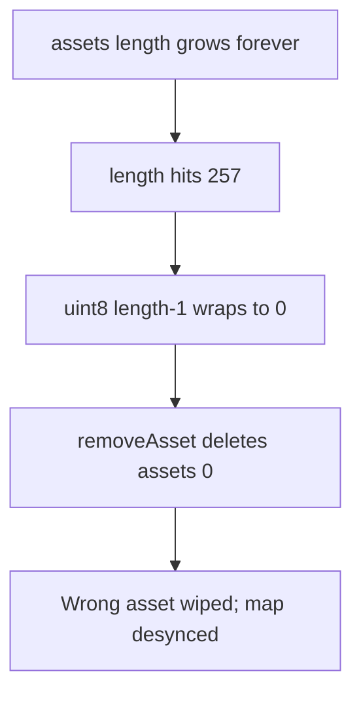

# ParaSpace — [H-08] NFTFloorOracle asset and feeder structures can be corrupted

> **Vulnerability classes:** wrong-condition · data-corruption · uint8 truncation

> **Reproduction:** self-contained Foundry PoC with **only `forge-std`** — no fork.
> Full trace: [output.txt](output.txt).

<!-- non-defihacklabs -->
<!-- source-auditvault: https://github.com/Auditware/AuditVault/blob/main/findings/15981-h-08-nftfloororacles-asset-and-feeder-structures-can-be-corr.md -->
<!-- date: 2022-11 -->

**AuditVault taxonomy:** `lang/solidity` · `platform/code4rena` · `severity/high` · `sector/lending` · `sector/nft` · `sector/oracle` · genome: `wrong-condition` · `data-corruption/price-manipulation` · `access-roles`

---

## Key info

| | |
|---|---|
| **Impact** | **HIGH** — `uint8` index wrap past 255 permanently corrupts asset/feeder maps |
| **Protocol** | [ParaSpace](https://code4rena.com/reports/2022-11-paraspace) |
| **Vulnerable code** | `NFTFloorOracle._addAsset` / `_addFeeder` — `uint8(assets.length - 1)` |
| **Bug class** | Unsafe downcast of array index |
| **Finding** | Code4rena 2022-11-paraspace · #15981 (H-08) · reporter **Jeiwan** |
| **Note** | #25724 is the same root cause (deferred as duplicate) |
| **Compiler** | `^0.8.24` (PoC) |

---

## TL;DR

1. Asset indices stored as `uint8`; `assets` never shrinks on remove (`delete` only).
2. After 256 assets, the next add stores `uint8(256) == 0`.
3. `removeAsset` then zeros the wrong slot — oracle structures permanently broken.

---

## The vulnerable code

```solidity
assets.push(_asset);
assetFeederMap[_asset].index = uint8(assets.length - 1); // @> VULN: truncates once length > 255
// FIX: use uint32/uint256 index
```

---

## Diagrams



---

## Impact

Inability to correctly address assets/feeders → oracle malfunction and collateral mispricing.

## Remediation

Widen index type to `uint32`/`uint256`; pop assets on remove like feeders.

## Sources

- [AuditVault #15981](https://github.com/Auditware/AuditVault/blob/main/findings/15981-h-08-nftfloororacles-asset-and-feeder-structures-can-be-corr.md)
- [Code4rena 2022-11-paraspace](https://code4rena.com/reports/2022-11-paraspace)
- `code-423n4/2022-11-paraspace@c6820a2` `paraspace-core/contracts/misc/NFTFloorOracle.sol`
