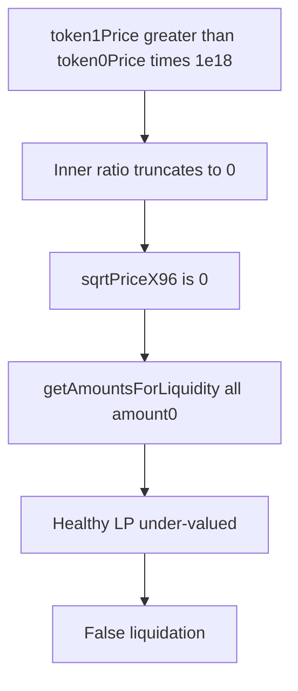

# ParaSpace — [H-09] UniswapV3 tokens of certain pairs will be wrongly valued

> **Vulnerability classes:** arithmetic/decimal-mismatch · false liquidation

> **Reproduction:** self-contained Foundry PoC with **only `forge-std`** — no fork.
> Full trace: [output.txt](output.txt).

<!-- non-defihacklabs -->
<!-- source-auditvault: https://github.com/Auditware/AuditVault/blob/main/findings/15982-h-09-uniswapv3-tokens-of-certain-pairs-will-be-wrongly-value.md -->
<!-- date: 2022-11 -->

**AuditVault taxonomy:** `lang/solidity` · `platform/code4rena` · `severity/high` · `sector/dex` · `sector/lending` · `sector/oracle` · genome: `decimal-mismatch` · `variant` · `token-decimal-normalization`

---

## Key info

| | |
|---|---|
| **Impact** | **HIGH** — extreme price ratios zero `sqrtPriceX96`; healthy UniV3 LP falsely liquidatable |
| **Protocol** | [ParaSpace](https://code4rena.com/reports/2022-11-paraspace) |
| **Vulnerable code** | `UniswapV3OracleWrapper._getOracleData` same-decimal `sqrtPriceX96` branch |
| **Bug class** | Integer division truncates before fixed-point scale |
| **Finding** | Code4rena 2022-11-paraspace · #15982 (H-09) · reporter **Trust** |
| **Compiler** | `^0.8.24` (PoC) |

---

## TL;DR

1. Same-decimal branch: `sqrt(token0Price * 1e18 / token1Price) * 2^96 / 1e9`.
2. If `token1Price > token0Price * 1e18`, inner div is 0 → `sqrtPriceX96 = 0`.
3. Amount math treats position as pure amount0 → severe undervaluation → false liquidation.

---

## The vulnerable code

```solidity
oracleData.sqrtPriceX96 = uint160(
    (SqrtLib.sqrt(
        ((oracleData.token0Price * (10 ** 18)) / (oracleData.token1Price)) // @> VULN
    ) * 2 ** 96) / 1e9
);
// FIX: scale (e.g. multiply by 2**96) before the truncating division
```

---

## Diagrams



---

## Impact

Users holding UniV3 NFTs on extreme-ratio pairs can be liquidated while economically healthy.

## Remediation

Multiply by `2**96` (or use higher intermediate precision) **before** the division that can zero.

## Sources

- [AuditVault #15982](https://github.com/Auditware/AuditVault/blob/main/findings/15982-h-09-uniswapv3-tokens-of-certain-pairs-will-be-wrongly-value.md)
- [Code4rena 2022-11-paraspace](https://code4rena.com/reports/2022-11-paraspace)
- `code-423n4/2022-11-paraspace@c6820a2` `paraspace-core/contracts/misc/UniswapV3OracleWrapper.sol`
