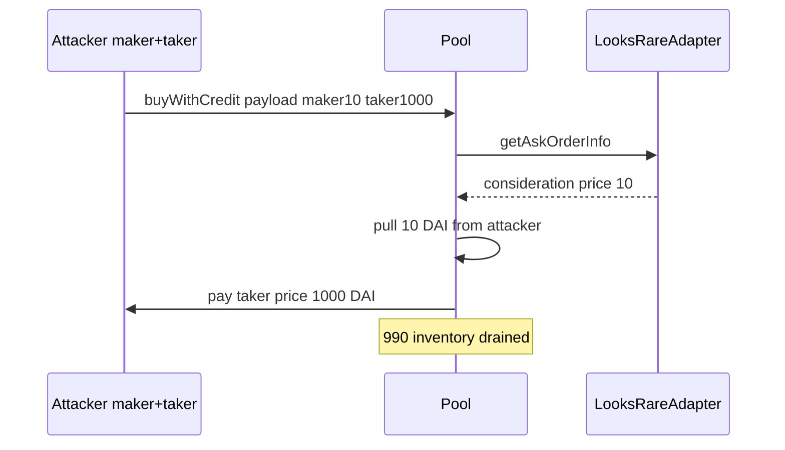

# ParaSpace — [H-10] Attacker can drain pool using executeBuyWithCredit

> **Vulnerability classes:** wrong-condition · direct-drain · marketplace adapter mismatch

> **Reproduction:** self-contained Foundry PoC with **only `forge-std`** — no fork.
> Full trace: [output.txt](output.txt).

<!-- non-defihacklabs -->
<!-- source-auditvault: https://github.com/Auditware/AuditVault/blob/main/findings/15983-h-10-attacker-can-drain-pool-using-executebuywithcredit-with.md -->
<!-- date: 2022-11 -->

**AuditVault taxonomy:** `lang/solidity` · `platform/code4rena` · `severity/high` · `sector/lending` · `sector/nft` · `sector/nft-marketplace` · genome: `wrong-condition` · `direct-drain` · `use-reentrancy-guard`

---

## Key info

| | |
|---|---|
| **Impact** | **HIGH** — drain ERC20 inventory from the Pool via maker/taker price mismatch |
| **Protocol** | [ParaSpace](https://code4rena.com/reports/2022-11-paraspace) |
| **Vulnerable code** | `LooksRareAdapter.getAskOrderInfo` — consideration uses `makerAsk.price` only |
| **Bug class** | Accounting vs execution price mismatch |
| **Finding** | Code4rena 2022-11-paraspace · #15983 (H-10) · reporter **Trust** |
| **Compiler** | `^0.8.24` (PoC) |

---

## TL;DR

1. Pool charges the user from OrderInfo consideration built with **maker** price.
2. LooksRare exchange transfers **taker** price from the pool to the maker.
3. Attacker is both sides: maker=10, taker=1000 → net drains 990 of pool funds (+ keeps NFT path).

---

## The vulnerable code

```solidity
consideration[0] = ConsiderationItem({
    ...
    startAmount: makerAsk.price, // @> VULN: maker price only - exchange moves takerBid.price
    endAmount: makerAsk.price,
    // FIX: require(makerAsk.price == takerBid.price)
    ...
});
```

---

## Diagrams



---

## Impact

PoC harm: **990 DAI** drained from pool inventory; attacker ends with profit and NFT.

## Remediation

Require `makerAsk.price == takerBid.price` (or build consideration from the price the exchange actually transfers).

## Sources

- [AuditVault #15983](https://github.com/Auditware/AuditVault/blob/main/findings/15983-h-10-attacker-can-drain-pool-using-executebuywithcredit-with.md)
- [Code4rena 2022-11-paraspace](https://code4rena.com/reports/2022-11-paraspace)
- `code-423n4/2022-11-paraspace@c6820a2` `paraspace-core/contracts/misc/marketplaces/LooksRareAdapter.sol`
