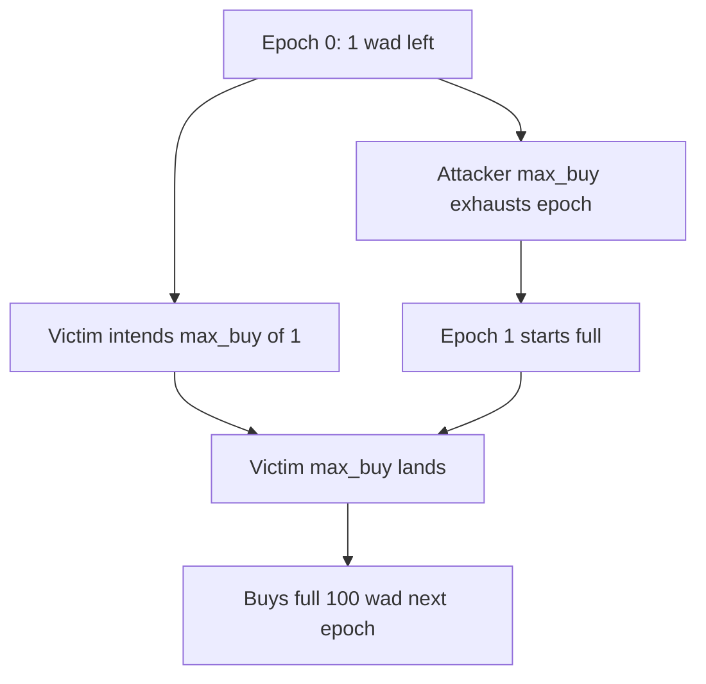

# Mute.Io — Bond max-buyer might end up buying the max buy of the next epoch

> **Reproduction:** self-contained Foundry PoC (forge-std only) — no fork.
> Full trace: [output.txt](output.txt).

<!-- non-defihacklabs -->
<!-- source-auditvault: https://github.com/Auditware/AuditVault/blob/main/findings/16038-h-01-bond-max-buyer-might-end-up-buying-the-max-buy-of-the-n.md -->
<!-- date: 2023-03 -->

**AuditVault taxonomy:** lang/solidity · platform/code4rena · severity/high · sector/dex · genome: wrong-condition · direct-drain

---

## Key info

| | |
|---|---|
| **Impact** | **HIGH** — max_buy after epoch flip purchases full next-epoch allocation at worse price |
| **Protocol** | Mute.Io |
| **Bug class** | `max_buy` uses live `maxPurchaseAmount()` with no epoch pin |
| **Finding** | Code4rena 2023-03-mute H-01 · #16038 |
| **Report** | https://code4rena.com/reports/2023-03-mute |
| **Source** | [AuditVault](https://github.com/Auditware/AuditVault/blob/main/findings/16038-h-01-bond-max-buyer-might-end-up-buying-the-max-buy-of-the-n.md) |
| **Status** | Audit finding — reproduced as a standalone local synthetic |
| **Compiler** | `^0.8.24` (PoC) |

---

## TL;DR

`deposit(..., max_buy=true)` ignores the caller's intended epoch and always takes the current epoch's remaining max. If the epoch rolls before inclusion, the buyer silently purchases the entire next epoch.

**HARM:** victim intended 1 wad remainder, received full 100 wad next-epoch max payout.

---

## Root cause

No epoch-id check on the max_buy path.

## Preconditions

Near-exhausted epoch; concurrent fill or frontrun rolls epoch before victim's max_buy lands.

## Attack walkthrough

Seed 99% filled → attacker max_buy exhausts remainder → victim max_buy takes full next epoch.

## Diagrams

## Impact

Users over-purchase bonds at worse pricing than intended when epochs roll mid-flight.

## Sources

- [AuditVault finding](https://github.com/Auditware/AuditVault/blob/main/findings/16038-h-01-bond-max-buyer-might-end-up-buying-the-max-buy-of-the-n.md)
- Report: https://code4rena.com/reports/2023-03-mute
- Reduced source provenance: github.com/code-423n4/2023-03-mute@4d8b13a contracts/bonds/MuteBond.sol
