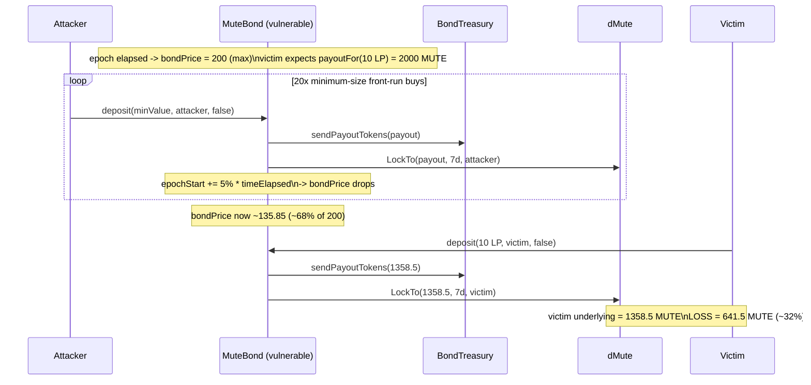

# [H-02] Attacker can front-run a MuteBond buyer and lower their payout

**Protocol:** Mute.io — bond sale (Code4rena `2023-03-mute`)
**Vulnerable file:** `contracts/bonds/MuteBond.sol` @ `4d8b13add2907b17ac14627cfa04e0c3cc9a2bed`
**Source finding:** AuditVault `#16039`, reporter 0xA5DF.

## Root cause

`MuteBond` prices a bond as a function of the time elapsed in the current epoch:

```solidity
function bondPrice() public view returns (uint) {
    uint timeElapsed = block.timestamp - epochStart;   // grows through the epoch
    uint priceDelta  = maxPrice - startPrice;
    if (timeElapsed > epochDuration) timeElapsed = epochDuration;
    return timeElapsed.mul(priceDelta).div(epochDuration).add(startPrice);
}
```

`bondPrice()` is the **payout-per-LP** the buyer receives (a *higher* price is *better* for
the buyer). After every purchase, `deposit()` advances `epochStart` forward by ~5% of the
elapsed time:

```solidity
uint timeElapsed = block.timestamp - epochStart;
epochStart = epochStart.add(timeElapsed.mul(5).div(100));   // <-- lowers the price for the NEXT buyer
```

Advancing `epochStart` shrinks `timeElapsed` for the next `bondPrice()`, so **each purchase
lowers the price for the following buyer**. Crucially, `deposit(value, depositor, max_buy)`
takes **no minimum-payout / minimum-price argument** — the buyer cannot bound what they
receive. An attacker (or simply another buyer, or an owner config change) can therefore
front-run a victim's `deposit` with a burst of minimum-size purchases and force the victim's
transaction to settle at a materially lower price.

## Exploit walkthrough (real numbers)

Deployment matches `test/bonds.ts`: `startPrice = 100e18`, `maxPrice = 200e18`, one 7-day
epoch, `maxPayout = 1_000_000e18`.

1. One epoch elapses, so `bondPrice()` reaches its max, `200e18`. The victim broadcasts a
   `deposit(10e18, victim, false)` expecting `payoutFor(10e18) = 2000e18` MUTE.
2. The attacker front-runs with **20 minimum-size purchases** (`payout` just above the
   `0.01e18` floor, `value ≈ 1e14` LP each). Every purchase runs the audited
   `epochStart += 5% * timeElapsed`, so after 20 buys `timeElapsed = 7d * 0.95^20 ≈ 0.3585 * 7d`.
3. `bondPrice()` is now `0.3585 * (200-100) + 100 = 135.85e18` — about **68% of the 200 the
   victim quoted (a ~32% reduction)**.
4. The victim's `deposit` settles at `135.85e18`, paying **`1358.5e18` MUTE** instead of the
   `2000e18` they expected. The shortfall is measured on-chain through the real `dMute`
   accounting: `dMute.GetUnderlyingTokens(victim) == 1358.5e18`.

**Harm:** the victim loses **`641.5e18` MUTE (~32%)** of their intended payout. This is a
buyer loss (no direct attacker extraction), exactly the impact class described in the report.

```
expected price (max)         : 200.000000000000000000
actual price after front-run : 135.849537037037037037
expected payout (MUTE)       : 2000.000000000000000000
victim payout   (MUTE)       : 1358.495370370370370370
victim payout LOSS (MUTE)    :  641.504629629629629630
```

## What is deployed (no mocks on the exploit path)

The registry test deploys the **real audited stack**, unmodified, compiled from the pinned
commit:

- `MuteBond` (vulnerable) — `contracts/bonds/MuteBond.sol`
- `BondTreasury` (whitelist + payout gate) — `contracts/bonds/BondTreasury.sol`
- `dMute` + `dSoulBound` (payout lock / accounting) — `contracts/dao/dMute.sol`, `dSoulBound.sol`
  (with OpenZeppelin 4.8.1 `EIP712`/`ECDSA`/`Strings`/`Math`, the versions the repo pins)
- `ERC20Default` (real MUTE / LP tokens) — `contracts/test/ERC20Default.sol`

The victim's reduced payout is proven through the real `dMute` lock accounting, not a stub.



## Reproduce

```bash
_shared/run-poc/run_poc.sh 16039-h-02-attacker-can-front-run-bond-buyer-and-make-them-buy-it_exp -vvvvv
```

Expected: `[PASS] testRealMuteBondFrontRunLowersVictimPayout()`.

## Mitigation

Add a minimum-payout (or minimum-price) parameter to `deposit()` and revert when the realised
payout is below it, so a front-run cannot silently degrade the buyer's terms.

Sources: [MuteBond audited source](https://github.com/code-423n4/2023-03-mute/blob/4d8b13add2907b17ac14627cfa04e0c3cc9a2bed/contracts/bonds/MuteBond.sol), [AuditVault finding #16039](https://github.com/Auditware/AuditVault/blob/main/findings/16039-h-02-attacker-can-front-run-bond-buyer-and-make-them-buy-it.md).
