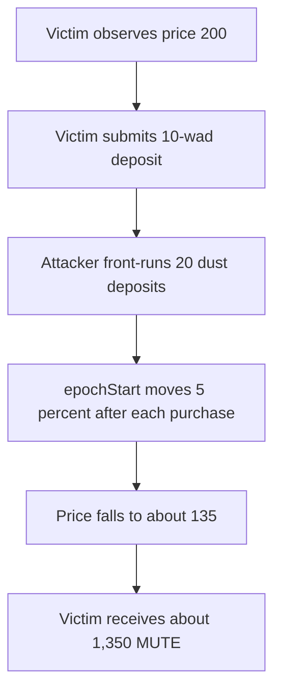

# Mute.Io — front-running a bond buyer lowers the payout

> **Vulnerability classes:** vuln/defi/sandwich-attack · vuln/defi/slippage · vuln/logic/wrong-condition
> **Reproduction:** self-contained local synthetic Foundry PoC (no fork); see [output.txt](output.txt).

<!-- non-defihacklabs -->
<!-- source-auditvault: https://github.com/Auditware/AuditVault/blob/main/findings/16039-h-02-attacker-can-front-run-bond-buyer-and-make-them-buy-it.md -->
<!-- date: 2023-03 -->

**AuditVault taxonomy:** lang/solidity · platform/code4rena · severity/high · impact/mev/frontrun · trigger/time-based/epoch-boundary · genome: wrong-condition · genome: frontrun

## Key info

| | |
|---|---|
| **Loss** | Victim's 2,000 MUTE quote falls to roughly 1,350 MUTE after twenty tiny front-run purchases (about 32% less). |
| **Vulnerable contract** | Reduced `MuteBond.deposit` preserving the audited `epochStart` update (`test/16039-h-02-attacker-can-front-run-bond-buyer-and-make-them-buy-it.sol:103`). |
| **Attacker EOA** | `0x1111111111111111111111111111111111111111` (synthetic runner account). |
| **Attack contract** | `Exploit` (deploys `MockERC20`, `MockERC20`, then `MuteBond`). |
| **Attack tx** | Local `Exploit.run()`; no historical transaction exists because this is an audit finding. |
| **Chain · block · date** | Synthetic Ethereum VM · block `0x1181d03` · 2023-03. |
| **Compiler** | `solc ^0.8.24` (synthetic reduction). |
| **Bug class** | Missing minimum payout/slippage bound lets a mempool front-run move the price curve. |

## TL;DR

`MuteBond` recalculates its time-ramped price from a mutable `epochStart`. Every purchase moves that start forward by 5% of the elapsed interval. Because `deposit` accepts no minimum payout or expected price, an attacker can submit twenty dust purchases before a victim's transaction. The victim's unchanged 10-wad deposit then executes at about 135 instead of the quoted 200 price.

## Background

Mute.Io bonds exchange an LP token for MUTE at a price that ramps from `startPrice` to `maxPrice` during a seven-day epoch. Purchases update accounting and then move `epochStart`, intentionally nudging the price curve. A user observes `bondPrice()` while preparing a transaction, but the contract does not bind that quote to the transaction.

## The vulnerable code

The synthetic keeps the audited control flow from [`MuteBond.sol`](https://github.com/code-423n4/2023-03-mute/blob/4d8b13add2907b17ac14627cfa04e0c3cc9a2bed/contracts/bonds/MuteBond.sol#L151-L214):

```solidity
uint timeElapsed = block.timestamp - epochStart;
epochStart = epochStart.add(timeElapsed.mul(5).div(100)); // @> VULN
```

In the reduction, `clock` replaces `block.timestamp` so the browser VM can model separate blocks without cheatcodes. The vulnerable state transition remains the same: anyone can cause the price reference point to advance, and no caller-provided minimum payout is checked.

## Root cause

The bond quote is stateful and mutable, but `deposit` has no `minPayout`, `minPrice`, or epoch snapshot. The attacker therefore changes shared pricing state in front of the victim's transaction. This is a sandwich/front-running exposure rather than a token-transfer bug.

## Preconditions

1. The epoch has progressed enough for `bondPrice()` to be near `maxPrice`.
2. The victim submits a normal `deposit` without a minimum payout bound.
3. The attacker can get several small deposits mined before the victim.

## Attack walkthrough

1. At the end of the ramp, `Exploit.run()` records `expectedPrice = 200` and a 10-wad victim quote of 2,000 MUTE (`output.txt`).
2. The attacker computes the smallest accepted purchase and submits twenty deposits, advancing the synthetic clock one second between each transaction.
3. Each deposit executes the unguarded `epochStart` update at the vulnerable line, moving the reference point toward the current timestamp.
4. The victim's transaction is included after the dust sequence. `actualPrice` is about 135 (the report's TypeScript PoC measured 135.8).
5. The victim receives fewer MUTE tokens and `payoutLoss` is strictly positive. A minimum-payout check would revert instead.

## Diagrams



## Impact

The victim's payout is silently reduced. The finding's report demonstrates roughly a 32% reduction; this reduction reproduces the same direction and magnitude using the audited formula and one-second block steps. Innocent intervening users or an owner configuration update can cause the same outcome without a malicious trader.

## Remediation

Add a caller-supplied `minPayout` (or minimum price) and revert when `payoutFor(value) < minPayout`. A quote should also include an epoch/version or deadline so a user can reject stale state. Keep the 5% curve movement if desired, but never make it an unbounded silent slippage source.

## How to reproduce

```text
_shared/run_poc.sh 16039-h-02-attacker-can-front-run-bond-buyer-and-make-them-buy-it_exp -vvvvv
```

The command runs entirely from the committed minimal `anvil_state.json`; no RPC or API key is needed. The paired test also includes a control case showing that, absent the front-run sequence, the observed quote is paid exactly.

## Sources

- [AuditVault finding #16039](https://github.com/Auditware/AuditVault/blob/main/findings/16039-h-02-attacker-can-front-run-bond-buyer-and-make-them-buy-it.md)
- [Code4rena Mute.Io report (2023-03)](https://code4rena.com/reports/2023-03-mute)
- [MuteBond.sol at audited commit](https://github.com/code-423n4/2023-03-mute/blob/4d8b13add2907b17ac14627cfa04e0c3cc9a2bed/contracts/bonds/MuteBond.sol)

*Reference: [Code4rena 2023-03 Mute.Io](https://code4rena.com/reports/2023-03-mute).* 
