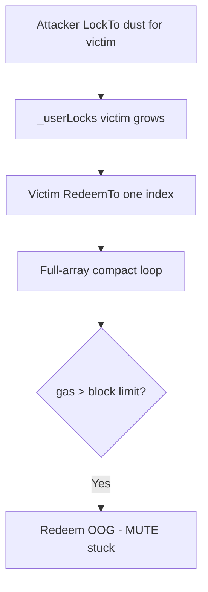

# Mute.Io — dMute: attacker can push lock items to victim's array

> **Reproduction:** self-contained Foundry PoC (forge-std only) — no fork.
> Full trace: [output.txt](output.txt).

<!-- non-defihacklabs -->
<!-- source-auditvault: https://github.com/Auditware/AuditVault/blob/main/findings/16040-h-03-dmutesol-attacker-can-push-lock-items-to-victims-array.md -->
<!-- date: 2023-03 -->

**AuditVault taxonomy:** lang/solidity · platform/code4rena · severity/high · sector/governance · genome: unbounded-loop · dos-resistance

---

## Key info

| | |
|---|---|
| **Impact** | **HIGH** — inflated `_userLocks` makes `RedeemTo` OOG → MUTE permanently locked |
| **Protocol** | Mute.Io |
| **Bug class** | Permissionless `LockTo(to=victim)` + O(n) redeem/scan |
| **Finding** | Code4rena 2023-03-mute H-03 · #16040 |
| **Report** | https://code4rena.com/reports/2023-03-mute |
| **Source** | [AuditVault](https://github.com/Auditware/AuditVault/blob/main/findings/16040-h-03-dmutesol-attacker-can-push-lock-items-to-victims-array.md) |
| **Status** | Audit finding — sample+extrapolate gas PoC |
| **Compiler** | `^0.8.24` (PoC) |

---

## TL;DR

Anyone can `LockTo` dust for any address, inflating their lock array. `RedeemTo` iterates the entire array even when redeeming one index, so enough spam makes redeem exceed block gas (zkSync 12.5M / ETH 30M).

**HARM:** extrapolated redeem/scan gas exceeds block gas limits → permanent lock of victim MUTE.

---

## Root cause

No ACL on `LockTo` destination; redeem is O(array length).

## Preconditions

Negligible MUTE for dust locks; cheap gas on zkSync.

## Attack walkthrough

Spam SAMPLE locks → measure scan gas → extrapolate to REAL_N → require > block gas.

## Diagrams

## Impact

Locked MUTE cannot be redeemed; upstream bond/amplifier features unsafe.

## Sources

- [AuditVault finding](https://github.com/Auditware/AuditVault/blob/main/findings/16040-h-03-dmutesol-attacker-can-push-lock-items-to-victims-array.md)
- Report: https://code4rena.com/reports/2023-03-mute
- Reduced source provenance: github.com/code-423n4/2023-03-mute@4d8b13a contracts/dao/dMute.sol
