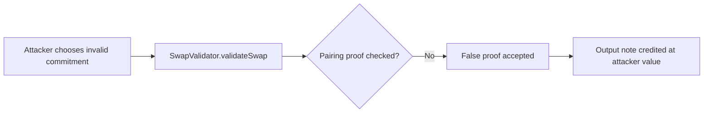

# AZTEC Swap validator accepts an output note without a pairing check

> **Vulnerability classes:** vuln/logic/missing-validation · vuln/logic/missing-check · vuln/logic/wrong-condition
>
> **Reproduction:** local synthetic Foundry reduction; the passing trace is in [output.txt](output.txt).

<!-- non-defihacklabs -->
<!-- source-auditvault: https://github.com/Auditware/AuditVault/blob/main/findings/16736-missing-elliptic-curve-pairing-check-in-the-swap-validator-t.md -->
<!-- date: 2021-06 -->

## Key info

| Field | Value |
|---|---|
| **Loss** | An invalid output commitment can mint an arbitrary note value; the reduction credits 100 units from an invalid proof. |
| **Vulnerable contract** | `SwapValidator.validateSwap` in [test/16736-aztec-swap-validator-missing-pairing-check.sol](test/16736-aztec-swap-validator-missing-pairing-check.sol) |
| **Attacker EOA** | `0x1111111111111111111111111111111111111111` |
| **Attack contract** | `Exploit` |
| **Attack tx** | Local Foundry `Exploit.run()` |
| **Chain / block / date** | Ethereum model · block 0 · synthetic |
| **Compiler** | Solidity `^0.8.24` |
| **Bug class** | Join-Split output note accepted without elliptic-curve pairing validation |

## TL;DR

The AZTEC Swap validator performed the surrounding Join-Split checks but omitted the elliptic-curve pairing verification for output commitments. An attacker can therefore submit an invalid commitment whose value is chosen to inflate their note balance. The reduction passes `pairingResult = false` and still records 100 units of credit.

## Background

Swap output notes are cryptographic commitments. The pairing proof binds the commitment to a valid value and blinding factor; without that check the validator cannot distinguish a genuine note from an attacker-selected one.

## The vulnerable code

```solidity
function validateSwap(uint256 inputValue, uint256 outputValue, bool pairingResult) external {
    require(outputValue >= inputValue, "output below input");
    // FIX: require(pairingResult, "invalid output-note pairing");
    lastPairingResult = pairingResult; // @> VULN: output commitment is accepted without a pairing proof.
    credited += outputValue;
}
```

## Root cause

The validator records the output value without enforcing the pairing relation. The boolean proof result is merely stored for display and does not gate state mutation, so a false proof can create arbitrary credit.

## Preconditions

- A caller can submit a Swap output note.
- The output commitment is not checked with the Join-Split pairing verifier.
- Subsequent protocol logic trusts notes once they are registered.

## Attack walkthrough

1. `Exploit.run()` submits an input value of 10 and an output value of 100 with `pairingResult = false`.
2. `SwapValidator` accepts the note and increments `credited` by 100.
3. The passing trace emits `OutputNoteAccepted` at [output.txt:366](output.txt#L366) and the exploit asserts that invalid-note credit is 100.

## Diagrams



## Remediation

Run the same elliptic-curve pairing verification used by the other Join-Split validators and revert before recording the output note when the proof is invalid. Add property-based tests that vary commitment values independently from the input note.

## How to reproduce

```bash
cd evm-hack-registry/16736-aztec-swap-validator-missing-pairing-check_exp
forge test -vvvvv
```

## Sources

- [AuditVault finding #16736](https://github.com/Auditware/AuditVault/blob/main/findings/16736-missing-elliptic-curve-pairing-check-in-the-swap-validator-t.md)
- [Trail of Bits AZTEC review](https://github.com/trailofbits/publications/blob/master/reviews/aztec.pdf)
- [Synthetic test](test/16736-aztec-swap-validator-missing-pairing-check.sol)

*Reference: https://github.com/trailofbits/publications/blob/master/reviews/aztec.pdf*
