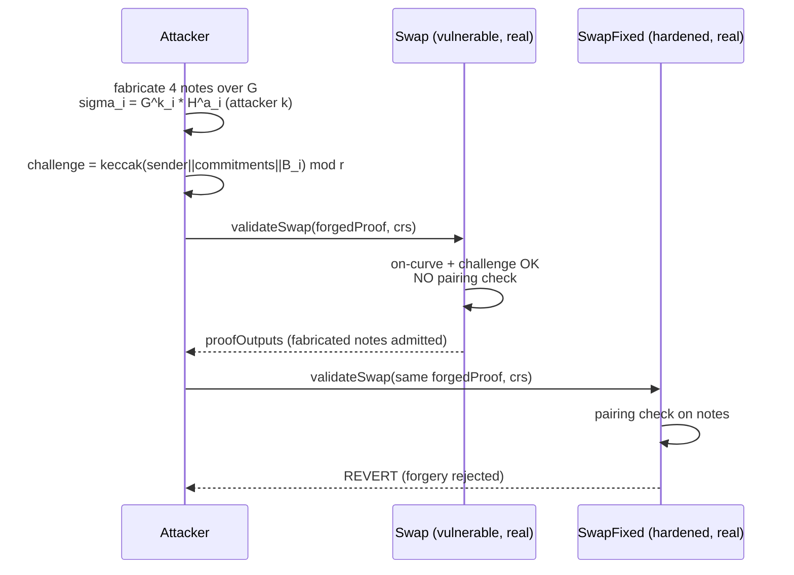

# AZTEC Swap validator: missing elliptic-curve pairing check

The AZTEC `Swap` validator verifies a confidential swap zero-knowledge proof but
**omits the elliptic-curve pairing check** (`validatePairing`). The pairing is
the only step that binds the note commitments to the protocol's trusted setup —
without it the validator accepts a proof on Fiat–Shamir consistency alone, so an
attacker can submit **fabricated notes committing to any value they choose** and
have them admitted to the note registry as spendable notes.

- Real repo: [`AztecProtocol/aztec-v1`](https://github.com/AztecProtocol/aztec-v1)
- Vulnerable validator: `packages/protocol/contracts/ACE/validators/swap/Swap.sol`
- The current repo `Swap.sol` performs the pairing check (`validatePairing(0x84)`
  at line 225); the vendored `src/Swap.sol` is the historical version **without**
  it. `src/SwapFixed.sol` is the real hardened source (pairing + accumulator
  binding restored). Both are the real audited AZTEC source, unmodified.

## Root cause

An AZTEC note is a pair of bn128 points `(gamma, sigma)` with
`sigma = gamma^k * h^a`, where `k` is the confidential value and `gamma` is
supposed to be a **trusted-setup** point. A balanced-proof validator must check:

1. each commitment is on-curve and `k`, `a` are in range — `validateCommitment`;
2. the Fiat–Shamir challenge reconstructs — `keccak256(sender || commitments || B_i) == challenge`;
3. **the pairing** `e(sigma_acc, t2) * e(gamma_acc, g2) == 1` — `validatePairing`.

The vulnerable `Swap` performs (1) and (2) but **not (3)** (and not the
accumulator scaling that feeds it). Checks (1) and (2) are fully attacker-
satisfiable: the prover chooses the blinding factors, so any set of on-curve
points with a self-consistent challenge passes. Only the pairing ties `sigma`
and `gamma` to the trusted setup and enforces value conservation. Its absence
means fabricated notes — never issued by a real mint/deposit — are accepted.

## The exploit (built entirely on-chain, real bn128 precompiles)

The PoC constructs a forged Swap transcript inside the exploit contract:

1. Pick four notes with attacker-chosen values `k = [100, 1e18, 100, 1e18]`
   (the challenge check forces `k[2]=k[0]`, `k[3]=k[1]` — the swap match).
2. For each note compute `sigma_i = G^{k_i} * H^{a_i}` using **the plain
   generator `G = (1,2)`**, not a trusted-setup point (precompiles `0x07`/`0x06`).
3. Compute blinding-factor commitments `T_i = G^{kap_i} * H^{alp_i}` (these equal
   the verifier's recomputed `B_i` by construction).
4. Compute the challenge `c = keccak256(sender || (gamma_i,sigma_i) || B_i) mod r`
   — byte-for-byte the way `Swap.validateSwap` hashes it.
5. Set the responses `kbar_i = kap_i + c*k_i`, `abar_i = alp_i + c*a_i (mod r)`
   and assemble the AZTEC `proofData` (header, four notes, four owners, and a
   verbatim real metadata tail so `SwapABIEncoder` emits cleanly).

Submitting this proof:

- **`Swap` (vulnerable) ACCEPTS it** and returns `proofOutputs` containing the
  attacker's fabricated output notes (`note[1]` worth `1e18`, `note[2]` worth
  `100`). The PoC asserts the exact compressed `sigma` coordinates of the forged
  output notes are present in the validator's output — i.e. they would be written
  to the note registry as spendable notes created from nothing.
- **`SwapFixed` (hardened) REJECTS the identical proof** — its restored pairing /
  accumulator binding detects that the notes are not trusted-setup commitments.

No synthetic validator is used: both `Swap` and `SwapFixed` are the real audited
AZTEC contracts. The forged proof is a real, transparently-constructed witness
(the finding is the missing check, demonstrated by input that must fail but is
accepted).



## Impact

A forged confidential-swap proof is validated, so attacker-fabricated output
notes (committing to arbitrary value) enter the note registry as legitimate,
spendable notes. Once in the registry they can be spent through any Join-Split
protocol, minting value from nothing. Severity: **High**.

## Mitigation

Add the elliptic-curve pairing verification (`validatePairing`) to the `Swap`
validator, matching the other balanced-proof validators — as done in the current
`Swap.sol` (see `src/SwapFixed.sol`).

## Reproduce

```bash
cd 16736-aztec-swap-validator-missing-pairing-check_exp
../_shared/run-poc/run_poc.sh 16736-aztec-swap-validator-missing-pairing-check_exp -vvvvv
```

Both tests pass: `test_vulnerable_accepts_forged_notes` (the forgery is admitted)
and `test_fixed_rejects_forged_notes` (the hardened validator rejects it).

<!-- source-auditvault: https://github.com/Auditware/AuditVault/blob/main/findings/16736-missing-elliptic-curve-pairing-check-in-the-swap-validator-t.md -->
