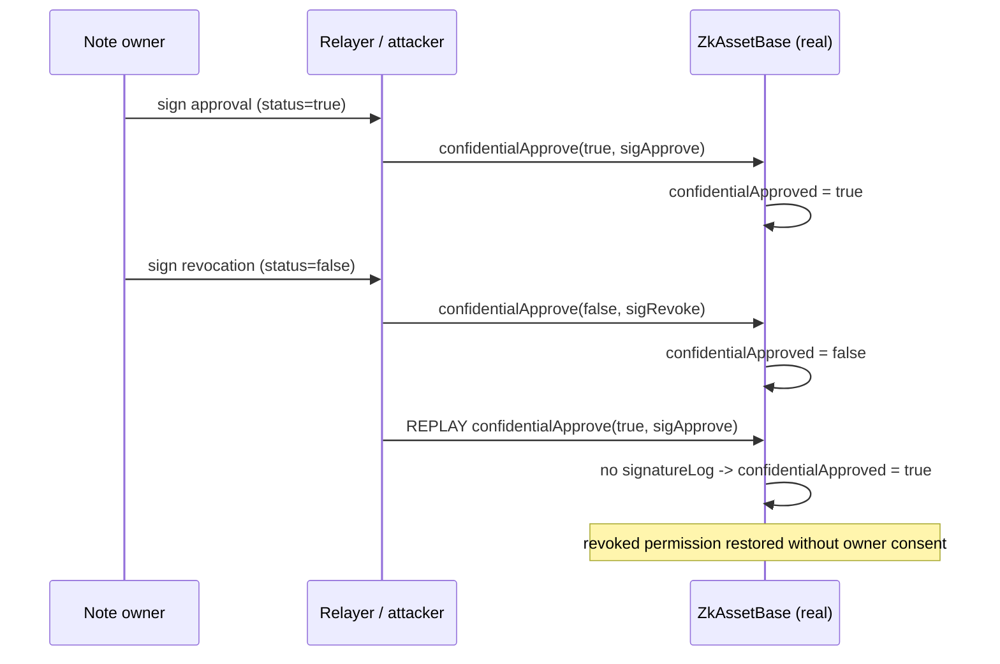

# AZTEC `confidentialApprove` signature replay / revocation inversion

The AZTEC `ZkAssetBase.confidentialApprove` lets a note owner sign an EIP-712
`NoteSignature` authorizing (or revoking) a third party to spend a note. In the
vulnerable snapshot the signed struct is **not consumed** — there is no
`signatureLog` — so an old, already-observed approval signature can be **replayed
to overwrite a revocation**, silently restoring a spender's permission without
the owner's consent.

- Real repo: [`AztecProtocol/aztec-v1`](https://github.com/AztecProtocol/aztec-v1)
- Vulnerable contract: `packages/protocol/contracts/ERC1724/base/ZkAssetBase.sol`
- Fixed by commit [`e730bde0`](https://github.com/AztecProtocol/aztec-v1/commit/e730bde00c4719f6295c0a25e7e83619ab8cff65),
  which adds `mapping(bytes32 => bool) public signatureLog;` and
  `require(signatureLog[signatureHash] != true, "signature has already been used")`.
- `src/ERC1724/base/ZkAssetBase.sol` is the real vulnerable source (no
  `signatureLog`); `src/ERC1724/base/ZkAssetBaseFixed.sol` adds exactly the real
  fix. Both are the real audited source; only the `confidentialApprove` guard
  differs.

## Root cause

`confidentialApprove` validates an EIP-712 signature over
`(noteHash, spender, spenderApproval)` and then writes
`confidentialApproved[noteHash][spender] = spenderApproval`. The vulnerable
version keeps **no record that a signature was used**, so any signature the owner
ever produced remains valid forever. An attacker (or the spender) who observed
the owner's original `spenderApproval = true` signature can resubmit it at any
later time — including after the owner has revoked — and the approval is
reinstated.

## The exploit (real ZkAssetBase, real ECDSA signatures)

The PoC deploys the real, unmodified `ZkAssetBase` and drives the real replay:

1. The note owner signs `spenderApproval = true`; a relayer submits it →
   `confidentialApproved[noteHash][spender] = true` (spender may now spend).
2. The note owner signs `spenderApproval = false` (revocation); it is submitted →
   `confidentialApproved[...] = false`.
3. The attacker **replays the owner's original step-1 approval signature** →
   `confidentialApproved[...] = true` again. The revocation is undone.

The registry test additionally deploys the **real fixed** `ZkAssetBaseFixed` and
shows the identical replay reverts with `"signature has already been used"`.

The only mocked component is a minimal ACE note-registry shim that reports the
note as unspent and owned by the signer: a real note can only be created by a
validated zero-knowledge mint/join-split proof (off-chain proving), so the note's
existence is a precondition external to this bug — the replay logic under test is
100% the real audited `ZkAssetBase`/`validateSignature`/EIP-712 code.



## Impact

A note owner cannot reliably revoke a spend approval: any previously-signed
approval can be replayed to restore it. This lets a malicious spender (or relayer)
regain spend authorization over the owner's notes after the owner has explicitly
withdrawn it. Severity: **High**.

## Mitigation

Consume signatures: record `keccak256(signature)` in a `signatureLog` mapping and
reject any non-empty signature that has already been used (the real `e730bde0`
fix), and/or add a per-owner nonce to the signed struct.

## Reproduce

```bash
cd 16739-aztec-confidentialapprove-replay-status_exp
../_shared/run-poc/run_poc.sh 16739-aztec-confidentialapprove-replay-status_exp -vvvvv
```

`test_vulnerable_replay_restores_revoked_approval` shows the replay restoring the
revoked approval; `test_fixed_rejects_replay` shows the real fix rejecting it.

<!-- source-auditvault: https://github.com/Auditware/AuditVault/blob/main/findings/16739-replay-attack-and-revocation-inversion-on-confidentialapprov.md -->
