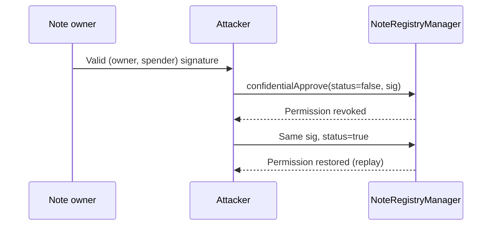

# AZTEC confidentialApprove signature replay and status inversion

> **Vulnerability classes:** vuln/auth/signature-replay · vuln/auth/signature-validation · vuln/bridge/replay
>
> **Reproduction:** local synthetic Foundry reduction; the passing trace is in [output.txt](output.txt).

<!-- non-defihacklabs -->
<!-- source-auditvault: https://github.com/Auditware/AuditVault/blob/main/findings/16739-replay-attack-and-revocation-inversion-on-confidentialapprov.md -->
<!-- date: 2021-06 -->

## Key info

| Field | Value |
|---|---|
| **Loss** | A previously revoked note spender can replay the same signature and regain permission. |
| **Vulnerable contract** | `NoteRegistryManager.confidentialApprove` in [test/16739-aztec-confidentialapprove-replay-status.sol](test/16739-aztec-confidentialapprove-replay-status.sol) |
| **Attacker EOA** | `0x1111111111111111111111111111111111111111` |
| **Attack contract** | `Exploit` |
| **Attack tx** | Local Foundry `Exploit.run()` |
| **Chain / block / date** | Ethereum model · block 0 · synthetic |
| **Compiler** | Solidity `^0.8.24` |
| **Bug class** | Detached status bit and missing replay protection in confidential approval signatures |

## TL;DR

`confidentialApprove` verifies a digest over only `(owner, spender)`. The signed status bit is omitted and signatures are never consumed, so a valid approval signature can be resubmitted with either status. The reduction first revokes permission and then replays the identical signature with `status = true`.

## Background

AZTEC note registries let an owner authorize a third party to spend confidential notes. The authorization must bind the owner, spender, status, and a one-time nonce; otherwise anyone holding a valid detached signature can alter the permission state.

## The vulnerable code

```solidity
bytes32 digest = keccak256(abi.encode(owner, spender));
require(signature == digest, "invalid owner signature");
// FIX: include status and a nonce in the signed digest, then consume the nonce.
approved[owner][spender] = status; // @> VULN: status is detached and the signature has no replay marker.
```

## Root cause

The status parameter is accepted after signature verification rather than being authenticated by it. No mapping records that a digest has already been used. The same owner/spender digest therefore authorizes an arbitrary sequence of revoke/restore operations.

## Preconditions

- A valid confidential-approval signature is observed or submitted on-chain.
- `confidentialApprove` does not include status in the signed payload.
- No nonce or digest-consumption state prevents replay.

## Attack walkthrough

1. `Exploit` obtains the valid digest for its note owner and spender.
2. It calls `confidentialApprove(..., false, signature)`, revoking the spender.
3. It immediately resubmits the same signature with `status = true`.
4. The passing trace records the `revoked` and `replayed` reads at [output.txt:387](output.txt#L387) and [output.txt:391](output.txt#L391), showing permission restored from the detached signature.

## Diagrams



## Remediation

Include `_status` and a monotonically increasing nonce (or unique digest) in the signed struct, reject a digest that was already consumed, and update the off-chain AZTEC signer to produce the same bound payload. Domain-separate signatures by registry and chain.

## How to reproduce

```bash
cd evm-hack-registry/16739-aztec-confidentialapprove-replay-status_exp
forge test -vvvvv
```

## Sources

- [AuditVault finding #16739](https://github.com/Auditware/AuditVault/blob/main/findings/16739-replay-attack-and-revocation-inversion-on-confidentialapprov.md)
- [Trail of Bits AZTEC review](https://github.com/trailofbits/publications/blob/master/reviews/aztec.pdf)
- [Synthetic test](test/16739-aztec-confidentialapprove-replay-status.sol)

*Reference: https://github.com/trailofbits/publications/blob/master/reviews/aztec.pdf*
