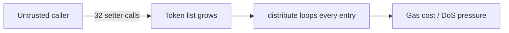

# Basis MultiDistributor — unprotected minimum-distribution list growth

> **Vulnerability classes:** vuln/access-control/missing-auth · vuln/dos/unbounded-loop
>
> **Reproduction:** local synthetic Foundry reduction; the complete passing trace is in [output.txt](output.txt).

<!-- non-defihacklabs -->
<!-- source-auditvault: https://github.com/Auditware/AuditVault/blob/main/findings/16760-setminimumdistribution-is-not-protected-trailofbits-basis-pd.md -->
<!-- date: 2022-01 -->

## Key info

| Field | Value |
|---|---|
| Loss | An arbitrary caller appends 32 entries, increasing distribution work from 1 to 33 iterations. |
| Vulnerable contract | `MultiDistributor.setMinimumDistribution` in [test/16760-setminimumdistribution-not-protected.sol](test/16760-setminimumdistribution-not-protected.sol) |
| Attacker EOA | `0x1111111111111111111111111111111111111111` |
| Attack contract | `Exploit` |
| Attack tx | Local Foundry `Exploit.run()` |
| Chain · block · date | Ethereum model · block 0 · synthetic |
| Compiler | Solidity `^0.8.24` |
| Bug class | Missing authorization on unbounded list mutation |

## TL;DR

`setMinimumDistribution` is documented for trusted participants, but anyone can append token addresses. Repeated zero-minimum entries inflate every distribution loop and can eventually cause a gas-limit denial of service.

## Background

The minimum-distribution threshold exists to prevent negligible entries. It is ineffective when untrusted callers can add entries without governance or owner authorization.

## The vulnerable code

```solidity
function setMinimumDistribution(address token, uint256 tokenMinDistribution) external {
    if (tokenIdx[token] == 0) tokens.push(token);
    // @> VULN: intended trusted-participant operation has no access check.
    minDistribution[token] = tokenMinDistribution;
}
```

## Root cause

The mutator is public and unbounded while `distribute` iterates the entire `tokens` array. No role, allowlist, or cap protects the expensive state transition.

## Preconditions

- `setMinimumDistribution` is externally callable.
- Distribution operations iterate all registered tokens.
- An attacker can submit repeated transactions (or a loop in one transaction).

## Attack walkthrough

1. Add 32 unique token addresses with minimum distribution zero.
2. Invoke `distribute`; it loops 33 entries instead of the baseline one.
3. The passing trace records the enlarged loop at [output.txt:4](output.txt#L4).

## Diagrams



## Remediation

Restrict the setter to an owner, controller, or allowlist and cap the list length. Consider a mapping-based distribution registry or bounded iteration rather than an attacker-controlled array.

## How to reproduce

```bash
cd evm-hack-registry/16760-setminimumdistribution-not-protected_exp
forge test -vvvvv
```

## Sources

- [AuditVault finding #16760](https://github.com/Auditware/AuditVault/blob/main/findings/16760-setminimumdistribution-is-not-protected-trailofbits-basis-pd.md)
- [Trail of Bits Basis review](https://github.com/trailofbits/publications/blob/master/reviews/basis.pdf)
- [Synthetic test](test/16760-setminimumdistribution-not-protected.sol)

*Reference: https://github.com/trailofbits/publications/blob/master/reviews/basis.pdf*
