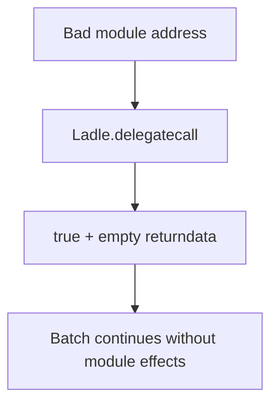

# Non-existent module delegatecall appears successful — unchecked target

> **Vulnerability classes:** vuln/dependency/unsafe-external-call · vuln/input-validation/missing
>
> **Reproduction:** self-contained synthetic Foundry reduction; see [output.txt](output.txt).

<!-- non-defihacklabs -->
<!-- source-auditvault: https://github.com/Auditware/AuditVault/blob/main/findings/16975-lack-of-contract-existence-check-on-delegatecall-may-lead-to.md -->
<!-- date: 2021-06 -->

## Key info

| Field | Value |
|---|---|
| **Loss** | Batches silently skip a module call and continue with stale state |
| **Vulnerable contract** | `Ladle.moduleCall` |
| **Attacker EOA** | `0x1111111111111111111111111111111111111111` |
| **Attack contract** | `Ladle` via `Exploit` |
| **Attack tx** | `Exploit.run()` |
| **Chain / block / date** | Ethereum model · block 0 · 2021-06 |
| **Compiler** | `solc 0.8.24` (synthetic) |
| **Bug class** | Delegatecall lacks code-existence validation |

## TL;DR

`delegatecall` to an EOA or destroyed contract returns true. Ladle's module registry can therefore mark a no-code address as valid and report a successful module execution that did nothing.

## Background

Yield V2's Ladle exposes both batched self-calls and registered module calls. The audit warns that neither path checks `extcodesize` before delegating.

## The vulnerable code

```solidity
(bool success, bytes memory ret) = module.delegatecall(data); // @> no code check
require(success, "module failed");
```

## Root cause

The registry's boolean membership check is treated as proof of executable code; the EVM's empty-account delegatecall behavior is ignored.

## Preconditions

- An administrator registers an incorrect or later-destroyed module address.
- A user invokes `moduleCall` or a batch containing it.

## Attack walkthrough

1. `Exploit` registers `0xBEEF` as a module.
2. `moduleCall` delegates to the no-code account and gets `(true, "")`.
3. The `Proof` event at [output.txt:375](output.txt) records the false success.

## Diagrams



## Remediation

Require `module.code.length > 0` before every delegatecall and document that selfdestruct/non-deployed modules cannot be treated as successful targets.

## How to reproduce

```bash
cd evm-hack-registry/16975-lack-of-contract-existence-check-on-delegatecall-may-lead-to_exp
forge test -vvvvv
```

## Sources

- [AuditVault finding](https://github.com/Auditware/AuditVault/blob/main/findings/16975-lack-of-contract-existence-check-on-delegatecall-may-lead-to.md)
- [Trail of Bits Yield V2 review](https://github.com/trailofbits/publications/blob/master/reviews/YieldV2.pdf)
- [Synthetic test](test/16975-lack-of-contract-existence-check-on-delegatecall-may-lead-to.sol)

*Reference: https://github.com/trailofbits/publications/blob/master/reviews/YieldV2.pdf*
