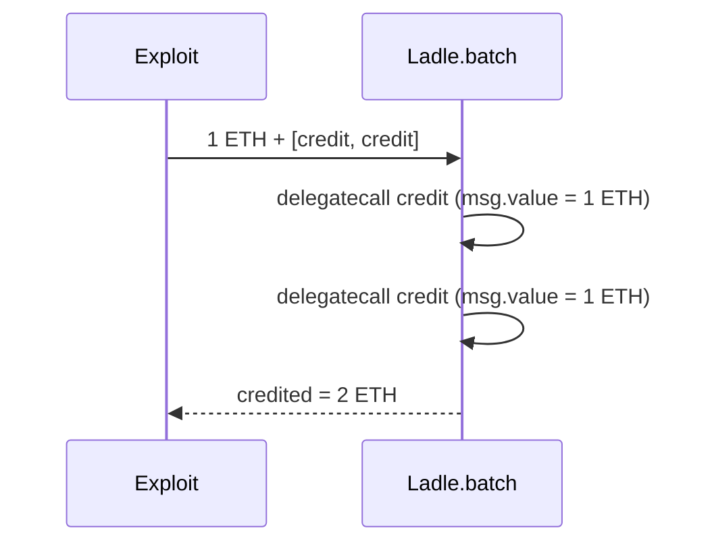

# Payable delegatecall loop reuses `msg.value` — value-accounting hazard

> **Vulnerability classes:** vuln/dependency/unsafe-external-call · vuln/logic/state-update
>
> **Reproduction:** self-contained synthetic Foundry reduction; see [output.txt](output.txt).

<!-- non-defihacklabs -->
<!-- source-auditvault: https://github.com/Auditware/AuditVault/blob/main/findings/16976-use-of-delegatecall-in-a-payable-function-inside-a-loop-trai.md -->
<!-- date: 2021-06 -->

## Key info

| Field | Value |
|---|---|
| **Loss** | Future value-sensitive logic can count one payment multiple times |
| **Vulnerable contract** | `Ladle.batch` |
| **Attacker EOA** | `0x1111111111111111111111111111111111111111` |
| **Attack contract** | `Ladle` via `Exploit` |
| **Attack tx** | `Exploit.run{value: 1 ether}()` |
| **Chain / block / date** | Ethereum model · block 0 · 2021-06 |
| **Compiler** | `solc 0.8.24` (synthetic) |
| **Bug class** | Payable delegatecall loop retains original value |

## TL;DR

Every `delegatecall` in a payable batch inherits the original `msg.value`. The reduction calls a hypothetical value-sensitive `credit()` twice and records two ether of credit from one ether supplied.

## Background

Yield V2 did not use `msg.value` meaningfully at review time, but a later refactor could turn this into an accounting exploit. The PoC makes that future-use hazard explicit.

## The vulnerable code

```solidity
for (uint256 i; i < calls.length; ++i) {
    (bool success,) = address(this).delegatecall(calls[i]); // @> msg.value retained
    require(success);
}
```

## Root cause

The batch abstraction does not constrain or account for value across delegated subcalls; each sees the same transaction value.

## Preconditions

- A payable function is reachable through `batch`.
- That function uses `msg.value` to update balances or permissions.

## Attack walkthrough

1. `Exploit` sends one ether to `batch` with two `credit()` calls.
2. Both delegated calls observe `1 ether` and increment `credited`.
3. The `Proof` event at [output.txt:381](output.txt) shows 2 ether credited.

## Diagrams



## Remediation

Make batch non-payable unless value semantics are explicit, pass a per-call value budget, or enforce that at most one delegated call consumes `msg.value`.

## How to reproduce

```bash
cd evm-hack-registry/16976-use-of-delegatecall-in-a-payable-function-inside-a-loop-trai_exp
forge test -vvvvv
```

## Sources

- [AuditVault finding](https://github.com/Auditware/AuditVault/blob/main/findings/16976-use-of-delegatecall-in-a-payable-function-inside-a-loop-trai.md)
- [Trail of Bits Yield V2 review](https://github.com/trailofbits/publications/blob/master/reviews/YieldV2.pdf)
- [Synthetic test](test/16976-use-of-delegatecall-in-a-payable-function-inside-a-loop-trai.sol)

*Reference: https://github.com/trailofbits/publications/blob/master/reviews/YieldV2.pdf*
