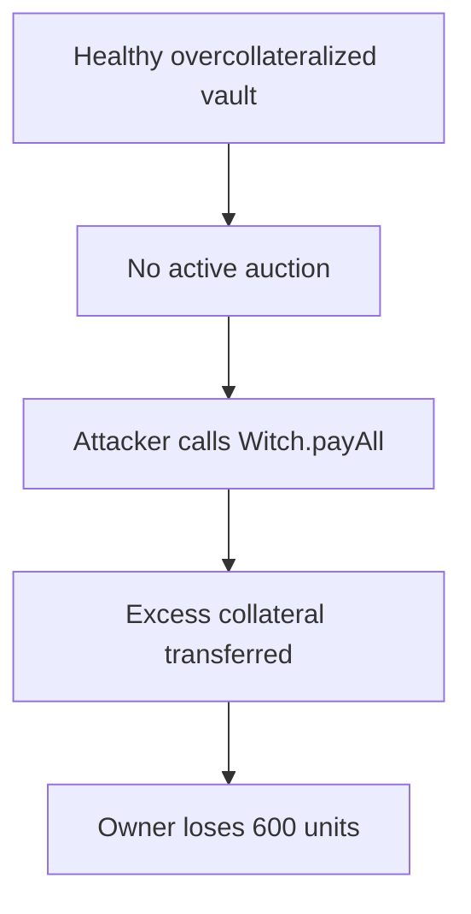

# Yield V2 Witch.payAll liquidates vault collateral without an active auction

> **Vulnerability classes:** vuln/logic/wrong-condition · vuln/logic/missing-check · vuln/defi/fee-manipulation
>
> **Reproduction:** local synthetic Foundry reduction; the passing trace is in [output.txt](output.txt).

<!-- non-defihacklabs -->
<!-- source-auditvault: https://github.com/Auditware/AuditVault/blob/main/findings/16980-witchs-buy-and-payall-functions-allow-users-to-buy-collatera.md -->
<!-- date: 2021-06 -->

## Key info

| Field | Value |
|---|---|
| **Loss** | Anyone can seize the excess collateral (600 synthetic units) from an overcollateralized vault that is not in an auction. |
| **Vulnerable contract** | `Witch.payAll` in [test/16980-yield-v2-witch-buy-payall-no-auction.sol](test/16980-yield-v2-witch-buy-payall-no-auction.sol) |
| **Attacker EOA** | `0x1111111111111111111111111111111111111111` |
| **Attack contract** | `Exploit` |
| **Attack tx** | Local Foundry `Exploit.run()` |
| **Chain / block / date** | Ethereum model · block 0 · synthetic |
| **Compiler** | Solidity `^0.8.24` |
| **Bug class** | Missing active-auction condition allows direct collateral drain |

## TL;DR

Yield V2's Witch `buy` and `payAll` paths are intended to operate only on vaults with an active liquidation auction. Without that state check, an arbitrary caller can invoke `payAll` on a healthy, overcollateralized vault and receive the difference between collateral and debt. The reduction drains 600 units from a 1,000/400 vault.

## Background

Liquidation auctions establish a price and a bounded window in which a Witch may transfer collateral. A vault outside an auction remains controlled by its owner; excess collateral must not be exposed to arbitrary buyers.

## The vulnerable code

```solidity
Vault storage vault = vaults[id];
uint256 excess = vault.collateralAmount - vault.debt;
// FIX: require(activeAuction[id], "auction inactive");
vault.collateralAmount = vault.debt; // @> VULN: payAll liquidates collateral without an active auction.
collateral.transfer(msg.sender, excess);
```

## Root cause

`payAll` computes and transfers the vault's excess without consulting `activeAuction`. The function's economic precondition is therefore absent, turning a liquidation-only operation into an unrestricted withdrawal from every overcollateralized vault.

## Preconditions

- A vault has collateral greater than debt.
- The vault has no active auction.
- An arbitrary caller can invoke `payAll`.

## Attack walkthrough

1. Alice opens a 1,000-unit vault backed by 400 units of debt; `activeAuction` remains false.
2. Bob calls `payAll(vaultId)` without bidding or starting an auction.
3. Witch reduces the vault to its debt and transfers 600 collateral to Bob.
4. The passing trace reads the attacker's 600-unit balance at [output.txt:398](output.txt#L398) and verifies the emptied excess.

## Diagrams



## Remediation

Require `activeAuction[id]` (and any other auction-state invariants) before `buy` or `payAll`. Clear the auction state only after settlement, and add tests proving both functions revert for healthy and non-auction vaults.

## How to reproduce

```bash
cd evm-hack-registry/16980-yield-v2-witch-buy-payall-no-auction_exp
forge test -vvvvv
```

## Sources

- [AuditVault finding #16980](https://github.com/Auditware/AuditVault/blob/main/findings/16980-witchs-buy-and-payall-functions-allow-users-to-buy-collatera.md)
- [Trail of Bits Yield V2 review](https://github.com/trailofbits/publications/blob/master/reviews/YieldV2.pdf)
- [Synthetic test](test/16980-yield-v2-witch-buy-payall-no-auction.sol)

*Reference: https://github.com/trailofbits/publications/blob/master/reviews/YieldV2.pdf*
