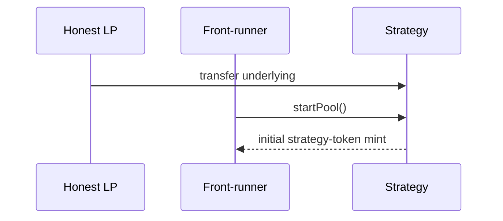

# Unbatched `startPool` can be front-run — initial mint theft

> **Vulnerability classes:** vuln/defi/sandwich-attack · vuln/logic/missing-check
>
> **Reproduction:** self-contained synthetic Foundry reduction; see [output.txt](output.txt).

<!-- non-defihacklabs -->
<!-- source-auditvault: https://github.com/Auditware/AuditVault/blob/main/findings/16983-failure-to-use-the-batched-transaction-flow-may-enable-theft.md -->
<!-- date: 2021-06 -->

## Key info

| Field | Value |
|---|---|
| **Loss** | An honest LP's preloaded base is minted to a front-runner |
| **Vulnerable contract** | `Strategy.startPool` |
| **Attacker EOA** | `0x1111111111111111111111111111111111111111` |
| **Attack contract** | `Strategy` via `Exploit` |
| **Attack tx** | `Exploit.run()` |
| **Chain / block / date** | Ethereum model · block 0 · 2021-06 |
| **Compiler** | `solc 0.8.24` (synthetic) |
| **Bug class** | Initial mint assigned to `msg.sender` |

## TL;DR

If liquidity is transferred to the Strategy before the router's batch reaches `startPool`, an attacker can front-run that call and receive the entire initial strategy-token mint.

## Background

Yield Protocol expects users to use a batchable router to transfer funds and start a pool atomically. The audited function instead uses the caller as the initial token recipient.

## The vulnerable code

```solidity
if (totalSupply == 0) strategyBalance[msg.sender] = baseBalance; // @> caller owns preloaded funds
```

## Root cause

The function derives ownership from `msg.sender` rather than an explicit beneficiary tied to the deposit or a router-authenticated intent.

## Preconditions

- A user has transferred underlying into the Strategy.
- `startPool` is callable in a separate, publicly visible transaction.

## Attack walkthrough

1. `seed(100)` models the honest user's transfer.
2. The attacker front-runs `startPool` and becomes the initial recipient.
3. The `Proof` event at [output.txt:376](output.txt) records 100 stolen strategy tokens.

## Diagrams



## Remediation

Mint to an explicit beneficiary supplied by the router, require an atomic transfer-and-start flow, or make the first pool initialization governance-controlled.

## How to reproduce

```bash
cd evm-hack-registry/16983-failure-to-use-the-batched-transaction-flow-may-enable-theft_exp
forge test -vvvvv
```

## Sources

- [AuditVault finding](https://github.com/Auditware/AuditVault/blob/main/findings/16983-failure-to-use-the-batched-transaction-flow-may-enable-theft.md)
- [Trail of Bits Yield V2 review](https://github.com/trailofbits/publications/blob/master/reviews/YieldV2.pdf)
- [Synthetic test](test/16983-failure-to-use-the-batched-transaction-flow-may-enable-theft.sol)

*Reference: https://github.com/trailofbits/publications/blob/master/reviews/YieldV2.pdf*
