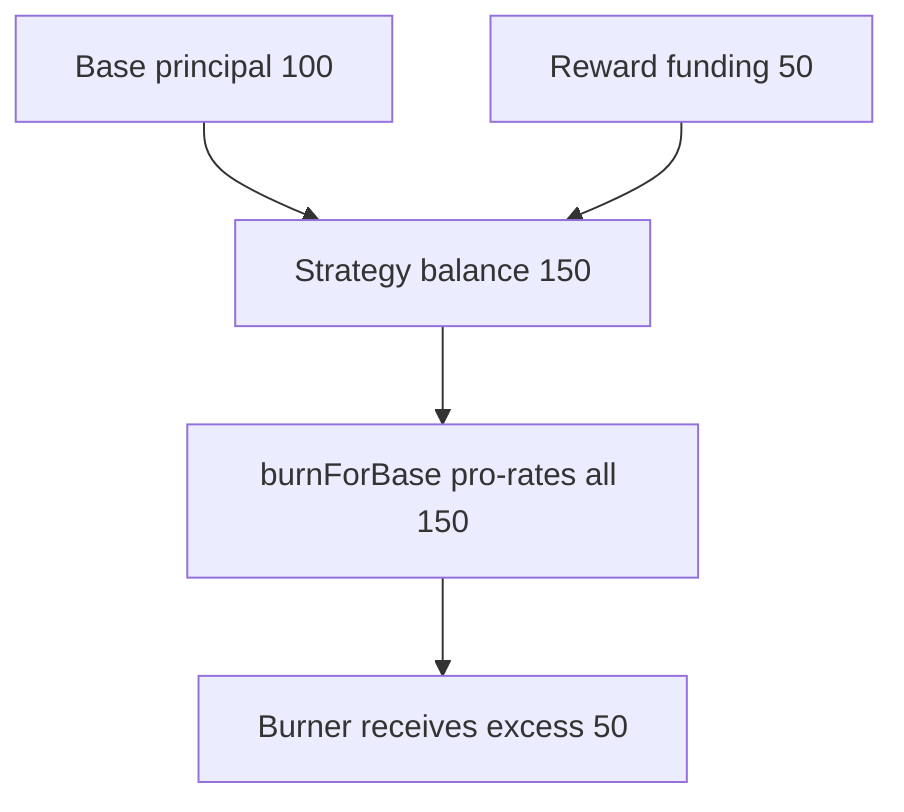

# Base/reward token alias inflates `burnForBase` — reward-accounting theft

> **Vulnerability classes:** vuln/logic/reward-calculation · vuln/logic/missing-validation
>
> **Reproduction:** self-contained synthetic Foundry reduction; see [output.txt](output.txt).

<!-- non-defihacklabs -->
<!-- source-auditvault: https://github.com/Auditware/AuditVault/blob/main/findings/16984-strategy-contracts-balance-tracking-system-could-facilitate.md -->
<!-- date: 2021-06 -->

## Key info

| Field | Value |
|---|---|
| **Loss** | Burners receive reward funding as if it were base principal |
| **Vulnerable contract** | `Strategy.burnForBase` / `setRewardsToken` |
| **Attacker EOA** | `0x1111111111111111111111111111111111111111` |
| **Attack contract** | `RewardToken` and `Strategy` via `Exploit` |
| **Attack tx** | `Exploit.run()` |
| **Chain / block / date** | Ethereum model · block 0 · 2021-06 |
| **Compiler** | `solc 0.8.24` (synthetic) |
| **Bug class** | Reward token may equal base token |

## TL;DR

`burnForBase` pro-rates the entire base-token balance. If rewards use the same token as base, reward funding is counted as principal and a burner receives 150 for 100 strategy tokens.

## Background

Yield V2's ERC20Rewards inheritance assumes the reward token is distinct from base, liquidity, fyToken, and strategy tokens. The reviewed setter lacked that identity check.

## The vulnerable code

```solidity
withdrawal = base.balanceOf(address(this)) * burnt / totalSupply; // @> includes rewards
```

## Root cause

Configuration permits the reward token to alias base, so balance-based withdrawal cannot distinguish principal from reward reserves.

## Preconditions

- An administrator sets `rewardsToken == base`.
- Reward tokens are funded before strategy tokens are burned.

## Attack walkthrough

1. `Exploit` configures the same token as base and rewards.
2. The strategy holds 100 principal plus 50 reward tokens.
3. Burning 100 strategy tokens pays 150; the `Proof` event is at [output.txt:393](output.txt).

## Diagrams



## Remediation

Reject reward-token aliases at configuration time and track principal/reserve balances separately before calculating redemptions.

## How to reproduce

```bash
cd evm-hack-registry/16984-strategy-contracts-balance-tracking-system-could-facilitate_exp
forge test -vvvvv
```

## Sources

- [AuditVault finding](https://github.com/Auditware/AuditVault/blob/main/findings/16984-strategy-contracts-balance-tracking-system-could-facilitate.md)
- [Trail of Bits Yield V2 review](https://github.com/trailofbits/publications/blob/master/reviews/YieldV2.pdf)
- [Synthetic test](test/16984-strategy-contracts-balance-tracking-system-could-facilitate.sol)

*Reference: https://github.com/trailofbits/publications/blob/master/reviews/YieldV2.pdf*
