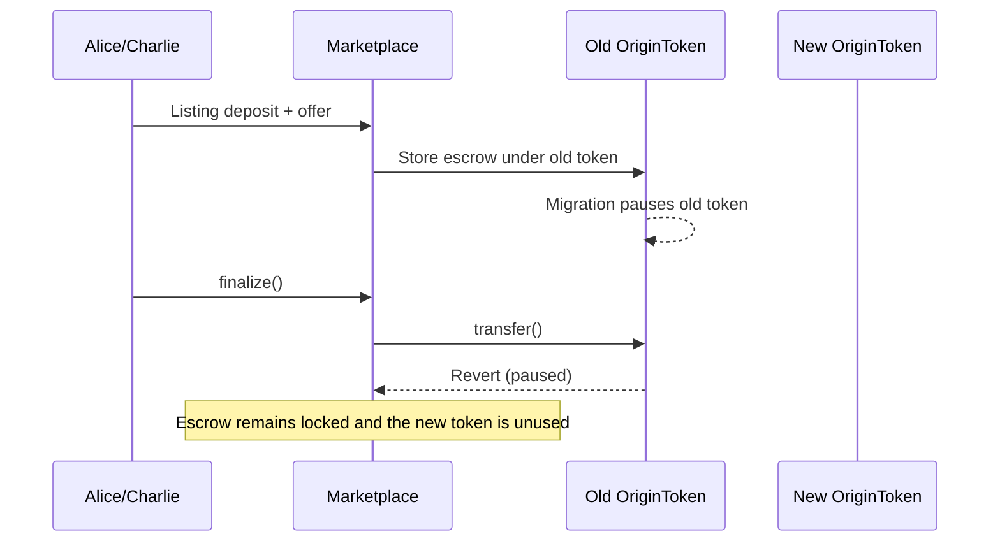

# OriginToken migration leaves Marketplace listings and offers locked

> **Vulnerability classes:** vuln/dependency/upgradeable-contract · vuln/logic/incorrect-state-transition · vuln/dos/lockup
>
> **Reproduction:** local synthetic Foundry reduction; the passing trace is in [output.txt](output.txt).

<!-- non-defihacklabs -->
<!-- source-auditvault: https://github.com/Auditware/AuditVault/blob/main/findings/17100-origintoken-contract-migration-breaks-marketplace-ofer-refer.md -->
<!-- date: 2022-01 -->

## Key info

| Field | Value |
|---|---|
| **Loss** | A listing deposit (1,000 units) and an offer (500 units) remain locked when the old token is paused. |
| **Vulnerable contract** | `Marketplace.finalize` in [test/17100-origin-token-migration-marketplace-reference.sol](test/17100-origin-token-migration-marketplace-reference.sol) |
| **Attacker EOA** | `0x1111111111111111111111111111111111111111` |
| **Attack contract** | `Exploit` |
| **Attack tx** | Local Foundry `Exploit.run()` |
| **Chain / block / date** | Ethereum model · block 0 · synthetic |
| **Compiler** | Solidity `^0.8.24` |
| **Bug class** | Marketplace retains a paused pre-migration token address and cannot settle escrow |

## TL;DR

OriginToken migration pauses the old token and deploys a new token, but Marketplace keeps its immutable reference to the old contract. Existing listings and offers therefore attempt transfers through a paused token and cannot be finalized. The reduction deposits 1,000 and 500 units, pauses the old token, and proves settlement remains blocked.

## Background

Marketplace escrow must use the same token contract that users can transfer after a migration. A token upgrade without an atomic Marketplace migration leaves all existing escrow tied to a disabled contract.

## The vulnerable code

```solidity
function finalize() external {
    require(listingDeposit != 0 && offerAmount != 0, "missing listing or offer");
    // FIX: atomically update currency and validate all outstanding listings/offers.
    currency.transfer(listingSeller, listingDeposit); // @> VULN: Marketplace keeps the paused pre-migration token reference.
    currency.transfer(offerBuyer, offerAmount);
}
```

## Root cause

The Marketplace currency address is immutable and is not updated by `TokenMigration`. Once the old OriginToken is paused, every settlement transfer reverts; deposits and offers remain in escrow indefinitely.

## Preconditions

- Users have created listings or offers denominated in the old OriginToken.
- TokenMigration pauses the old token and activates a new token contract.
- Marketplace has no migration hook or escrow conversion path.

## Attack walkthrough

1. Alice deposits 1,000 old-token units for a listing; Charlie deposits a 500-unit offer.
2. Migration pauses `oldToken`; `newToken` is deployed but Marketplace still points to `oldToken`.
3. `Exploit.run()` calls `Marketplace.finalize()`. The old token rejects the transfer.
4. The passing trace asserts `completed == false` and reads both non-zero escrow amounts at [output.txt:413](output.txt#L413) and [output.txt:415](output.txt#L415).

## Diagrams



## Remediation

Provide an authorized migration hook that updates the Marketplace currency and validates every outstanding listing and offer before switching. Alternatively migrate escrow balances atomically and allow users to cancel/refund if settlement cannot complete. Test upgrade sequences end-to-end.

## How to reproduce

```bash
cd evm-hack-registry/17100-origin-token-migration-marketplace-reference_exp
forge test -vvvvv
```

## Sources

- [AuditVault finding #17100](https://github.com/Auditware/AuditVault/blob/main/findings/17100-origintoken-contract-migration-breaks-marketplace-ofer-refer.md)
- [Trail of Bits Origin review](https://github.com/trailofbits/publications/blob/master/reviews/origin.pdf)
- [Synthetic test](test/17100-origin-token-migration-marketplace-reference.sol)

*Reference: https://github.com/trailofbits/publications/blob/master/reviews/origin.pdf*
