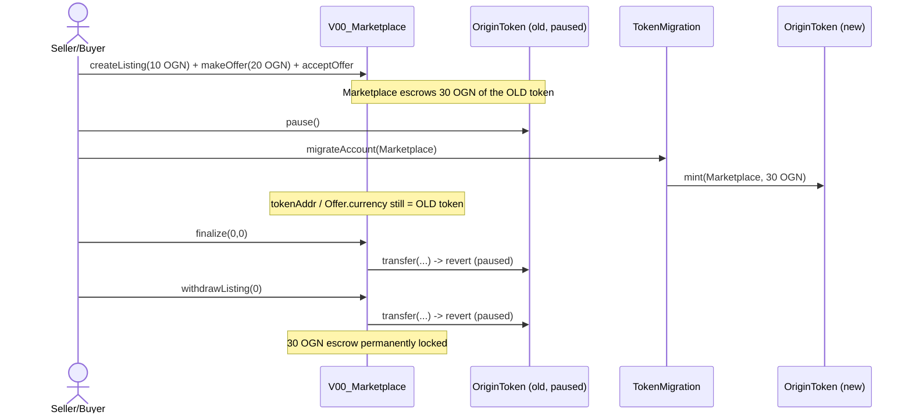

# OriginToken migration leaves V00 Marketplace escrow on the paused token

> **Vulnerability classes:** vuln/dependency/upgradeable-contract · vuln/logic/incorrect-state-transition · vuln/dos/lockup
>
> **Reproduction:** the test deploys the audited `OriginToken`, `TokenMigration`, and `V00_Marketplace` sources unmodified. It escrows a listing deposit and an accepted offer, runs the real token migration (mint replacement OGN + pause the old token), and then proves that **both** `finalize()` and `withdrawListing()` revert, leaving all escrow permanently locked. The passing trace is in [output.txt](output.txt).

<!-- non-defihacklabs -->
<!-- source-auditvault: https://github.com/Auditware/AuditVault/blob/main/findings/17100-origintoken-contract-migration-breaks-marketplace-ofer-refer.md -->
<!-- date: 2022-01 -->

## Key info

| Field | Value |
|---|---|
| **Loss** | A 10 OGN listing deposit and a 20 OGN offer (30 OGN total) remain escrowed in the Marketplace after migration, but neither can be settled nor withdrawn. |
| **Vulnerable contract** | `V00_Marketplace` — [src/contracts/marketplace/v00/Marketplace.sol](src/contracts/marketplace/v00/Marketplace.sol), specifically `tokenAddr`, `Offer.currency`, and `finalize`/`paySeller`/`withdrawListing`. |
| **Migration contracts** | Exact [OriginToken](src/contracts/token/OriginToken.sol) and [TokenMigration](src/contracts/token/TokenMigration.sol) sources from Origin's repository. |
| **Attack transaction** | `PoC_17100.test_migrationLeavesMarketplacePointingAtPausedToken()` |
| **Chain / block / date** | Ethereum-compatible execution · local Foundry (empty genesis, no fork) · 2022-01 report |
| **Compiler** | Solidity `^0.4.24` (compiled with solc 0.4.26; the audited source pragma) |
| **Bug class** | Migration pauses the old token, but the Marketplace has no migration hook for its token reference (`tokenAddr`) or existing offer currencies (`Offer.currency`). |

## Real source and audited commit

The vendored contracts are byte-for-byte the audited Origin source (only the
relative `import` path depths were adjusted, and the local marketplace `ERC20`
opaque-token interface was renamed to `IERC20` **in the Playground synthetic
only**, to deconflict with OpenZeppelin's `ERC20` in a single-file build):

- **Repo:** https://github.com/OriginProtocol/origin
- **Commit:** `981e580fa3ba9325e10eb0608fe6aeb4605e7a23` (path `origin-contracts/contracts/`) — the pre-`#1422` version reviewed by Trail of Bits, before the `require(fromToken.paused())` migration guard was added.
- [V00 Marketplace](src/contracts/marketplace/v00/Marketplace.sol) — identical to the commit.
- [OriginToken](src/contracts/token/OriginToken.sol) — identical (comment header aside).
- [TokenMigration](src/contracts/token/TokenMigration.sol) — identical to the commit.
- [WhitelistedPausableToken](src/contracts/token/WhitelistedPausableToken.sol) — identical.

The OpenZeppelin-solidity `1.10.0` dependency required by those files is in
[`node_modules/openzeppelin-solidity`](node_modules/openzeppelin-solidity).

## Vulnerable code path

The Marketplace records the OGN token address **once** in its constructor and
never lets it change except through an owner-only setter:

```solidity
IERC20 public tokenAddr; // Origin Token address
constructor(address _tokenAddr) public {
    owner = msg.sender;
    setTokenAddr(_tokenAddr); // Origin Token contract
}
```

Every ERC20 offer independently caches the currency address the buyer supplied:

```solidity
offers[listingID].push(Offer({ ..., currency: _currency, value: _value, ... }));
```

`finalize` -> `paySeller` then settles through that stored currency:

```solidity
function paySeller(uint listingID, uint offerID) private {
    ...
    require(offer.currency.transfer(offer.buyer, offer.refund), "Refund failed");
    require(offer.currency.transfer(listing.seller, value), "Transfer failed");
}
```

After the migration `offer.currency` / `tokenAddr` are still the **paused** old
`OriginToken`, whose `transfer` reverts (`whenNotPaused` -> `require(!paused)`,
no reason string in OZ 1.10.0). `withdrawListing` reverts for the same reason,
so the deposit cannot be recovered either.

## Reproduction walkthrough (with numbers)

1. Deploy the real `OriginToken` with a 30 OGN supply and the real
   `V00_Marketplace` pointing at it.
2. Create a listing with a **10 OGN** deposit and an accepted **20 OGN** offer
   denominated in the old token. The Marketplace now escrows **30 OGN**.
3. Deploy the real `TokenMigration`, hand it the new token's minting ownership,
   `pause()` the old token, and `migrateAccount(marketplace)`. The new token
   mints **30 OGN** to the Marketplace, while `marketplace.tokenAddr()` still
   returns the old token address.
4. `finalize(0, 0, ...)` reverts — `paySeller` calls `oldToken.transfer`, which
   is paused. `withdrawListing(0, ...)` reverts identically. The test asserts the
   old-token escrow (30 OGN), the un-spendable replacement balance (30 OGN), and
   the listing deposit (10 OGN) all remain in the Marketplace.



## Impact and remediation

Existing listings and offers can neither be finalized nor withdrawn after
migration. Un-pausing the old token would settle against a token that is no
longer the active OGN contract, while the newly minted balance is ignored.
Migration must update the Marketplace token reference and every outstanding
offer atomically, or provide a validated escrow conversion/refund path before
pausing the old token.

## How to reproduce

```bash
_shared/run-poc/run_poc.sh 17100-origin-token-migration-marketplace-reference_exp -vvvvv
# or, from the folder:
cd evm-hack-registry/17100-origin-token-migration-marketplace-reference_exp
forge test -vvvvv
```

## Sources

- [AuditVault finding #17100](https://github.com/Auditware/AuditVault/blob/main/findings/17100-origintoken-contract-migration-breaks-marketplace-ofer-refer.md)
- [Trail of Bits Origin review](https://github.com/trailofbits/publications/blob/master/reviews/origin.pdf)
- [Origin source repository](https://github.com/OriginProtocol/origin) @ `981e580fa3ba9325e10eb0608fe6aeb4605e7a23`
- [Real-source Forge test](test/17100-origin-token-migration-marketplace-reference_exp.sol)
