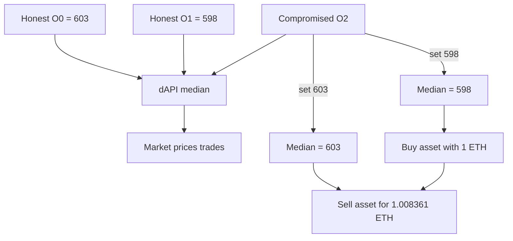
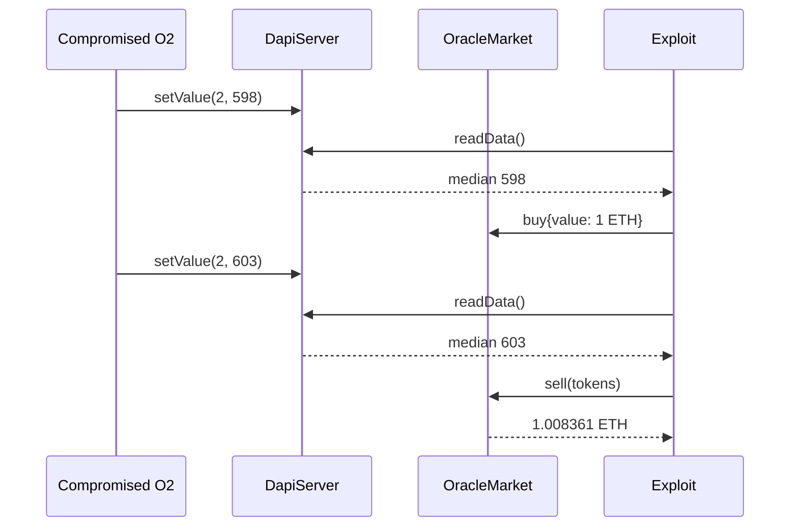

# API3 dAPI — one compromised oracle steers the median price

> **Vulnerability classes:** vuln/oracle/single-source · vuln/oracle/price-manipulation · vuln/oracle/missing-circuit-breaker
>
> **Reproduction:** local, cheatcode-free Foundry synthetic. The complete trace is in [output.txt](output.txt); the standalone source is [test/17624-compromise-of-a-single-oracle-enables-limited-control-of-the.sol](test/17624-compromise-of-a-single-oracle-enables-limited-control-of-the.sol).

<!-- non-defihacklabs -->
<!-- source-auditvault: https://github.com/Auditware/AuditVault/blob/main/findings/17624-compromise-of-a-single-oracle-enables-limited-control-of-the.md -->
<!-- date: 2022-03 -->

## Key info

| Field | Value |
|---|---|
| **Loss** | A compromised feed moves the executable dAPI price from 598 to 603; the synthetic market returns 1.008361 ETH for 1 ETH of working capital. |
| **Vulnerable contract** | `DapiServer.setValue` / `DapiServer.readData` in [test/17624-compromise-of-a-single-oracle-enables-limited-control-of-the.sol](test/17624-compromise-of-a-single-oracle-enables-limited-control-of-the.sol) |
| **Attacker EOA** | `0x1111111111111111111111111111111111111111` |
| **Attack contract** | `Exploit` |
| **Attack tx** | Local Foundry `Exploit.run{value: 2 ether}()` |
| **Chain / block / date** | Ethereum model · block 0 · synthetic · 2022-03 report |
| **Compiler** | Solidity `^0.8.24` |
| **Bug class** | Single-oracle compromise can choose the dAPI median inside the honest range; no quorum, deviation bound, or circuit breaker |

## TL;DR

API3's dAPI takes the middle value of three oracle submissions. With honest
values 603 and 598, compromising the third oracle lets an attacker choose any
median between those values. The reduction sets that feed to 598, buys an
asset, sets it to 603, and sells; the market's oracle-dependent pricing gives
the attacker a measurable ETH spread.

## Background

The finding concerns `airnode-protocol-v1/contracts/dapis/DapiServer.sol`.
Median aggregation protects against a single extreme outlier, but it does not
make the result independent of a partially compromised set. For an odd number
of reports, one compromised report can move the median throughout the interval
bounded by the honest reports. Any market that treats that value as executable
without monitoring or deviation controls inherits the manipulation.

## The vulnerable code

The reduction keeps the report's behavior explicit. `setValue` represents the
authenticated update path after O2's key has been compromised; the issue is
that one source is enough to change the value consumed by downstream markets.

```solidity
function setValue(uint8 index, uint256 value) external {
    require(index < 3, "oracle index");
    values[index] = value; // @> VULN: one compromised oracle can steer the dAPI median
    // FIX: require quorum/independent validation and reject outliers or stale feeds.
}

function readData() public view returns (uint256) {
    // sort the three submitted values
    ...
    return b; // @> VULN: median has no partial-compromise resistance
}
```

The real dAPI has signed oracle updates and more surrounding machinery; this
single-file model removes that plumbing while preserving the security property
under review.

## Root cause

The protocol treats the median as if it were robust to one compromised oracle.
It is only robust to an outlier that remains outside the honest interval. A
malicious report placed at either endpoint becomes the median and is then used
as an executable market price. There is no independent quorum, maximum
deviation check, freshness circuit breaker, or off-chain alert that prevents a
trade at the manipulated value.

## Preconditions

- Two honest feeds report 598 and 603.
- The attacker obtains control of the third oracle's signing/update path.
- A downstream market prices an asset directly from `readData()`.
- Sufficient market liquidity exists for a buy-then-sell round trip.

## Attack walkthrough

1. The three reports are 603, 598, and 600; the median is 600.
2. The compromised O2 report is changed to 598. The median becomes 598, the
   lowest honest value, and the market sells more asset units per ETH.
3. The attacker buys with 1 ETH and receives `1e18 / 598` token units.
4. O2 is changed to 603. The median becomes 603, the highest honest value.
5. The attacker sells the acquired units. The market pays 1.008361 ETH,
   returning more than the 1 ETH working capital. `Exploit.run` requires the
   spread to exceed 0.008 ETH, so the harm is an accounting/balance assertion,
   not a fabricated token chip.

## Diagrams





## Impact

The exact spread depends on the honest reports and market liquidity, but any
downstream trade, collateral check, or liquidation that consumes this value can
be executed at a price selected by one compromised source within the honest
range. A small spread is still deterministic and repeatable; larger report
dispersion produces larger losses or profits. The report therefore recommends
monitoring in the short term and a more robust partial-compromise computation
in the long term.

## Remediation

Treat a single feed compromise as an expected failure mode. Require a quorum
of independent sources, enforce a maximum per-update deviation and freshness
window, pause or fall back when those checks fail, and monitor the dAPI for
suspicious endpoint movement. Markets should apply their own conservative
TWAP/deviation checks rather than treating the median as an unconditional spot
price.

## How to reproduce

```bash
cd evm-hack-registry/17624-compromise-of-a-single-oracle-enables-limited-control-of-the_exp
forge test -vvvvv
```

The tests are fully local and use no fork, RPC, or cheatcodes. The harm test
passes when `Exploit.run{value: 2 ether}()` leaves more than 1 ETH after the
low-median buy/high-median sell cycle; the control test shows the honest median
and both reachable endpoints.

## Sources

- [AuditVault finding #17624](https://github.com/Auditware/AuditVault/blob/main/findings/17624-compromise-of-a-single-oracle-enables-limited-control-of-the.md)
- [Trail of Bits API3 Security Assessment (March 30, 2022)](https://github.com/trailofbits/publications/blob/master/reviews/API3.pdf)
- [Synthetic test](test/17624-compromise-of-a-single-oracle-enables-limited-control-of-the.sol)

*Reference: Trail of Bits, [API3 Security Assessment](https://github.com/trailofbits/publications/blob/master/reviews/API3.pdf), finding #17624, curated by [AuditVault](https://github.com/Auditware/AuditVault/blob/main/findings/17624-compromise-of-a-single-oracle-enables-limited-control-of-the.md).* 
