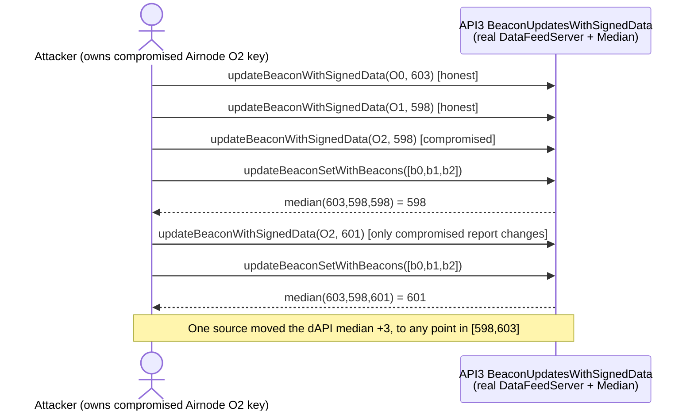

# API3 dAPI median can be moved by one compromised report

> **Vulnerability classes:** vuln/oracle/single-source · vuln/oracle/price-manipulation · vuln/oracle/missing-circuit-breaker
>
> **Reproduction:** the test signs three reports, submits them through the real API3 `BeaconUpdatesWithSignedData` path, and calls the real `DataFeedServer.updateBeaconSetWithBeacons` aggregation. With honest reports of 598 and 603, changing only the third report moves the returned median from 598 to 601. No downstream market is invented.

<!-- non-defihacklabs -->
<!-- source-auditvault: https://github.com/Auditware/AuditVault/blob/main/findings/17624-compromise-of-a-single-oracle-enables-limited-control-of-the.md -->
<!-- date: 2022-03 -->

## Key info

| Field | Value |
|---|---|
| **Observed effect** | With two honest reports fixed at 598 and 603, one report can select any median inside that interval. |
| **Vulnerable implementation** | API3 `BeaconUpdatesWithSignedData` → `DataFeedServer.aggregateBeacons` → `Median.median` in [src/api3-server-v1](src/api3-server-v1). |
| **Harness** | `BeaconSetHarness` in the test adds only read/ID helpers to the exact API3 server base. |
| **Attack transaction** | `PoC_17624.test_one_compromised_oracle_moves_exact_dapi_median()` |
| **Chain / block / date** | Ethereum-compatible execution · local Foundry · 2022-03 report |
| **Compiler** | Solidity `0.8.17` (the vendored API3 source pragma) |
| **Bug class** | Median aggregation has no protection against a partially compromised oracle set. |

## TL;DR

For three values, the median is the middle ordered value. If two honest
oracles report 598 and 603, a compromised third oracle can report 598, 601,
603, or any value in between, and the exact API3 median follows it. A
downstream protocol that treats the dAPI result as an executable spot price
must add its own deviation, freshness, or circuit-breaker controls; this POC
deliberately stops at the real aggregation boundary instead of adding a
downstream protocol that is absent from the report.

## Source used by the test

The test uses the API3 `airnode-protocol-v1` source tree, including the real
signed-update and aggregation contracts:

- [BeaconUpdatesWithSignedData.sol](src/api3-server-v1/BeaconUpdatesWithSignedData.sol)
- [DataFeedServer.sol](src/api3-server-v1/DataFeedServer.sol)
- [Median.sol](src/api3-server-v1/aggregation/Median.sol)
- [QuickSelect.sol](src/api3-server-v1/aggregation/QuickSelect.sol)
- [Sort.sol](src/api3-server-v1/aggregation/Sort.sol)
- [ExtendedSelfMulticall.sol](src/utils/ExtendedSelfMulticall.sol)

The test-only `BeaconSetHarness` exposes the inherited data-feed read and ID
derivation helpers; all report authentication, storage updates, beacon-set
aggregation, sorting, and median selection execute from the vendored source.

## Vulnerable code path

The exact implementation sorts short arrays and returns the middle element:

```solidity
if (arrayLength <= MAX_SORT_LENGTH) {
    sort(array);
    if (arrayLength % 2 == 1) {
        return array[arrayLength / 2];
    }
}
```

`DataFeedServer.aggregateBeacons` reads each stored beacon, builds the value
array, and returns `int224(median(values))` for the beacon set. The signed
update entry point authenticates each Airnode report before writing that
stored value.

There is no quorum or deviation check in this aggregation operation. The
authentication and update plumbing around the server determines who may
submit each report, but once one report is controlled, the median itself
provides no further partial-compromise resistance.

## Reproduction walkthrough

1. Sign and submit real beacon updates for values 603, 598, and 598 through
   `updateBeaconWithSignedData`.
2. Call `updateBeaconSetWithBeacons`; the exact server stores median 598.
3. Sign one newer update for the compromised third Airnode with value 601 and
   aggregate the same beacon set again. The exact server now stores 601 while
   both honest reports remain unchanged.
4. The test asserts the exact three-unit shift and does not model a market,
   attacker balance, or profit number that is not present in the report.

## Impact and remediation

Any consumer that prices collateral, swaps, or liquidations directly from
this value can be operated at a value selected by one compromised source
within the honest range. API3's report recommends monitoring for suspicious
movement and making dAPI computations robust to partial compromise. Consumers
should additionally enforce source quorum, freshness, and maximum-deviation
checks appropriate to their risk.

## Attack sequence



## How to reproduce

```bash
cd evm-hack-registry
_shared/run-poc/run_poc.sh 17624-compromise-of-a-single-oracle-enables-limited-control-of-the_exp -vvvvv
```

## Sources

- [AuditVault finding #17624](https://github.com/Auditware/AuditVault/blob/main/findings/17624-compromise-of-a-single-oracle-enables-limited-control-of-the.md)
- [Trail of Bits API3 Security Assessment (March 30, 2022)](https://github.com/trailofbits/publications/blob/master/reviews/API3.pdf)
- [API3 Airnode protocol source](https://github.com/api3dao/airnode-protocol-v1)
- [Real-source Forge test](test/17624-compromise-of-a-single-oracle-enables-limited-control-of-the_exp.sol)
