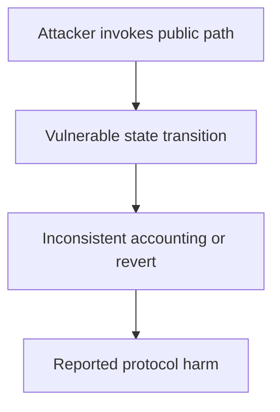

# DeGate — arbitrary token integration can lock deposits

<!-- non-defihacklabs -->
<!-- source-auditvault: https://github.com/Auditware/AuditVault/blob/main/findings/17856-token-management-diculties-caused-by-the-addition-of-arbitra.md -->
<!-- date: 2022-11 -->

> **Vulnerability classes:** vuln/input-validation/missing · vuln/logic/state-update · vuln/dos/frozen-funds

> **Reproduction:** Fully local synthetic; run [forge test](.) and inspect [output.txt](output.txt). The Playground bundle replays the same 17856-degate-arbitrary-token-balance-check invariant.

## Key info

| Field | Value |
| --- | --- |
| Loss | A deflationary-token deposit is over-credited and cannot be withdrawn |
| Vulnerable contract | ExchangeV3 (reconstructed) |
| Attacker EOA | 0x1111111111111111111111111111111111111111 (synthetic caller) |
| Attack contract | [Exploit](test/17856-degate-arbitrary-token-balance-check.sol) |
| Attack tx | Local `Exploit.run()` call (no historical transaction) |
| Chain · block · date | Ethereum · local stub 0x1181d03 · 2022-11 |
| Compiler | Solidity 0.8.35 (pragma ^0.8.24) |
| Bug class | vuln/input-validation/missing · vuln/logic/state-update · vuln/dos/frozen-funds |

## TL;DR

Any user can add a token before its special balance check is enabled. A 10% deflationary transfer credits 100 while only 90 arrives, leaving the credited withdrawal permanently under-collateralized.

## Background

AuditVault finding [17856-degate-arbitrary-token-balance-check](https://github.com/Auditware/AuditVault/blob/main/findings/17856-token-management-diculties-caused-by-the-addition-of-arbitra.md) is an audit-time issue rather than a historical exploit. This write-up reduces the report to one state transition and keeps the claimed harm assertion executable offline.

## The vulnerable code

The minimized source is explicitly marked **RECONSTRUCTED** and preserves the report's blamed operation with an `@> VULN` marker in [test/17856-degate-arbitrary-token-balance-check.sol](test/17856-degate-arbitrary-token-balance-check.sol). It is byte-identical to the Playground synthetic source. No verified production source was available in this local checkout.

## Root cause

Token integration is permissionless but the checkBalance flag defaults false; accounting trusts nominal amount rather than received balance.

## Preconditions

The affected protocol path is deployed; the attacker can reach the public operation described in the report. The synthetic removes unrelated integrations while preserving the state and authorization assumptions required for the finding.

## Attack walkthrough

1. Add an arbitrary token, deposit 100 (90 received), then attempt withdrawal of 100 and observe the locked balance.
2. The `run()` method requires the broken invariant and sets `confirmed`; the Forge trace records a passing test at [output.txt:355](output.txt).
3. The remediation is to validate the accounting/state transition before accepting the external call or to consume the one-time state.

## Diagrams



## Remediation

Validate external addresses and returned balances before updating state, and make each one-time transition explicit. Add invariant tests covering zero/deflationary/epoch-boundary inputs.

## How to reproduce

```bash
cd 17856-degate-arbitrary-token-balance-check_exp
forge test -vvv
```

The browser replay uses `scripts/poc-configs/17856-degate-arbitrary-token-balance-check.mjs` and the same local-deploy `Exploit` contract.

## Sources

- [AuditVault finding](https://github.com/Auditware/AuditVault/blob/main/findings/17856-token-management-diculties-caused-by-the-addition-of-arbitra.md)
- [Trail of Bits report](https://github.com/trailofbits/publications/blob/master/reviews/DeGate.pdf)
- Reduced local source: [test/17856-degate-arbitrary-token-balance-check.sol](test/17856-degate-arbitrary-token-balance-check.sol)
- Forge regression: [test/17856-degate-arbitrary-token-balance-check_exp.sol](test/17856-degate-arbitrary-token-balance-check_exp.sol)

