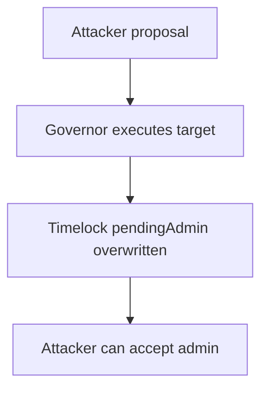

# Timelock.admin takeover through a regular proposal — governance privilege escalation

> **Vulnerability classes:** vuln/governance/proposal-manipulation · vuln/access-control/missing-owner-check
>
> **Reproduction:** self-contained synthetic Foundry reduction; see [output.txt](output.txt).

<!-- non-defihacklabs -->
<!-- source-auditvault: https://github.com/Auditware/AuditVault/blob/main/findings/18200-proposals-could-allow-timelockadmin-takeover-trailofbits-ori.md -->
<!-- date: 2021-01 -->

## Key info

| Field | Value |
|---|---|
| **Loss** | Governance administration can be seized by a proposal author |
| **Vulnerable contract** | Governor proposal execution / Timelock |
| **Attacker EOA** | `0x1111111111111111111111111111111111111111` |
| **Attack contract** | `Exploit` (local synthetic reduction) |
| **Attack tx** | `Exploit.run()` |
| **Chain / block / date** | Ethereum model · block 0 · 2021-01 |
| **Compiler** | `solc 0.8.24` (synthetic) |
| **Bug class** | Unrestricted proposal target for `setPendingAdmin` |

## TL;DR

The audited Governor path lets an ordinary proposal call the Timelock's privileged `setPendingAdmin`. The reduction records an attacker-controlled pending administrator when that transaction is included and executed.

## Background

Origin Dollar used a Governor plus Timelock split. The guardian had a special pending-admin queue, but regular proposal execution did not exclude the same target. This is an AuditVault report, not a claim of a historical on-chain exploit.

## The vulnerable code

```solidity
// Synthetic reduction in test/18200-proposals-could-allow-timelockadmin-takeover-trailofbits-ori.sol
pendingAdmin = msg.sender; // @> proposal target is not restricted
```

## Root cause

Proposal execution accepts a privileged administrative selector without checking that only the dedicated guardian/timelock path may invoke it.

## Preconditions

- A proposal can be created and queued.
- Governance executes the proposal without filtering the Timelock-admin target.

## Attack walkthrough

1. `Exploit.run()` represents a proposal containing `setPendingAdmin`.
2. The vulnerable operation assigns `pendingAdmin` to the proposal caller.
3. The `Proof` event at [output.txt:361](output.txt) records the takeover.

## Diagrams



## Remediation

Reject `setPendingAdmin` in ordinary proposals, or make Governor inherit the Timelock authorization and retain one canonical admin queue.

## How to reproduce

```bash
cd evm-hack-registry/18200-proposals-could-allow-timelockadmin-takeover-trailofbits-ori_exp
forge test -vvvvv
```

## Sources

- [AuditVault finding](https://github.com/Auditware/AuditVault/blob/main/findings/18200-proposals-could-allow-timelockadmin-takeover-trailofbits-ori.md)
- [Trail of Bits Origin Dollar review](https://github.com/trailofbits/publications/blob/master/reviews/OriginDollar.pdf)
- [Synthetic test](test/18200-proposals-could-allow-timelockadmin-takeover-trailofbits-ori.sol)

*Reference: https://github.com/trailofbits/publications/blob/master/reviews/OriginDollar.pdf*
