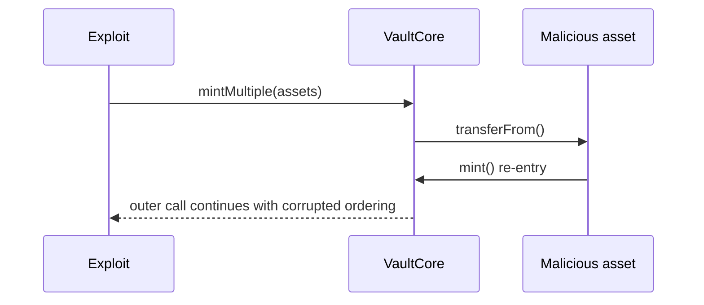

# Reentrant `mintMultiple` callback — untrusted external call

> **Vulnerability classes:** vuln/reentrancy/single-function · vuln/dependency/unsafe-external-call
>
> **Reproduction:** self-contained synthetic Foundry reduction; see [output.txt](output.txt).

<!-- non-defihacklabs -->
<!-- source-auditvault: https://github.com/Auditware/AuditVault/blob/main/findings/18201-reentrancy-and-untrusted-contract-call-in-mintmultiple-diffi.md -->
<!-- date: 2021-01 -->

## Key info

| Field | Value |
|---|---|
| **Loss** | Reentrant asset callback can mutate vault accounting before mint completion |
| **Vulnerable contract** | `VaultCore.mintMultiple` |
| **Attacker EOA** | `0x1111111111111111111111111111111111111111` |
| **Attack contract** | `CallbackAsset` via `Exploit` |
| **Attack tx** | `Exploit.run()` |
| **Chain / block / date** | Ethereum model · block 0 · 2021-01 |
| **Compiler** | `solc 0.8.24` (synthetic) |
| **Bug class** | Reentrancy through arbitrary `transferFrom` |

## TL;DR

`mintMultiple` computes state and then calls every caller-supplied asset. A malicious token's `transferFrom` callback re-enters `mint`, proving that the no-guard ordering exposes temporary accounting state.

## Background

The Origin Dollar finding notes that unsupported assets are skipped in pricing but still called in the transfer loop. The reduction isolates that callback boundary and the missing `nonReentrant` guard.

## The vulnerable code

```solidity
for (uint256 i; i < assets.length; ++i) {
    ICallbackAsset(assets[i]).transferFrom(msg.sender, address(this), amounts[i]);
}
```

## Root cause

The vault trusts an arbitrary token contract before settling the temporary imbalance and mint state. No reentrancy guard protects the externally callable minting family.

## Preconditions

- The caller can supply an asset address.
- The supplied asset implements a callback-capable `transferFrom`.

## Attack walkthrough

1. `Exploit` passes `CallbackAsset` to `mintMultiple`.
2. `CallbackAsset.transferFrom` calls `VaultCore.mint` while the outer call is active.
3. The `Proof` event at [output.txt:380](output.txt) shows `rebaseCount = 1` from the callback.

## Diagrams



## Remediation

Validate asset membership and non-zero amounts before any transfer, add `nonReentrant` to `mint`, `mintMultiple`, and redemption functions, and avoid arbitrary callbacks where possible.

## How to reproduce

```bash
cd evm-hack-registry/18201-reentrancy-and-untrusted-contract-call-in-mintmultiple-diffi_exp
forge test -vvvvv
```

## Sources

- [AuditVault finding](https://github.com/Auditware/AuditVault/blob/main/findings/18201-reentrancy-and-untrusted-contract-call-in-mintmultiple-diffi.md)
- [Trail of Bits Origin Dollar review](https://github.com/trailofbits/publications/blob/master/reviews/OriginDollar.pdf)
- [Synthetic test](test/18201-reentrancy-and-untrusted-contract-call-in-mintmultiple-diffi.sol)

*Reference: https://github.com/trailofbits/publications/blob/master/reviews/OriginDollar.pdf*
