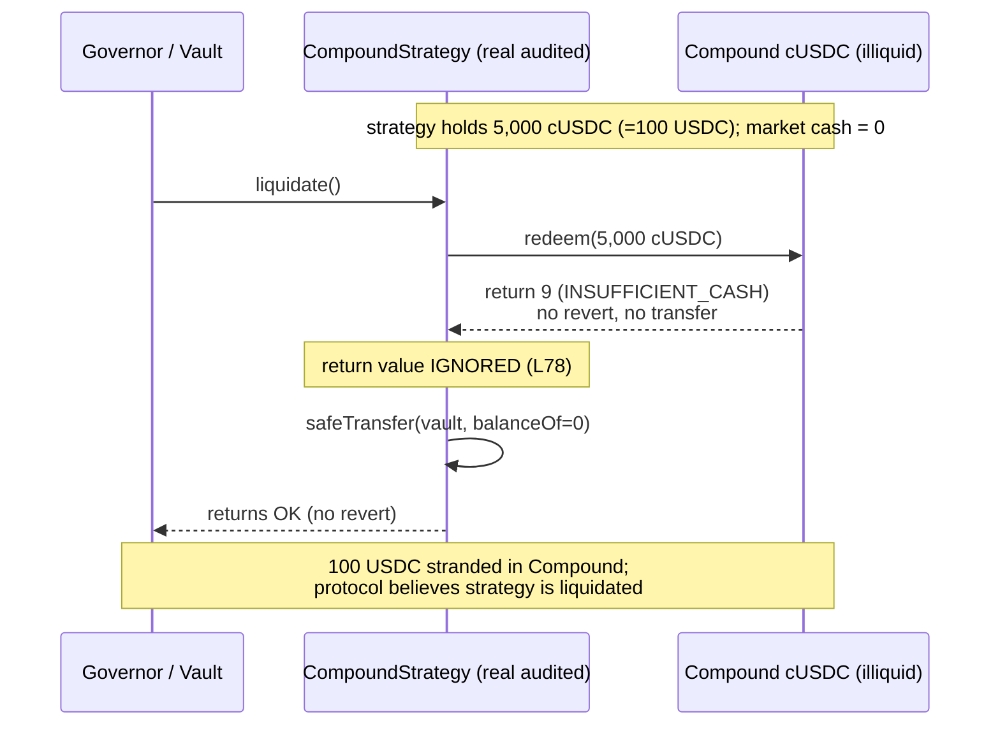

<!-- source-auditvault: 18210-lack-of-return-value-checks-can-lead-to-unexpected-results-t.md -->
# Origin Dollar (OUSD): `CompoundStrategy.liquidate()` ignores Compound's redeem error code

Trail of Bits finding **TOB-OUSD-019** ("Lack of return value checks can lead to
unexpected results"). This PoC deploys the **real audited Origin Dollar source**
and drives the real exploit path end-to-end in an empty local genesis.

## Root cause

`CompoundStrategy.liquidate()` redeems the strategy's entire cToken balance back to
the underlying asset, but **discards the return value** of `cToken.redeem`:

```solidity
// src/strategies/CompoundStrategy.sol  (audited commit 06ed1650, liquidate L73-L87)
function liquidate() external onlyVaultOrGovernor {
    for (uint256 i = 0; i < assetsMapped.length; i++) {
        ICERC20 cToken = _getCTokenFor(assetsMapped[i]);
        if (cToken.balanceOf(address(this)) > 0) {
            cToken.redeem(cToken.balanceOf(address(this)));   // <-- return value IGNORED (L78)
            IERC20 asset = IERC20(assetsMapped[i]);
            asset.safeTransfer(vaultAddress, asset.balanceOf(address(this)));
        }
    }
}
```

Compound's `cToken.redeem` is documented to return `0` on success and a **non-zero
error code otherwise** (see `ICompound.ICERC20.redeem`), and it **does not revert**
when a redemption fails (e.g. `TOKEN_INSUFFICIENT_CASH = 9` when a highly-utilised
market has no cash to pay out). Because the strategy never checks the code, a
**failed redemption is silently treated as success**: `liquidate()` runs to
completion without reverting while `0` underlying is actually withdrawn, then
transfers the strategy's (unchanged, `0`) underlying balance to the Vault. The
funds stay stranded in Compound while the caller is told the strategy was emptied.

## The exploit (real numbers)

1. The strategy invests **100 USDC** into Compound → it holds **5,000 cUSDC**
   (`100e6 * 1e18 / 2e14`), Compound holds 100 USDC of cash.
2. The Compound market becomes illiquid — a borrower draws out all 100 USDC of cash
   (a normal, common state for a 100%-utilised money market).
3. The Governor calls `liquidate()` to pull all funds back to the Vault.
4. `cToken.redeem(5000e8)` finds insufficient cash and returns error code **9**,
   **without reverting** and **without transferring** anything.
5. The strategy ignores the code and reports success.

**Harm asserted (with numbers):**

| Quantity | Value |
|---|---|
| `cToken.redeem` return code | **9** (INSUFFICIENT_CASH) — a failure, ignored |
| `liquidate()` outcome | **succeeds / does not revert** |
| USDC delivered to the Vault | **0** (of the expected 100) |
| cUSDC left stranded in the strategy | **5,000 cUSDC = 100 USDC** |
| `strategy.checkBalance(USDC)` after "liquidation" | **100e6** (funds still there) |

A fixed `liquidate()` (`require(cToken.redeem(...) == 0, "Redeem failed")`, shipped
in commit `ed83f5d6`) would instead **revert** and surface the failure, preventing
the protocol from treating the illiquid strategy as emptied.

## Sequence



## Reproduce

```bash
_shared/run-poc/run_poc.sh 18210-lack-of-return-value-checks-can-lead-to-unexpected-results-t_exp -vvvvv
```

The real audited contracts deployed by the test:
`src/strategies/CompoundStrategy.sol`, `src/utils/InitializableAbstractStrategy.sol`,
`src/governance/Governable.sol`, `src/strategies/ICompound.sol` — copied verbatim
from Origin Dollar commit
[`06ed1650`](https://github.com/OriginProtocol/origin-dollar/blob/06ed1650124d675490c79a9ef0d4dce53e982ff2/contracts/contracts/strategies/CompoundStrategy.sol)
(the ToB-audited version; the fix is
[`ed83f5d6`](https://github.com/OriginProtocol/origin-dollar/commit/ed83f5d637cfb3cbd17f6faa250c2339e0fc0c7b)).
Only the external Compound cToken (faithful error-code semantics) and the opaque
USDC ERC20 are minimal stand-ins.

Sources: [Origin Dollar review (Trail of Bits)](https://github.com/trailofbits/publications/blob/master/reviews/OriginDollar.pdf), [AuditVault finding #18210](https://github.com/Auditware/AuditVault/blob/main/findings/18210-lack-of-return-value-checks-can-lead-to-unexpected-results-t.md).
