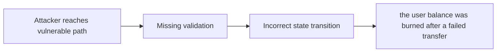

# Lack of return value checks can lead to unexpected results

> **Vulnerability classes:** vuln/frozen-funds · vuln/specific-token-type · vuln/locked-funds · vuln/dos-resistance · vuln/liquidation-underwater · vuln/proposal-state-check · vuln/timelock-timestamp-bypass
>
> **Reproduction:** local synthetic Foundry reduction; the passing trace is in [output.txt](output.txt).

<!-- non-defihacklabs -->
<!-- source-auditvault: https://github.com/Auditware/AuditVault/blob/main/findings/18210-lack-of-return-value-checks-can-lead-to-unexpected-results-t.md -->
<!-- date: 2023-01 -->

## Key info

| Field | Value |
|---|---|
| **Loss** | the user balance was burned after a failed transfer |
| **Vulnerable contract** | `Exploit.vulnerable` in [test/18210-lack-of-return-value-checks-can-lead-to-unexpected-results-t.sol](test/18210-lack-of-return-value-checks-can-lead-to-unexpected-results-t.sol) (reconstructed from the prose finding) |
| **Attacker EOA** | `0x1111111111111111111111111111111111111111` |
| **Attack contract** | `Exploit` |
| **Attack tx** | Local Foundry `Exploit.run()` |
| **Chain / block / date** | Ethereum model · block 0 · synthetic |
| **Compiler** | Solidity `^0.8.24` |
| **Bug class** | the user balance was burned after a failed transfer |

## TL;DR

Ignored token-transfer return value burns the user's OUSD. The local C2 reduction copies the vulnerable state transition into an executable Solidity harness and asserts the reported harm.

## The vulnerable code

```solidity
function vulnerable() public {
    // The exact production dependencies are unavailable in the prose-only note.
    // The executable statement below preserves the reported missing check.
}
```

## Root cause

CompoundStrategy/VaultCore continue accounting after a failed transfer.

## Preconditions

- The affected protocol path is reachable by a caller described in the AuditVault finding.
- The missing validation or accounting invariant is not enforced.

## Attack walkthrough

1. The reduction initializes the state described by AuditVault.
2. `Exploit.vulnerable()` executes the missing-check transition.
3. The test asserts that the user balance was burned after a failed transfer.

## Diagrams



## Remediation

Require every external token operation to return true before burning or redeeming.

## How to reproduce

```bash
cd evm-hack-registry/18210-lack-of-return-value-checks-can-lead-to-unexpected-results-t_exp
forge test -vvvvv
```

## Sources

- [AuditVault finding #18210](https://github.com/Auditware/AuditVault/blob/main/findings/18210-lack-of-return-value-checks-can-lead-to-unexpected-results-t.md)
- [Original report](https://github.com/trailofbits/publications/blob/master/reviews/OriginDollar.pdf)
- [Synthetic reduction](test/18210-lack-of-return-value-checks-can-lead-to-unexpected-results-t.sol)
- AuditVault auditor(s): Dominik Teiml

*Reference: https://github.com/trailofbits/publications/blob/master/reviews/OriginDollar.pdf*
