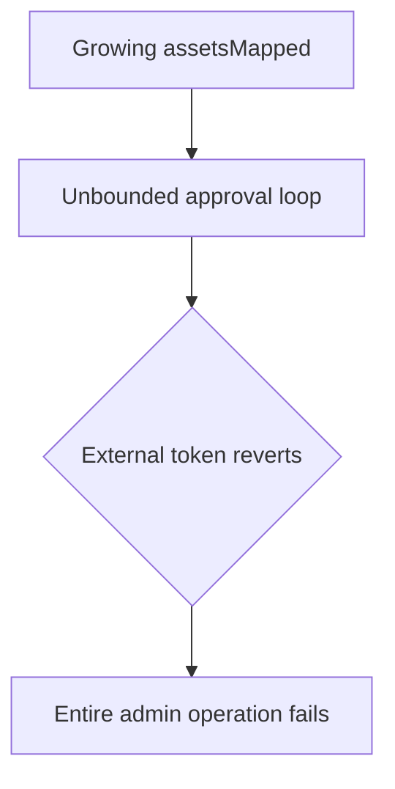

# Unbounded external loops can permanently DoS administration — gas-limit denial of service

> **Vulnerability classes:** vuln/dos/unbounded-loop · vuln/dependency/unsafe-external-call
>
> **Reproduction:** self-contained synthetic Foundry reduction; see [output.txt](output.txt).

<!-- non-defihacklabs -->
<!-- source-auditvault: https://github.com/Auditware/AuditVault/blob/main/findings/18211-external-calls-in-loop-can-lead-to-denial-of-service-trailof.md -->
<!-- date: 2021-01 -->

## Key info

| Field | Value |
|---|---|
| **Loss** | Asset approval/liquidation administration becomes uncallable |
| **Vulnerable contract** | `AaveStrategy.safeApproveAllTokens` |
| **Attacker EOA** | `0x1111111111111111111111111111111111111111` |
| **Attack contract** | `FailingAsset` via `Exploit` |
| **Attack tx** | `Exploit.run()` |
| **Chain / block / date** | Ethereum model · block 0 · 2021-01 |
| **Compiler** | `solc 0.8.24` (synthetic) |
| **Bug class** | Unbounded loop over external token calls |

## TL;DR

An ever-growing `assetsMapped` array is traversed with external approvals. One paused/reverting token traps the whole operation; in production, array growth alone can exceed the gas limit.

## Background

The Origin Dollar review identifies this pattern in AaveStrategy and several other contracts. The reduction models the first failing asset and captures the resulting denial of service.

## The vulnerable code

```solidity
for (uint256 i; i < assetsMapped.length; ++i) {
    IApprover(assetsMapped[i]).approve(address(this), type(uint256).max);
}
```

## Root cause

There is no bounded iteration, removal path, or per-item failure handling for an externally controlled, unbounded list.

## Preconditions

- The mapped asset list can grow over time.
- At least one asset can revert or the loop can exceed the block gas limit.

## Attack walkthrough

1. `Exploit` adds a healthy and a paused `FailingAsset`.
2. `safeApproveAllTokens` reaches the paused token and reverts.
3. The `Proof` event at [output.txt:385](output.txt) records the failed administrative call.

## Diagrams



## Remediation

Process bounded slices, permit removal/compaction, and isolate per-asset failures. Avoid requiring one transaction to call every external token.

## How to reproduce

```bash
cd evm-hack-registry/18211-external-calls-in-loop-can-lead-to-denial-of-service-trailof_exp
forge test -vvvvv
```

## Sources

- [AuditVault finding](https://github.com/Auditware/AuditVault/blob/main/findings/18211-external-calls-in-loop-can-lead-to-denial-of-service-trailof.md)
- [Trail of Bits Origin Dollar review](https://github.com/trailofbits/publications/blob/master/reviews/OriginDollar.pdf)
- [Synthetic test](test/18211-external-calls-in-loop-can-lead-to-denial-of-service-trailof.sol)

*Reference: https://github.com/trailofbits/publications/blob/master/reviews/OriginDollar.pdf*
