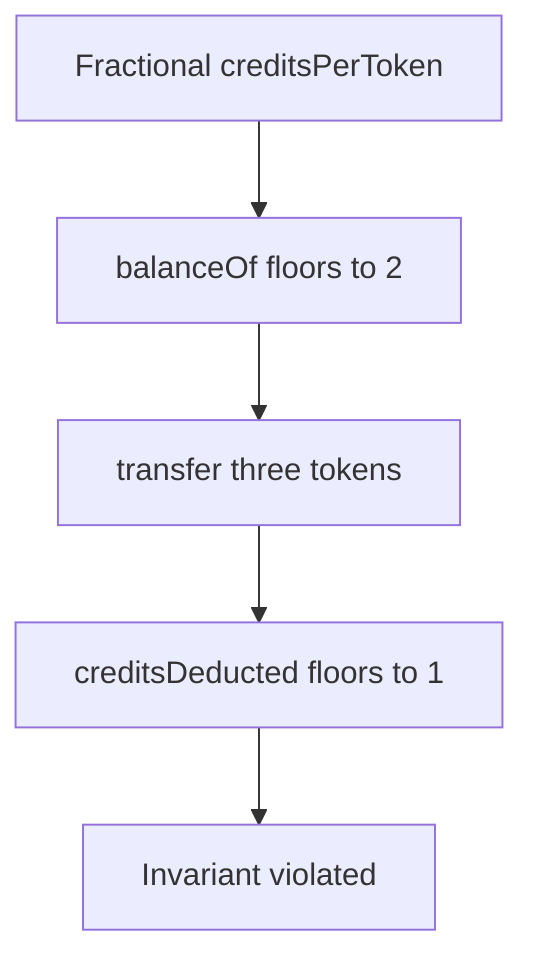

# OUSD can transfer more than the displayed balance — rounding/precision loss

> **Vulnerability classes:** vuln/arithmetic/rounding · vuln/arithmetic/precision-loss · vuln/logic/missing-check
>
> **Reproduction:** self-contained synthetic Foundry reduction; see [output.txt](output.txt).

<!-- non-defihacklabs -->
<!-- source-auditvault: https://github.com/Auditware/AuditVault/blob/main/findings/18213-ousd-allows-users-to-transfer-more-tokens-than-expected-trai.md -->
<!-- date: 2021-01 -->

## Key info

| Field | Value |
|---|---|
| **Loss** | A holder can transfer one token more than `balanceOf` reports |
| **Vulnerable contract** | `OUSD._executeTransfer` |
| **Attacker EOA** | `0x1111111111111111111111111111111111111111` |
| **Attack contract** | `OUSD` via `Exploit` |
| **Attack tx** | `Exploit.run()` |
| **Chain / block / date** | Ethereum model · block 0 · 2021-01 |
| **Compiler** | `solc 0.8.24` (synthetic) |
| **Bug class** | Rounded credit deduction without a pre-balance check |

## TL;DR

Rebasing credits can make the token-facing balance larger than the credit deduction for a transfer. Flooring `creditsDeducted` before validating the token amount lets a three-token transfer succeed when only two tokens are visible.

## Background

The AuditVault sequence changes supply and mints across users before exercising the transfer invariant. This local reduction uses the same credit/token rounding relationship without claiming a live exploit.

## The vulnerable code

```solidity
uint256 creditsDeducted = value * creditsPerToken / 1e18; // @> floors first
creditBalances[msg.sender] -= creditsDeducted;
```

## Root cause

The implementation validates only the rounded credit amount, not the exact token balance that users and integrations observe.

## Preconditions

- `creditsPerToken` is fractional due to rebasing.
- The caller can transfer through the credit-based ERC-20 path.

## Attack walkthrough

1. The synthetic state gives the attacker one credit at `0.5` credits/token, displaying two tokens.
2. `transfer` sends three tokens while deducting one credit.
3. The `Proof` event at [output.txt:377](output.txt) captures the over-balance transfer.

## Diagrams



## Remediation

Check the exact token balance before credit arithmetic, use a rounding direction that cannot undercharge, and test transfer invariants with property-based fuzzing.

## How to reproduce

```bash
cd evm-hack-registry/18213-ousd-allows-users-to-transfer-more-tokens-than-expected-trai_exp
forge test -vvvvv
```

## Sources

- [AuditVault finding](https://github.com/Auditware/AuditVault/blob/main/findings/18213-ousd-allows-users-to-transfer-more-tokens-than-expected-trai.md)
- [Trail of Bits Origin Dollar review](https://github.com/trailofbits/publications/blob/master/reviews/OriginDollar.pdf)
- [Synthetic test](test/18213-ousd-allows-users-to-transfer-more-tokens-than-expected-trai.sol)

*Reference: https://github.com/trailofbits/publications/blob/master/reviews/OriginDollar.pdf*
