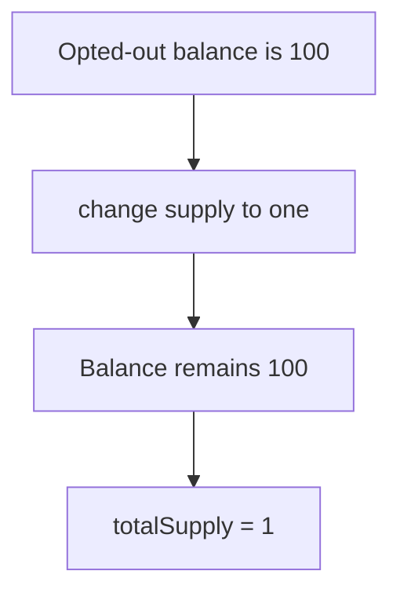

# OUSD total supply can fall below user balances — broken rebasing invariant

> **Vulnerability classes:** vuln/logic/wrong-condition · vuln/arithmetic/rounding
>
> **Reproduction:** self-contained synthetic Foundry reduction; see [output.txt](output.txt).

<!-- non-defihacklabs -->
<!-- source-auditvault: https://github.com/Auditware/AuditVault/blob/main/findings/18214-ousd-total-supply-can-be-arbitrary-even-smaller-than-user-ba.md -->
<!-- date: 2021-01 -->

## Key info

| Field | Value |
|---|---|
| **Loss** | ERC-20 supply accounting becomes inconsistent and can understate claims |
| **Vulnerable contract** | `OUSD.changeSupply` / rebase opt-out accounting |
| **Attacker EOA** | `0x1111111111111111111111111111111111111111` |
| **Attack contract** | `OUSD` via `Exploit` |
| **Attack tx** | `Exploit.run()` |
| **Chain / block / date** | Ethereum model · block 0 · 2021-01 |
| **Compiler** | `solc 0.8.24` (synthetic) |
| **Bug class** | Supply update does not reconcile non-rebasing balances |

## TL;DR

An opted-out account keeps its balance while `changeSupply` lowers the aggregate total. The common `balanceOf(x) <= totalSupply()` invariant is immediately false.

## Background

OUSD exposes non-rebasing accounts. The report warns that global supply changes must account for these fixed balances; this PoC isolates the invariant break.

## The vulnerable code

```solidity
totalSupply = newSupply; // @> account balances are not reconciled
```

## Root cause

The supply setter permits an arbitrary lower value without checking the sum of opted-out balances.

## Preconditions

- An account has opted out of rebasing.
- A privileged supply change can lower total supply.

## Attack walkthrough

1. `Exploit` mints a 100-token fixed balance and opts out.
2. `changeSupply(1)` lowers global supply.
3. The `Proof` event at [output.txt:380](output.txt) shows balance `100` versus supply `1`.

## Diagrams



## Remediation

Preserve the supply/balance invariant during rebases, explicitly account for non-rebasing balances, and reject any target supply below outstanding balances.

## How to reproduce

```bash
cd evm-hack-registry/18214-ousd-total-supply-can-be-arbitrary-even-smaller-than-user-ba_exp
forge test -vvvvv
```

## Sources

- [AuditVault finding](https://github.com/Auditware/AuditVault/blob/main/findings/18214-ousd-total-supply-can-be-arbitrary-even-smaller-than-user-ba.md)
- [Trail of Bits Origin Dollar review](https://github.com/trailofbits/publications/blob/master/reviews/OriginDollar.pdf)
- [Synthetic test](test/18214-ousd-total-supply-can-be-arbitrary-even-smaller-than-user-ba.sol)

*Reference: https://github.com/trailofbits/publications/blob/master/reviews/OriginDollar.pdf*
