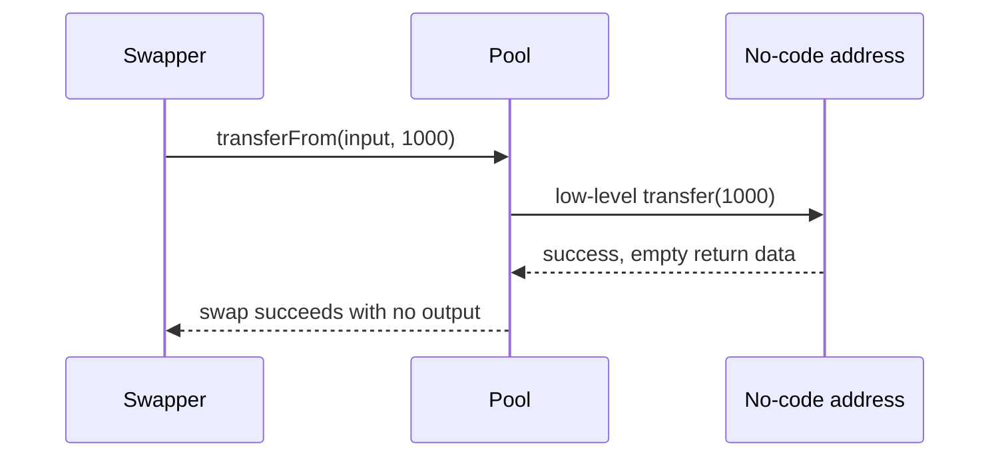

# Pool accepts input when output token has no code — silent transfer failure

> **Vulnerability classes:** vuln/dependency/unchecked-return-value · vuln/input-validation/missing
>
> **Reproduction:** self-contained synthetic Foundry reduction; see [output.txt](output.txt).

<!-- non-defihacklabs -->
<!-- source-auditvault: https://github.com/Auditware/AuditVault/blob/main/findings/18260-transfer-operations-may-silently-fail-due-to-the-lack-of-con.md -->
<!-- date: 2021-02 -->

## Key info

| Field | Value |
|---|---|
| **Loss** | A swapper loses input tokens without receiving output |
| **Vulnerable contract** | `Transfers.safeTransfer` / `safeTransferFrom` |
| **Attacker EOA** | `0x1111111111111111111111111111111111111111` |
| **Attack contract** | `Pool` and `MockToken` via `Exploit` |
| **Attack tx** | `Exploit.run()` |
| **Chain / block / date** | Ethereum model · block 0 · 2021-02 |
| **Compiler** | `solc 0.8.24` (synthetic) |
| **Bug class** | Low-level call lacks contract-existence check |

## TL;DR

Solidity low-level calls to an account with no code return success. The pool therefore accepts 1,000 input tokens while its “output token” call to a non-deployed address moves nothing.

## Background

The Primitive review calls out this exact `Transfers`/`TransferHelper` pattern. The local pool keeps the vulnerable call semantics and makes the loss observable.

## The vulnerable code

```solidity
(bool success, bytes memory data) = token.call(
    abi.encodeWithSignature("transfer(address,uint256)", to, value)
);
require(success && (data.length == 0 || abi.decode(data, (bool))), "Transfer fail");
```

## Root cause

The helper validates only the boolean/return-data convention, not `token.code.length > 0`.

## Preconditions

- The pool can be configured with a destroyed or not-yet-deployed token address.
- A swap transfers input before attempting the output transfer.

## Attack walkthrough

1. `Exploit` mints 1,000 input tokens and swaps to address `0xBEEF`.
2. The nonexistent output call returns success with empty data.
3. The `Proof` event at [output.txt:380](output.txt) shows 1,000 input tokens in the pool and zero output.

## Diagrams



## Remediation

Require `token.code.length > 0` before low-level calls, use vetted `SafeERC20`, and atomically validate both token addresses before taking input.

## How to reproduce

```bash
cd evm-hack-registry/18260-transfer-operations-may-silently-fail-due-to-the-lack-of-con_exp
forge test -vvvvv
```

## Sources

- [AuditVault finding](https://github.com/Auditware/AuditVault/blob/main/findings/18260-transfer-operations-may-silently-fail-due-to-the-lack-of-con.md)
- [Trail of Bits Primitive review](https://github.com/trailofbits/publications/blob/master/reviews/Primitive.pdf)
- [Synthetic test](test/18260-transfer-operations-may-silently-fail-due-to-the-lack-of-con.sol)

*Reference: https://github.com/trailofbits/publications/blob/master/reviews/Primitive.pdf*
