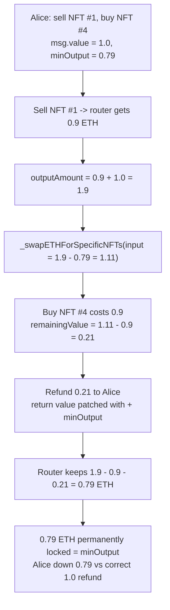
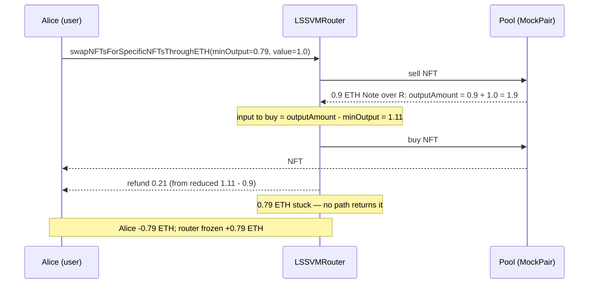

# Sudoswap LSSVMRouter — specified `minOutput` remains locked in the router

> **Vulnerability classes:** vuln/dos/frozen-funds · vuln/logic/refund-miscalculation · impact/loss-of-funds/locked-funds
>
> **AuditVault taxonomy:** `lang/solidity` · `sector/dex` · `sector/nft` · `sector/nft-marketplace` · `platform/cyfrin` · `severity/high` · `vuln/dos/frozen-funds` · `impact/loss-of-funds/locked-funds` · `novelty/variant`
> **Genome:** `frozen-funds` · `locked-funds` · `variant` · `dos-resistance` · `fot-slippage` · `integer-bounds`

> **Reproduction:** a self-contained Foundry PoC that compiles & runs in an
> isolated project with **only `forge-std`** — no fork, no RPC, no cheatcodes.
> Full trace: [output.txt](output.txt). Synthetic:
> [test/18411-specified-minoutput-will-remain-locked-in-lssvmrouterswapnft.sol](test/18411-specified-minoutput-will-remain-locked-in-lssvmrouterswapnft.sol)
> · Driver: [test/18411-specified-minoutput-will-remain-locked-in-lssvmrouterswapnft_exp.sol](test/18411-specified-minoutput-will-remain-locked-in-lssvmrouterswapnft_exp.sol).

<!-- non-defihacklabs -->
<!-- source-auditvault: https://github.com/Auditware/AuditVault/blob/main/findings/18411-specified-minoutput-will-remain-locked-in-lssvmrouterswapnft.md -->
<!-- date: 2023-06 -->

---

## Key info

| | |
|---|---|
| **Impact** | **HIGH** — a user who protects a NFT-for-specific-NFT swap with a non-zero `minOutput` has exactly that amount of ETH permanently stranded in the router; the higher the slippage floor, the more is lost |
| **Protocol** | [Sudoswap](https://sudoswap.xyz) `lssvm2` — NFT AMM router (`LSSVMRouter`) |
| **Vulnerable code** | `LSSVMRouter.swapNFTsForSpecificNFTsThroughETH` — `outputAmount - minOutput` passed as the ETH→NFT input, combined with `_swapETHForSpecificNFTs` refunding from that already-reduced amount |
| **Bug class** | Refund miscalculation → frozen funds: `minOutput` is deducted from the amount used to buy NFTs, then never added back into the refund |
| **Finding** | Cyfrin — Sudoswap review, 2023-06 · #18411 · reporter **Hans** |
| **Report** | [2023-06-01-Sudoswap.md](https://github.com/solodit/solodit_content/blob/main/reports/Cyfrin/2023-06-01-Sudoswap.md) |
| **Source** | [AuditVault](https://github.com/Auditware/AuditVault/blob/main/findings/18411-specified-minoutput-will-remain-locked-in-lssvmrouterswapnft.md) |
| **Status** | Audit finding on a live-on-mainnet router (`0x2b2e…8329`); the affected functions were never wired to the Sudoswap UI, reducing likelihood. Reproduced here as a standalone local PoC. |
| **Compiler** | `^0.8.24` (PoC) |

This is an **audit finding**, not a historical on-chain incident. The PoC keeps the
vulnerable `outputAmount - minOutput` deduction and the refund-based-on-the-reduced-
input logic verbatim, and models native ETH as a WETH ERC20 so the stranded value is
a directly measurable balance (the browser EVM has no Foundry cheatcodes to mint
native ETH).

---

## TL;DR

1. `swapNFTsForSpecificNFTsThroughETH` sells the user's NFTs for ETH, then uses that
   ETH (plus `msg.value`) to buy the specific NFTs the user wants.
2. For the ETH→NFT half it passes **`outputAmount - minOutput`** as the input amount,
   i.e. it holds back `minOutput` from the money used to buy NFTs.
3. The internal `_swapETHForSpecificNFTs` seeds `remainingValue = inputAmount` (the
   already-reduced figure), subtracts the purchase cost, and **refunds `remainingValue`**.
   Because it was seeded from the reduced input, the held-back `minOutput` is *not* in
   the refund.
4. The function's return value is patched with `+ minOutput` so the caller *thinks* it
   got `minOutput` back — but no ETH transfer for that slice ever happens.
5. Result: exactly `minOutput` of ETH stays in the router with **no code path to
   retrieve it** — permanently locked. A user setting a 0.79 ETH slippage floor loses
   0.79 ETH even though the swap "succeeds".

---

## The vulnerable code

The `minOutput` deduction (verbatim, `LSSVMRouter.swapNFTsForSpecificNFTsThroughETH`):

```solidity
// Swap ETH for specific NFTs
// cost <= inputValue = outputAmount - minOutput, so outputAmount' = (outputAmount - minOutput - cost) + minOutput >= minOutput
outputAmount = _swapETHForSpecificNFTs(
    trade.tokenToNFTTrades, outputAmount - minOutput, ethRecipient, nftRecipient  // @> minOutput held back from the buy input
) + minOutput;                                                                    //    return value patched, but no ETH follows
```

The refund, computed from the **already-reduced** input (verbatim, `_swapETHForSpecificNFTs`):

```solidity
remainingValue = inputAmount;               // == outputAmount - minOutput
...
remainingValue -= pairCost;                 // subtract the purchase cost
...
// Return remaining value to sender
if (remainingValue > 0) {
    ethRecipient.safeTransferETH(remainingValue);   // minOutput was never in here
}
```

The `+ minOutput` on the return value is a bookkeeping fiction: it inflates the reported
`outputAmount` but is never backed by a transfer, so the ETH physically remains in the
router.

---

## Root cause

`minOutput` is an *aggregate slippage floor* — the minimum surplus ETH the user expects
to keep. The router treats it as if subtracting it from the buy budget and then adding
it back to the return value were value-preserving. It is not: the subtraction happens on
the money that gets **spent/refunded**, while the addition happens only on a **return
value**, never on an actual ETH movement. The slippage floor therefore becomes a
withdrawal that has no matching payout — funds freeze in the router.

## Preconditions

- A user calls `swapNFTsForSpecificNFTsThroughETH` (or `…ForAnyNFTsThroughETH`) with a
  non-zero `minOutput` — the natural, self-protective thing to do.
- The combined input `outputAmount - minOutput` is still large enough to cover the
  purchase cost (no intermediate underflow), so the swap goes through and the loss is
  silent rather than a revert.

## Attack walkthrough

From [output.txt](output.txt), with sale proceeds 0.9, buy cost 0.9, attached value 1.0,
and a `minOutput` slippage floor of 0.79 (all in ETH, modeled as WETH):

1. Alice owns NFT #1 (to sell) and wants the pool's NFT #4. She calls the router with
   `msgValue = 1.0` and `minOutput = 0.79`.
2. Router sells NFT #1 → receives **0.9** ETH. `outputAmount = 0.9`, then `+= 1.0` → **1.9**.
3. Router calls `_swapETHForSpecificNFTs` with input `1.9 − 0.79 = 1.11`.
4. Buying NFT #4 costs **0.9**; `remainingValue = 1.11 − 0.9 = 0.21` is refunded to Alice.
5. Router ends holding `1.9 − 0.9 (buy) − 0.21 (refund) = **0.79**` ETH — exactly
   `minOutput`, with no function that can ever move it out.
6. **HARM:** Alice received NFT #4 (the swap "worked"), was refunded only **0.21** ETH
   where a correct router refunds the full **1.0** surplus, and is out **0.79** ETH —
   frozen in the router forever. A control run with `minOutput = 0` strands **nothing**,
   proving the deduction is the cause.

## Diagrams





## Remediation

Pass `minOutput` through to the internal refund calculation so the surplus reflects the
true contract balance, and validate the floor rather than silently withholding it:

```solidity
// correct: buy with the full budget, refund the whole surplus, then check the floor
outputAmount = _swapETHForSpecificNFTs(trade.tokenToNFTTrades, outputAmount, ethRecipient, nftRecipient);
require(outputAmount >= minOutput, "outputAmount too low");
```

This way the `outputAmount` return value correctly reflects the excess ETH actually
transferred to the caller, and nothing is stranded.

## How to reproduce

```bash
cd ~/RustroverProjects/audits/evm-hack-registry/18411-specified-minoutput-will-remain-locked-in-lssvmrouterswapnft_exp
forge test -vvv
# Fully local — no fork, no RPC, no anvil_state required.
# Expected: both tests PASS:
#   test_exploit                     (minOutput = 0.79 -> router freezes 0.79, Alice shorted)
#   test_zeroMinOutput_locksNothing  (control: minOutput = 0 -> nothing stranded)
```

Synthetic source:
[test/18411-specified-minoutput-will-remain-locked-in-lssvmrouterswapnft.sol](test/18411-specified-minoutput-will-remain-locked-in-lssvmrouterswapnft.sol)
— the verbatim `outputAmount - minOutput` deduction and refund-from-reduced-input logic,
plus the `MockWETH`/`MockNFT`/`MockPair` reduction and an `Exploit` that plays the user.

> Note: the sale-proceeds / buy-cost / attached-value magnitudes are reduced-model
> constants (real Sudoswap prices come from a bonding curve, out of scope), so the exact
> +0.79 / −0.79 figures validate the model; the bug class (a slippage floor deducted
> from the buy budget but never refunded → frozen funds) and the verbatim vulnerable
> lines are faithful. Native ETH is modeled as a WETH ERC20 so the stranded value is a
> measurable balance in the cheatcode-free browser EVM.

---

*Reference: finding **#18411** by **Hans** in the [Cyfrin Sudoswap review (Jun 2023)](https://github.com/solodit/solodit_content/blob/main/reports/Cyfrin/2023-06-01-Sudoswap.md) · curated by [AuditVault](https://github.com/Auditware/AuditVault/blob/main/findings/18411-specified-minoutput-will-remain-locked-in-lssvmrouterswapnft.md)*
