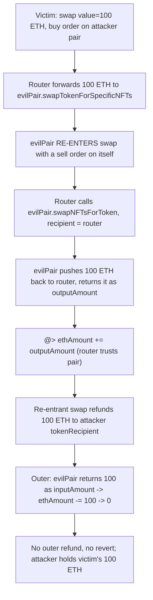
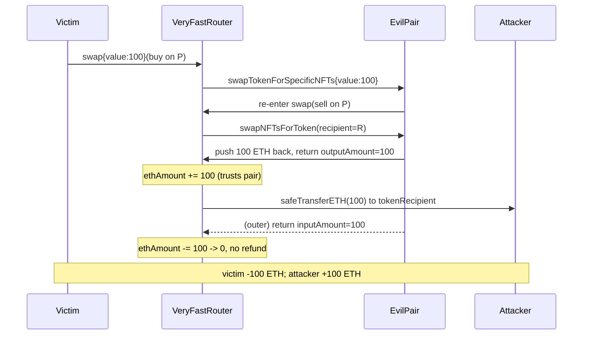

# Sudoswap `VeryFastRouter` — malicious pair re-enters `swap` to drain the original caller's ETH

> **Vulnerability classes:** vuln/reentrancy/single-function · vuln/access-control/missing-input-validation · impact/loss-of-funds/direct-drain

> **Reproduction:** a self-contained Foundry PoC that compiles & runs in an
> isolated project with **only `forge-std`** — no fork, no RPC, no `anvil_state`.
> Full trace: [output.txt](output.txt). PoC:
> [test/18412-malicious-pair-can-re-enter-veryfastrouter-to-drain-original_exp.sol](test/18412-malicious-pair-can-re-enter-veryfastrouter-to-drain-original_exp.sol).

<!-- non-defihacklabs -->
<!-- source-auditvault: https://github.com/Auditware/AuditVault/blob/main/findings/18412-malicious-pair-can-re-enter-veryfastrouter-to-drain-original.md -->
<!-- date: 2023-06 -->

---

## Key info

| | |
|---|---|
| **Impact** | **HIGH** — an attacker steals the entire ETH the original caller sent to `VeryFastRouter.swap`; the caller receives no NFTs and no refund |
| **Protocol** | [Sudoswap](https://sudoswap.xyz) — `lssvm2` (new AMM router with partial-fill support) |
| **Vulnerable code** | `VeryFastRouter.swap` — re-entrant, forwards ETH to an **unvalidated** `order.pair`, and trusts the pair's return value in its virtual `ethAmount` accounting |
| **Bug class** | Single-function re-entrancy + missing pair validation → internal-accounting manipulation |
| **Finding** | Cyfrin — Sudoswap `lssvm2` review, 2023-06 · #18412 · reporter **Hans** |
| **Report** | [2023-06-01-Sudoswap.md](https://github.com/solodit/solodit_content/blob/main/reports/Cyfrin/2023-06-01-Sudoswap.md) |
| **Source** | [AuditVault](https://github.com/Auditware/AuditVault/blob/main/findings/18412-malicious-pair-can-re-enter-veryfastrouter-to-drain-original.md) |
| **Status** | Audit finding — acknowledged by Sudoswap/Cyfrin (risk surface framed as caller passing improper arguments; pairs validated client-side). Reproduced here as a standalone local PoC. |
| **Compiler** | `^0.8.24` (PoC) · vulnerable source `^0.8.0` |

This is an **audit finding**, not a historical on-chain incident. The real
`VeryFastRouter` depends on a factory, bonding curves, ERC721/1155 pairs and
royalty engines; the PoC keeps the `swap` body faithful for the executed attack
path (the virtual-`ethAmount` accounting the finding blames) and reduces the
surrounding machinery to the minimum needed to drive the drain.

---

## TL;DR

1. `VeryFastRouter.swap` is the batch sell/buy entry point. It is **not**
   `nonReentrant` and **never checks** that a supplied `order.pair` is a real
   factory pair.
2. A user is tricked into a buy order whose `pair` is the attacker's honeypot
   pair, sending ETH with the call (`recycleETH = true`).
3. `swap` forwards that ETH to `evilPair.swapTokenForSpecificNFTs{value: …}`.
   The malicious pair **re-enters** `swap` with a sell order on itself.
4. During the re-entrant sell, the malicious pair pushes the router's held ETH
   (the caller's funds) back to the router and returns it as `outputAmount`.
   The router trusts it: `ethAmount += outputAmount`, then refunds that
   "balance" to the attacker via `safeTransferETH(tokenRecipient, ethAmount)`.
5. Back in the outer call, the pair returns the full forwarded amount as
   `inputAmount`, so `ethAmount -= inputAmount` zeroes out and no refund
   reverts. The caller's entire ETH ends up with the attacker.

---

## The vulnerable code

`VeryFastRouter.swap` — the virtual-`ethAmount` accounting (verbatim shape from
[`src/VeryFastRouter.sol#L266-L486`](https://github.com/sudoswap/lssvm2/blob/78d38753b2042d7813132f26e5573c6699b605ef/src/VeryFastRouter.sol#L266)):

```solidity
function swap(Order calldata swapOrder) external payable returns (uint256[] memory results) {
    uint256 ethAmount = msg.value;                       // no nonReentrant, no pair validation
    ...
    // sell order (recycleETH branch):
    outputAmount = order.pair.swapNFTsForToken(          // pair is UNVALIDATED
        order.nftIds, order.minExpectedOutput, payable(address(this)), true, msg.sender
    );
    ethAmount += outputAmount;                            // @> trusts the (untrusted) pair's return value
    ...
    // buy order (direct branch):
    inputAmount = order.pair.swapTokenForSpecificNFTs{value: order.ethAmount}(  // forwards caller ETH
        order.nftIds, order.maxInputAmount, swapOrder.nftRecipient, true, msg.sender
    );
    if (order.ethAmount != 0) { ethAmount -= inputAmount; }
    ...
    // single refund of the virtual balance:
    if (ethAmount != 0) { payable(swapOrder.tokenRecipient).safeTransferETH(ethAmount); }
}
```

The `LSSVMPair` contracts themselves are re-entrance-guarded via the factory, but
`VeryFastRouter` is not — and it treats any caller-supplied address as a pair.

---

## Root cause

The router builds a **virtual** ETH balance (`ethAmount`) from values returned
by the pair, rather than from its own measured balance, and it lets an arbitrary
address play the role of "pair". Because `swap` is re-entrant, a malicious pair
can (a) receive the caller's ETH, (b) re-enter `swap`, and (c) manipulate the
`outputAmount`/`inputAmount` return values so the router pays out the caller's
ETH to the attacker while the outer accounting nets to zero and never reverts.

## Preconditions

- The caller is tricked into including an order on the attacker's pair
  (client-side validation is the only protection; the contract enforces none).
- The caller sends ETH with the call (`recycleETH = true`, or specifies the
  router as token recipient).

## Attack walkthrough

From [output.txt](output.txt), victim stake = 100 ETH:

1. Victim calls `swap{value: 100 ETH}` with a buy order on the attacker's pair.
2. Router forwards 100 ETH to `evilPair.swapTokenForSpecificNFTs`.
3. `evilPair` re-enters `swap` with a sell order on itself.
4. Router calls `evilPair.swapNFTsForToken(recipient = router)`; the pair pushes
   the 100 ETH back to the router and returns it as `outputAmount`.
5. Router: `ethAmount += 100 ETH` → refunds 100 ETH to the attacker's
   `tokenRecipient`.
6. Outer call: `evilPair` returns 100 ETH as `inputAmount` → `ethAmount -= 100`
   → 0 → no outer refund, no revert.
7. **HARM:** attacker holds 100 ETH; the victim received no NFTs and no refund;
   router and pair retain no dust.

## Diagrams





## Remediation

Make `swap` `nonReentrant`, and validate that every `order.pair` is a
factory-deployed pair (e.g. `factory.isValidPair(order.pair)`) before calling
into it. Prefer measured balances over a return-value-driven virtual balance.

## How to reproduce

```bash
cd ~/RustroverProjects/audits/evm-hack-registry/18412-malicious-pair-can-re-enter-veryfastrouter-to-drain-original_exp
forge test -vvv
# Fully local — no fork, no RPC, no anvil_state required.
# Expected: test_maliciousPairReentersRouterToDrainCaller PASSES
#   (attacker ends with the victim's full 100 ETH; victim drained to 0).
```

PoC source:
[test/18412-malicious-pair-can-re-enter-veryfastrouter-to-drain-original_exp.sol](test/18412-malicious-pair-can-re-enter-veryfastrouter-to-drain-original_exp.sol)
drives the same `Exploit` used by the Playground and re-asserts the drain.

> Note: the 100-ETH magnitude and the "pair pushes everything back" step are
> reduced-model choices (the finding's own PoC splits the loot 50/50 between the
> pair and a second attacker address to keep the original order from reverting).
> The bug class (re-entrant, unvalidated-pair `swap` whose virtual `ethAmount`
> accounting is driven by attacker-controlled return values → the original
> caller's ETH is drained) and the blamed lines are faithful.

---

*Reference: finding **#18412** by **Hans** in the [Cyfrin Sudoswap `lssvm2` review (Jun 2023)](https://github.com/solodit/solodit_content/blob/main/reports/Cyfrin/2023-06-01-Sudoswap.md) · vulnerable source [sudoswap/lssvm2@78d38753](https://github.com/sudoswap/lssvm2/blob/78d38753b2042d7813132f26e5573c6699b605ef/src/VeryFastRouter.sol#L266) · curated by [AuditVault](https://github.com/Auditware/AuditVault/blob/main/findings/18412-malicious-pair-can-re-enter-veryfastrouter-to-drain-original.md)*
