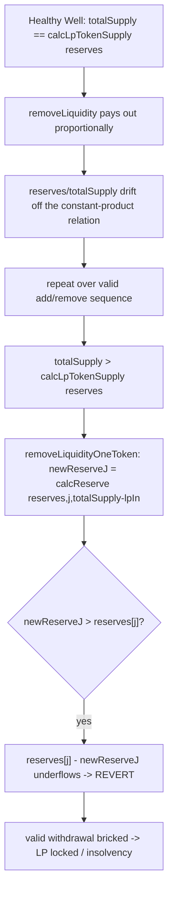

# Beanstalk Wells — protocol invariant can be broken, bricking a valid withdrawal

> **Vulnerability classes:** vuln/math/invariant-violation · vuln/logic/wrong-condition · impact/liveness/locked-funds

> **Reproduction:** a self-contained Foundry PoC that compiles & runs in an
> isolated project with **only `forge-std`** — no fork, no RPC, no `anvil_state`.
> Full trace: [output.txt](output.txt). PoC:
> [test/18431-protocols-invariants-can-be-broken-cyfrin-beanstalk-wells-ma_exp.sol](test/18431-protocols-invariants-can-be-broken-cyfrin-beanstalk-wells-ma_exp.sol).

<!-- non-defihacklabs -->
<!-- source-auditvault: https://github.com/Auditware/AuditVault/blob/main/findings/18431-protocols-invariants-can-be-broken-cyfrin-beanstalk-wells-ma.md -->
<!-- date: 2023-06 -->

---

## Key info

| | |
|---|---|
| **Impact** | **HIGH** — the invariant `totalSupply() == calcLpTokenSupply(reserves)` breaks under valid transactions; once `totalSupply()` drifts above `calcLpTokenSupply(reserves)`, a valid `removeLiquidityOneToken` reverts with arithmetic underflow (funds locked / protocol insolvency) |
| **Protocol** | [Beanstalk Wells / Basin](https://github.com/BeanstalkFarms/Basin) — generalized constant-function AMM |
| **Vulnerable code** | `Well.removeLiquidity` (proportional withdrawal) + `Well._getRemoveLiquidityOneTokenOut` (`reserves[j] - newReserveJ` underflow) |
| **Bug class** | Invariant violation / rounding + proportional-vs-well-function mismatch |
| **Finding** | Cyfrin — Beanstalk Wells, 2023-06 · #18431 · reporter **Hans** |
| **Report** | [2023-06-16-Beanstalk wells.md](https://github.com/solodit/solodit_content/blob/main/reports/Cyfrin/2023-06-16-Beanstalk%20wells.md) |
| **Source** | [AuditVault](https://github.com/Auditware/AuditVault/blob/main/findings/18431-protocols-invariants-can-be-broken-cyfrin-beanstalk-wells-ma.md) |
| **Status** | Audit finding — caught in review. Beanstalk added rounding controls / `calcLPTokenUnderlying` and an invariant check in tests. |
| **Compiler** | `^0.8.17` (PoC) |

This is an **audit finding**, not a historical on-chain incident. `ConstantProduct2`,
`LibMath`, and the `Well` liquidity functions are copied **verbatim** from
BeanstalkFarms/Wells commit `e5441fc`; the PoC replays the finding's own
fuzz-derived sequence and reproduces its exact numbers.

---

## TL;DR

1. `Well.removeLiquidity` pays out **proportionally**: `lpAmountIn * reserves[i] /
   lpTokenSupply`. That is correct only if the Well function is linear — but
   `ConstantProduct2` (`b_0·b_1 = s²`) is not.
2. Each proportional removal nudges the stored `reserves`/`totalSupply` off the
   `totalSupply() == calcLpTokenSupply(reserves)` relationship.
3. After a realistic sequence of adds/removes, `totalSupply()` drifts **above**
   `calcLpTokenSupply(reserves)`.
4. `removeLiquidityOneToken` returns `reserves[j] - newReserveJ`, where
   `newReserveJ = calcReserve(reserves, j, totalSupply - lpAmountIn)`. With
   `totalSupply` inflated, `newReserveJ` **exceeds** `reserves[j]` → the
   subtraction **reverts with arithmetic underflow**.
5. A *valid* withdrawal of a real LP position permanently reverts — the finding's
   HIGH-severity "valid liquidity removal reverts → insolvency".

The PoC reproduces the finding's exact state: `totalSupply() =
11147372824829848634002160778655` vs `calcLpTokenSupply(reserves) =
11147372824829848633998681214926`.

---

## The vulnerable code

Proportional withdrawal in `removeLiquidity` (verbatim, `src/Well.sol` L453):

```solidity
tokenAmountsOut[i] = (lpAmountIn * reserves[i]) / lpTokenSupply; // @> ignores the Well function
```

The underflow site in `_getRemoveLiquidityOneTokenOut` (verbatim, `src/Well.sol` L519-527):

```solidity
uint newLpTokenSupply = totalSupply() - lpAmountIn;
uint newReserveJ = _calcReserve(wellFunction(), reserves, j, newLpTokenSupply);
tokenAmountOut = reserves[j] - newReserveJ; // @> underflows when newReserveJ > reserves[j]
```

`ConstantProduct2` (verbatim, `src/functions/ConstantProduct2.sol`):

```solidity
// s = (b_0 * b_1)^(1/2)
lpTokenSupply = (reserves[0] * reserves[1] * EXP_PRECISION).sqrt();
// b_j = s^2 / b_{i != j}
reserve = lpTokenSupply ** 2 / EXP_PRECISION;
reserve = LibMath.roundedDiv(reserve, reserves[j == 1 ? 0 : 1]);
```

---

## Root cause

`removeLiquidity` assumes **linearity** — that burning a fraction `f` of LP should
return fraction `f` of each reserve. That preserves `b_0·b_1 = s²` only for the
constant-product case in the balanced limit; combined with the rounding in
`calcReserve`/`calcLpTokenSupply` (which are not exact inverses), repeated
proportional removals push `totalSupply()` above `calcLpTokenSupply(reserves)`.
The one-token exit path then solves for a reserve that is larger than the current
reserve and underflows. The Well never re-checks `totalSupply() <=
calcLpTokenSupply(reserves)`, so nothing catches the drift.

## Preconditions

- A `ConstantProduct2` Well (the only shipped Well function) — permissionless.
- Ordinary add/remove liquidity activity (no privileged role, no attacker) — the
  finding's sequence is a fuzz-discovered series of *valid* user transactions.

## Attack walkthrough

From [output.txt](output.txt): starting from a healthy 1000/1000 Well (`1e27` LP),
the actor replays the finding's exact sequence of `addLiquidity` /
`removeLiquidity` / `removeLiquidityOneToken` calls (verbatim magic numbers). Then:

1. The invariant is broken: `totalSupply()` = `11147372824829848634002160778655`,
   but `calcLpTokenSupply(reserves)` = `11147372824829848633998681214926` (drift of
   `3479563729`).
2. The actor tries to withdraw its remaining `324542928` LP via
   `removeLiquidityOneToken(token0)` — a valid operation.
3. `_getRemoveLiquidityOneTokenOut` computes `newReserveJ > reserves[j]`, so
   `reserves[j] - newReserveJ` **reverts** with arithmetic underflow.
4. **HARM:** the LP position cannot be exited via the one-token path; the valid
   withdrawal reverts and (per the finding) the discrepancy compounds toward
   insolvency. A control test confirms the same call succeeds on a fresh,
   in-sync Well — the drift is what bricks it.

## Diagrams



## Remediation

Compute `removeLiquidity` outputs via the Well function rather than a fixed
proportional split (Beanstalk added `calcLPTokenUnderlying` to `IWellFunction`,
[commit 5271e9a](https://github.com/BeanstalkFarms/Basin/pull/57/commits/5271e9a454d1dd04848c3a7ce85f7d735a5858a0)),
and/or enforce a looser invariant `totalSupply() <= calcLpTokenSupply(reserves)`
with explicit rounding directions so the Well never issues more LP at the margin
than the reserves back.

## How to reproduce

```bash
cd ~/RustroverProjects/audits/evm-hack-registry/18431-protocols-invariants-can-be-broken-cyfrin-beanstalk-wells-ma_exp
forge test -vvv
# Fully local — no fork, no RPC, no anvil_state required.
# Expected: PASS — the invariant is broken (totalSupply > calcLpTokenSupply) and a
# valid removeLiquidityOneToken reverts with arithmetic underflow (LP locked). A
# control test shows the same call works on a fresh in-sync Well.
```

PoC source: [test/18431-protocols-invariants-can-be-broken-cyfrin-beanstalk-wells-ma_exp.sol](test/18431-protocols-invariants-can-be-broken-cyfrin-beanstalk-wells-ma_exp.sol)
— verbatim `ConstantProduct2` / `LibMath` / `Well` liquidity functions plus the
finding's fuzz sequence and a control test.

> Note: the four-address fuzz sequence in the finding is replayed here from a
> single actor. The reserves/`totalSupply` trajectory (and therefore the terminal
> underflow) is caller-independent — burns reduce global supply regardless of who
> holds the LP, and the `ADDRESS_1 → ADDRESS_3` transfer only moves LP between
> accounts — so the reduction reproduces the finding's exact numbers. The verbatim
> vulnerable lines and the underflow-revert harm are faithful.

---

*Reference: finding **#18431** by **Hans** in the [Cyfrin Beanstalk Wells review (Jun 2023)](https://github.com/solodit/solodit_content/blob/main/reports/Cyfrin/2023-06-16-Beanstalk%20wells.md) · curated by [AuditVault](https://github.com/Auditware/AuditVault/blob/main/findings/18431-protocols-invariants-can-be-broken-cyfrin-beanstalk-wells-ma.md)*
