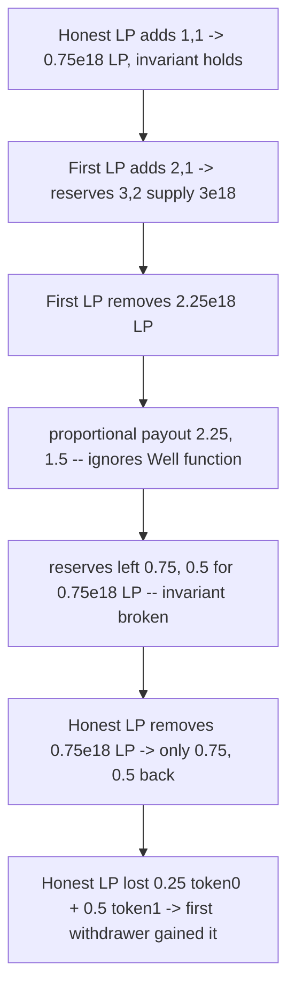
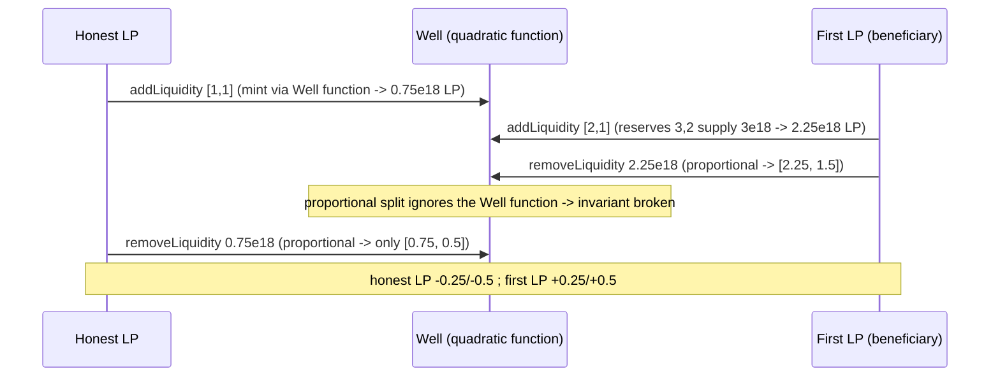

# Beanstalk Wells — `removeLiquidity` is wrong for generalized (non-linear) Well functions

> **Vulnerability classes:** vuln/logic/wrong-condition · vuln/math/invariant-violation · impact/loss-of-funds/lp-value-transfer

> **Reproduction:** a self-contained Foundry PoC that compiles & runs in an
> isolated project with **only `forge-std`** — no fork, no RPC, no `anvil_state`.
> Full trace: [output.txt](output.txt). PoC:
> [test/18433-removeliquidity-logic-is-not-correct-for-generalized-well-fu_exp.sol](test/18433-removeliquidity-logic-is-not-correct-for-generalized-well-fu_exp.sol).

<!-- non-defihacklabs -->
<!-- source-auditvault: https://github.com/Auditware/AuditVault/blob/main/findings/18433-removeliquidity-logic-is-not-correct-for-generalized-well-fu.md -->
<!-- date: 2023-06 -->

---

## Key info

| | |
|---|---|
| **Impact** | **HIGH** — `removeLiquidity` withdraws a fixed proportional share of reserves; for a non-linear Well function this breaks the Well invariant so one LP extracts value from another (direct LP loss of funds) |
| **Protocol** | [Beanstalk Wells / Basin](https://github.com/BeanstalkFarms/Basin) — generalized constant-function AMM |
| **Vulnerable code** | `Well.removeLiquidity` — `tokenAmountsOut[i] = lpAmountIn * reserves[i] / lpTokenSupply` (does not invert the Well function) |
| **Bug class** | Wrong condition / linearity assumption / invariant violation |
| **Finding** | Cyfrin — Beanstalk Wells, 2023-06 · #18433 · reporter **Hans** |
| **Report** | [2023-06-16-Beanstalk wells.md](https://github.com/solodit/solodit_content/blob/main/reports/Cyfrin/2023-06-16-Beanstalk%20wells.md) |
| **Source** | [AuditVault](https://github.com/Auditware/AuditVault/blob/main/findings/18433-removeliquidity-logic-is-not-correct-for-generalized-well-fu.md) |
| **Status** | Audit finding — caught in review. Beanstalk added `IWellFunction.calcLPTokenUnderlying` so the Well function decides removeLiquidity outputs. |
| **Compiler** | `^0.8.17` (PoC) |

This is an **audit finding**, not a historical on-chain incident. The
`Well.addLiquidity` / `removeLiquidity` bodies are copied **verbatim** from
BeanstalkFarms/Wells commit `e5441fc`; the `QuadraticWell` Well function is copied
**verbatim** from the finding's PoC (a Numoen-style quadratic curve).

---

## TL;DR

1. `addLiquidity` mints LP using the Well function (`calcLpTokenSupply`), so the
   invariant holds on the way in.
2. `removeLiquidity` does **not** invert the Well function — it pays out a flat
   proportional share: `lpAmountIn * reserves[i] / lpTokenSupply`.
3. Proportional withdrawal is value-preserving only if the Well function is
   linear. On the quadratic Well it is not: the withdrawer is over- or under-paid,
   the invariant breaks, and value moves between LPs.
4. Honest LP deposits **[1, 1]**, recovers only **[0.75, 0.5]**. The first
   withdrawer deposits **[2, 1]**, recovers **[2.25, 1.5]** — pocketing exactly the
   honest LP's **[0.25, 0.5]**.

---

## The vulnerable code

`Well.removeLiquidity` (verbatim, `src/Well.sol` L453):

```solidity
_burn(msg.sender, lpAmountIn);
for (uint i; i < _tokens.length; ++i) {
    tokenAmountsOut[i] = (lpAmountIn * reserves[i]) / lpTokenSupply; // @> flat proportional split
    ...
    _tokens[i].safeTransfer(recipient, tokenAmountsOut[i]);
    reserves[i] = reserves[i] - tokenAmountsOut[i];
}
```

Contrast `addLiquidity`, which *does* use the Well function (verbatim, `src/Well.sol` L416):

```solidity
lpAmountOut = _calcLpTokenSupply(wellFunction(), reserves) - totalSupply();
```

The finding's `QuadraticWell` (verbatim): `s = b_0 - (PRICE_BOUND - b_1/2)² / PRECISION`.

---

## Root cause

`removeLiquidity` hard-codes the constant-product intuition that "burning fraction
`f` of LP returns fraction `f` of every reserve". That inverse is only correct for
a linear/constant-product curve. Because `addLiquidity` mints via the Well function
but `removeLiquidity` ignores it, the two operations are inconsistent for any
non-linear Well function — the exact "generalized Well function" case the protocol
advertises support for. The mismatch breaks `totalSupply == calcLpTokenSupply(reserves)`
and lets whoever withdraws in the wrong direction extract value from the other LPs.

## Preconditions

- A Well deployed with a non-linear Well function (the protocol explicitly intends
  to support these; the finding uses Numoen's quadratic curve) — permissionless.
- Two or more LPs with liquidity in the Well (ordinary usage; no privileged role).

## Attack walkthrough

From [output.txt](output.txt):

1. Honest LP adds **[1, 1]** → receives `0.75e18` LP; reserves `(1, 1)`.
2. First LP adds **[2, 1]** → reserves `(3, 2)`, total LP `3e18`; it holds `2.25e18` LP.
3. First LP removes all `2.25e18` LP. Proportional payout = `[2.25, 1.5]`, so
   reserves fall to `(0.75, 0.5)`, supply to `0.75e18`.
4. Honest LP removes its `0.75e18` LP. Proportional payout = `[0.75, 0.5]`.
5. **HARM:** the honest LP deposited `[1, 1]` and recovered `[0.75, 0.5]` — a loss
   of `0.25` token0 + `0.5` token1. The first withdrawer deposited `[2, 1]` and
   recovered `[2.25, 1.5]` — a gain of exactly `[0.25, 0.5]`. Value was transferred
   between LPs by the buggy proportional math.

## Diagrams





## Remediation

Compute `removeLiquidity` outputs via the Well function instead of a fixed
proportional split. Beanstalk added `IWellFunction.calcLPTokenUnderlying`, which
returns the reserve amounts underlying a given LP quantity, so the Well function
itself decides how much to return and can preserve its own invariant
([commit 5271e9a](https://github.com/BeanstalkFarms/Basin/pull/57/commits/5271e9a454d1dd04848c3a7ce85f7d735a5858a0)).

## How to reproduce

```bash
cd ~/RustroverProjects/audits/evm-hack-registry/18433-removeliquidity-logic-is-not-correct-for-generalized-well-fu_exp
forge test -vvv
# Fully local — no fork, no RPC, no anvil_state required.
# Expected: PASS — honest LP deposits [1,1] but recovers [0.75, 0.5]; the first
# withdrawer deposits [2,1] and recovers [2.25, 1.5], pocketing the honest LP's
# [0.25, 0.5].
```

PoC source: [test/18433-removeliquidity-logic-is-not-correct-for-generalized-well-fu_exp.sol](test/18433-removeliquidity-logic-is-not-correct-for-generalized-well-fu_exp.sol)
— verbatim `Well.addLiquidity`/`removeLiquidity` and the finding's verbatim
`QuadraticWell`.

> Note: the quadratic curve and the [1,1]/[2,1] amounts are the finding's own PoC
> parameters; they fix the exact `[0.25, 0.5]` magnitude. The bug class
> (proportional `removeLiquidity` that ignores the Well function → invariant broken
> → LP value transferred) and the verbatim vulnerable line are faithful.

---

*Reference: finding **#18433** by **Hans** in the [Cyfrin Beanstalk Wells review (Jun 2023)](https://github.com/solodit/solodit_content/blob/main/reports/Cyfrin/2023-06-16-Beanstalk%20wells.md) · curated by [AuditVault](https://github.com/Auditware/AuditVault/blob/main/findings/18433-removeliquidity-logic-is-not-correct-for-generalized-well-fu.md)*
