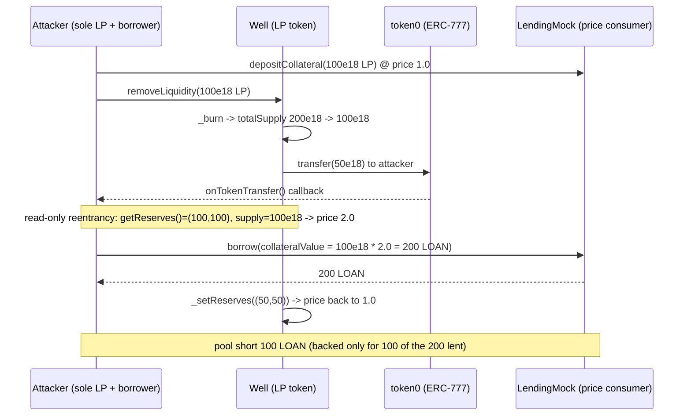
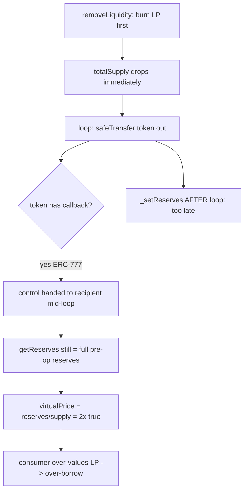

# Beanstalk Wells — read-only reentrancy in `Well.removeLiquidity`

> **Vulnerability classes:** vuln/reentrancy/read-only · vuln/logic/cei-violation · impact/data-corruption/price-manipulation

> **Reproduction:** a self-contained Foundry PoC that compiles & runs in an
> isolated project with **only `forge-std`** — no fork, no RPC, no `anvil_state`.
> Full trace: [output.txt](output.txt). PoC:
> [test/18434-read-only-reentrancy-cyfrin-beanstalk-wells-markdown_exp.sol](test/18434-read-only-reentrancy-cyfrin-beanstalk-wells-markdown_exp.sol).

<!-- non-defihacklabs -->
<!-- source-auditvault: https://github.com/Auditware/AuditVault/blob/main/findings/18434-read-only-reentrancy-cyfrin-beanstalk-wells-markdown.md -->
<!-- date: 2023-06 -->

---

## Key info

| | |
|---|---|
| **Impact** | **HIGH** — the Well LP token's on-chain "virtual price" can be read at a 2x-inflated value via read-only reentrancy; any protocol that prices the Well LP off `getReserves()/totalSupply()` in that window can be drained (Curve-LP-oracle-manipulation class) |
| **Protocol** | [Beanstalk Wells / Basin](https://github.com/BeanstalkFarms/Basin) — generalized constant-function AMM |
| **Vulnerable code** | `Well.removeLiquidity` — tokens are transferred out (firing a token callback) **before** `_setReserves` commits the new reserves; `getReserves()` is an unguarded view |
| **Bug class** | Read-only reentrancy / CEI violation |
| **Finding** | Cyfrin — Beanstalk Wells, 2023-06 · #18434 · reporter **Hans** |
| **Report** | [2023-06-16-Beanstalk wells.md](https://github.com/solodit/solodit_content/blob/main/reports/Cyfrin/2023-06-16-Beanstalk%20wells.md) |
| **Source** | [AuditVault](https://github.com/Auditware/AuditVault/blob/main/findings/18434-read-only-reentrancy-cyfrin-beanstalk-wells-markdown.md) |
| **Status** | Audit finding — caught in review (not exploited on-chain). Beanstalk fixed it by reverting `getReserves()` while the reentrancy guard is entered. |
| **Compiler** | `^0.8.17` (PoC) |

This is an **audit finding**, not a historical on-chain incident. The real
`Well` uses immutable-args cloning, packed byte-storage reserves and Pumps; the
PoC keeps `removeLiquidity` **verbatim** (BeanstalkFarms/Wells commit `e5441fc`,
`src/Well.sol` L440-463) and reduces the surrounding machinery to the minimum
needed to make the stale read observable and turn it into a measurable loss.

---

## TL;DR

1. `Well.removeLiquidity` burns the caller's LP **first**, then transfers each
   underlying token out, and only **after** the loop calls `_setReserves`.
2. If one token has a transfer callback (ERC-777), it hands control to the
   recipient mid-loop. At that instant `totalSupply()` has already dropped (the
   burn) but `getReserves()` still returns the **full pre-op reserves**.
3. `getReserves()` is a plain view with no reentrancy guard, so a re-entrant
   read observes reserves and supply that are out of sync → the LP "virtual
   price" reads **2x** its true value.
4. A naive lending market that prices the Well LP off `getReserves()/totalSupply()`
   lets the attacker borrow **200 LOAN** against collateral truly worth **100** —
   the pool is left **100 LOAN short**, unrecoverable.

---

## The vulnerable code

`Well.removeLiquidity` (verbatim, BeanstalkFarms/Wells commit `e5441fc`, `src/Well.sol` L440-463):

```solidity
_burn(msg.sender, lpAmountIn);                         // totalSupply drops NOW
for (uint i; i < _tokens.length; ++i) {
    tokenAmountsOut[i] = (lpAmountIn * reserves[i]) / lpTokenSupply;
    ...
    _tokens[i].safeTransfer(recipient, tokenAmountsOut[i]); // @> callback fires here, reserves still stale
    reserves[i] = reserves[i] - tokenAmountsOut[i];
}
_setReserves(_tokens, reserves);                       // reserves committed ONLY here, AFTER transfers
```

`getReserves()` is an unguarded view, so it is reachable during the callback:

```solidity
function getReserves() external view returns (uint[] memory reserves) {
    reserves = _getReserves(numberOfTokens());   // returns the stale, pre-op reserves
}
```

The finding's recommended fix moves `_setReserves` **before** the transfer loop
(CEI); Beanstalk instead made `getReserves()` revert while the guard is entered.

---

## Root cause

`removeLiquidity` violates Checks-Effects-Interactions: the **effect** (commit
reserves to storage) happens after the **interaction** (token transfers). Because
the burn *does* happen before the transfers, during the callback the two halves
of the price — reserves (stale, high) and totalSupply (already reduced) — are
inconsistent. The AMM's own state-write reentrancy guard (`nonReentrant`) does
not help: the dangerous read is a *view*, and views are not guarded.

## Preconditions

- A Well deployed with a token that has a transfer callback (ERC-777 or any
  hook token) — permissionless; anyone can bore such a Well.
- A third-party protocol that reads the Well's on-chain reserves/LP price
  (a lending market, an LP-collateral oracle, a pump consumer).

## Attack walkthrough

From [output.txt](output.txt): the attacker is the sole LP of a 100/100 Well
(200e18 LP, virtual price 1.0), and a lending market holds 1000 LOAN.

1. Attacker posts **100e18 LP** as collateral at the fair price 1.0 (borrow limit 100).
2. Attacker calls `removeLiquidity` for the other 100e18 LP. `_burn` runs → supply
   halves to 100e18; reserves in storage are still (100,100).
3. The token0 transfer fires the callback. Inside it, `getReserves()` = (100,100)
   but `totalSupply()` = 100e18 → `virtualPrice()` = **2.0**.
4. The lending market now values the 100e18 LP collateral at **200 LOAN** and lets
   the attacker borrow it all.
5. `removeLiquidity` finishes, `_setReserves` commits (50,50), price returns to 1.0.
6. **HARM:** the attacker holds **200 LOAN** against collateral worth **100 LOAN** —
   the lending pool is short **100 LOAN**, an unrecoverable loss.

## Diagrams





## Remediation

Follow CEI: commit `_setReserves` **before** transferring tokens (the finding's
suggested patch). Beanstalk's shipped fix instead makes `getReserves()` revert
while the `nonReentrant` guard is entered
([commit fcbf04a](https://github.com/BeanstalkFarms/Basin/pull/85/commits/fcbf04a99b00807891fb2a9791ba18ed425479ab)),
so no one can read reserves mid-operation.

## How to reproduce

```bash
cd ~/RustroverProjects/audits/evm-hack-registry/18434-read-only-reentrancy-cyfrin-beanstalk-wells-markdown_exp
forge test -vvv
# Fully local — no fork, no RPC, no anvil_state required.
# Expected: PASS — price observed mid-transfer is 2x; attacker over-borrows 200
# LOAN vs 100 fair; lender pool left 100 LOAN short.
```

PoC source: [test/18434-read-only-reentrancy-cyfrin-beanstalk-wells-markdown_exp.sol](test/18434-read-only-reentrancy-cyfrin-beanstalk-wells-markdown_exp.sol)
— the verbatim vulnerable `removeLiquidity`, an ERC-777-style callback token, and
a naive LP-price-consuming lending market that is drained.

> Note: the constant-sum LP accounting, the 1:1 LOAN pricing and the 2x
> magnitude are reduced-model assumptions (the real Well uses arbitrary well
> functions and Pumps). They fix the exact numbers; the bug class (reserves
> committed after transfers → unguarded `getReserves()` returns a stale,
> manipulable price during a token callback) and the verbatim vulnerable
> `removeLiquidity` are faithful to the finding.

---

*Reference: finding **#18434** by **Hans** in the [Cyfrin Beanstalk Wells review (Jun 2023)](https://github.com/solodit/solodit_content/blob/main/reports/Cyfrin/2023-06-16-Beanstalk%20wells.md) · curated by [AuditVault](https://github.com/Auditware/AuditVault/blob/main/findings/18434-read-only-reentrancy-cyfrin-beanstalk-wells-markdown.md)*
