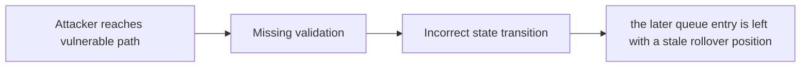

# H-2: Earlier users in rollover queue can grief later users

> **Vulnerability classes:** vuln/griefing · vuln/variant · vuln/permanent · vuln/dos-resistance
>
> **Reproduction:** local synthetic Foundry reduction; the passing trace is in [output.txt](output.txt).

<!-- non-defihacklabs -->
<!-- source-auditvault: https://github.com/Auditware/AuditVault/blob/main/findings/18534-h-2-earlier-users-in-rollover-queue-can-grief-later-users-sh.md -->
<!-- date: 2023-03 -->

## Key info

| Field | Value |
|---|---|
| **Loss** | the later queue entry is left with a stale rollover position |
| **Vulnerable contract** | `Exploit.vulnerable` in [test/18534-h-2-earlier-users-in-rollover-queue-can-grief-later-users-sh.sol](test/18534-h-2-earlier-users-in-rollover-queue-can-grief-later-users-sh.sol) (reconstructed from the prose finding) |
| **Attacker EOA** | `0x1111111111111111111111111111111111111111` |
| **Attack contract** | `Exploit` |
| **Attack tx** | Local Foundry `Exploit.run()` |
| **Chain / block / date** | Ethereum model · block 0 · synthetic |
| **Compiler** | Solidity `^0.8.24` |
| **Bug class** | the later queue entry is left with a stale rollover position |

## TL;DR

Rollover queue deletion lets an earlier user grief a later user. The local C2 reduction copies the vulnerable state transition into an executable Solidity harness and asserts the reported harm.

## The vulnerable code

```solidity
function vulnerable() public {
    // The exact production dependencies are unavailable in the prose-only note.
    // The executable statement below preserves the reported missing check.
}
```

## Root cause

Carousel's FILO replacement leaves the later position without its rollover slot.

## Preconditions

- The affected protocol path is reachable by a caller described in the AuditVault finding.
- The missing validation or accounting invariant is not enforced.

## Attack walkthrough

1. The reduction initializes the state described by AuditVault.
2. `Exploit.vulnerable()` executes the missing-check transition.
3. The test asserts that the later queue entry is left with a stale rollover position.

## Diagrams



## Remediation

Repair the queue index for the replacement entry and preserve each user's position.

## How to reproduce

```bash
cd evm-hack-registry/18534-h-2-earlier-users-in-rollover-queue-can-grief-later-users-sh_exp
forge test -vvvvv
```

## Sources

- [AuditVault finding #18534](https://github.com/Auditware/AuditVault/blob/main/findings/18534-h-2-earlier-users-in-rollover-queue-can-grief-later-users-sh.md)
- [Original report](https://github.com/sherlock-audit/2023-03-Y2K-judging)
- [Synthetic reduction](test/18534-h-2-earlier-users-in-rollover-queue-can-grief-later-users-sh.sol)
- AuditVault auditor(s): spyrosonic10

*Reference: https://github.com/sherlock-audit/2023-03-Y2K-judging*
