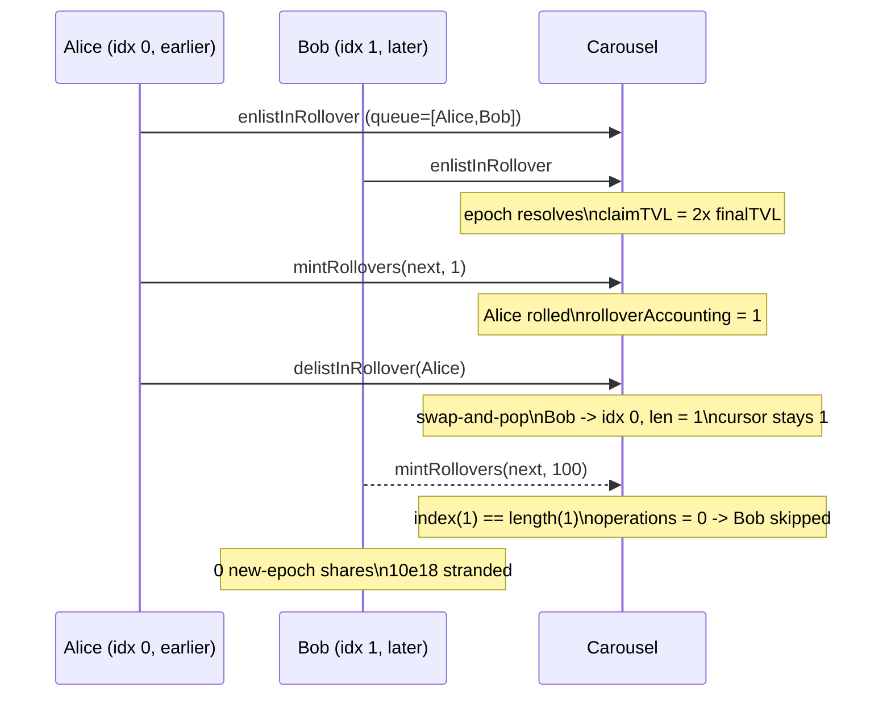

# Y2K Earthquake — earlier rollover-queue users can grief later users (permanent rollover DoS)

> **Vulnerability classes:** vuln/dos/griefing · vuln/logic/state-desync
>
> **Reproduction:** the test deploys the REAL audited `Carousel` (which is `VaultV2` + a
> standard OpenZeppelin `ERC1155`) — no protocol logic is mocked. Only the opaque
> underlying and emissions tokens are minimal real ERC-20s. It fills the real rollover
> queue in the audited order and drives the real `mintRollovers` / `delistInRollover`
> functions to permanently strand a later user's funds.

<!-- source-auditvault: https://github.com/Auditware/AuditVault/blob/main/findings/18534-h-2-earlier-users-in-rollover-queue-can-grief-later-users-sh.md -->

## Root cause

Audited source: `sherlock-audit/2023-03-Y2K` @ `93e3994`, file
[`Earthquake/src/v2/Carousel/Carousel.sol`](https://github.com/sherlock-audit/2023-03-Y2K/blob/main/Earthquake/src/v2/Carousel/Carousel.sol),
vendored here at [`src/src/v2/Carousel/Carousel.sol`](src/src/v2/Carousel/Carousel.sol).

`mintRollovers(epochId, operations)` tracks how far the queue has been processed with a
single index, `rolloverAccounting[epochId]`, and starts each call at that index:

```solidity
uint256 index = rolloverAccounting[_epochId];   // processed cursor
...
if (executions > 0) rolloverAccounting[_epochId] = index;
```

`delistInRollover(owner)` removes a queue entry with a **swap-and-pop**: it moves the
LAST queued user into the removed slot and shrinks the array:

```solidity
rolloverQueue[index] = rolloverQueue[length - 1]; // last user overwrites removed slot
rolloverQueue.pop();
ownerToRollOverQueueIndex[rolloverQueue[index].receiver] = index + 1;
```

The cursor and the swap-and-pop are never reconciled. A user who has already been
processed (so the cursor sits *above* their index) can delist; the last, not-yet-
processed user is swapped *below* the cursor. The next `mintRollovers` begins at the
stale cursor, computes `operations = length - index == 0`, and silently skips the
shifted user — who can never be rolled over for that epoch.

The fix (Y2K [PR #127](https://github.com/Y2K-Finance/Earthquake/pull/127)) reworks the
queue bookkeeping so a delist can no longer leave an unprocessable entry.

## Reproduction (real numbers)

`relayerFee = 1e18`, `depositFee = 0`. Alice and Bob each deposit `10e18` into epoch 1
and enlist for rollover, giving queue `[Alice(idx0), Bob(idx1)]`. Epoch 1 resolves as a
winner with `claimTVL = 2 x finalTVL`.

1. `mintRollovers(2, 1)` — Alice (index 0) is rolled into epoch 2 (mints `10e18 - 1e18 =
   9e18` new-epoch shares); `rolloverAccounting[2]` advances to `1`.
2. Alice calls `delistInRollover(Alice)` — swap-and-pop moves Bob into index 0 and pops
   the array to length `1`; `rolloverAccounting[2]` stays `1`.
3. `mintRollovers(2, 100)` — `index (1) == length (1)` => `operations = 0`; the loop never
   runs.

**Harm:** Bob ends with `0` epoch-2 shares, his rollover entry still points at the old
(resolved) epoch, and his `10e18` remain stranded in epoch 1 — the rollover core
functionality is denied until a brand-new epoch is created, despite Bob having correctly
enlisted.



## Run

```bash
_shared/run-poc/run_poc.sh 18534-h-2-earlier-users-in-rollover-queue-can-grief-later-users-sh_exp -vvvvv
```

Expected: `[PASS] testEarlierUserGriefsLaterUserRollover`. The assertions in
[`test/18534-h-2-earlier-users-in-rollover-queue-can-grief-later-users-sh_exp.sol`](test/18534-h-2-earlier-users-in-rollover-queue-can-grief-later-users-sh_exp.sol)
verify Bob's zero new-epoch shares, his stuck old-epoch rollover pointer, his stranded
`10e18`, and that the relayer cannot advance the cursor past him.

## Sources

- [AuditVault finding #18534](https://github.com/Auditware/AuditVault/blob/main/findings/18534-h-2-earlier-users-in-rollover-queue-can-grief-later-users-sh.md)
- [Sherlock 2023-03-Y2K issue #72](https://github.com/sherlock-audit/2023-03-Y2K-judging/issues/72)
- [Audited `Carousel.sol` @ 93e3994](https://github.com/sherlock-audit/2023-03-Y2K/blob/main/Earthquake/src/v2/Carousel/Carousel.sol)
- [Y2K fix PR #127](https://github.com/Y2K-Finance/Earthquake/pull/127)
