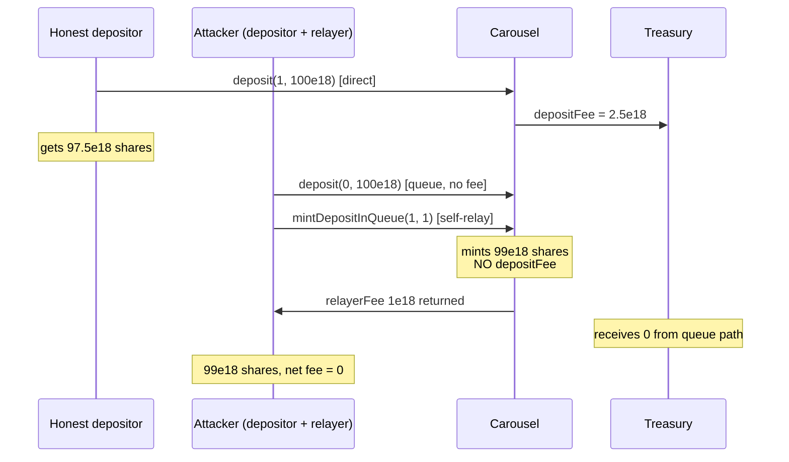

# Y2K Earthquake — `depositFee` can be bypassed via the deposit queue

> **Vulnerability classes:** vuln/logic/fee-calculation · vuln/defi/fee-theft
>
> **Reproduction:** the test deploys the REAL audited `Carousel` (`VaultV2` + a standard
> OpenZeppelin `ERC1155`) — no protocol logic is mocked; only the opaque underlying and
> emissions tokens are minimal real ERC-20s. It charges the dynamic deposit fee on the
> real direct-deposit path and shows the real queue path (`deposit(0,…)` +
> `mintDepositInQueue`) mints the same position for **zero** deposit fee.

<!-- source-auditvault: https://github.com/Auditware/AuditVault/blob/main/findings/18535-h-3-depositfee-can-be-bypassed-via-deposit-queue-sherlock-no.md -->

## Root cause

Audited source: `sherlock-audit/2023-03-Y2K` @ `93e3994`, file
[`Earthquake/src/v2/Carousel/Carousel.sol`](https://github.com/sherlock-audit/2023-03-Y2K/blob/main/Earthquake/src/v2/Carousel/Carousel.sol),
vendored here at [`src/src/v2/Carousel/Carousel.sol`](src/src/v2/Carousel/Carousel.sol).

The dynamic `depositFee` (linear from `0` at epoch creation up to `depositFee` bps at
epoch start) is charged **only** on the direct path, `_deposit` for a non-zero epoch id:

```solidity
if (depositFee > 0) {
    ...
    uint256 feeAmount = _assets.mulDivDown(fee, 10000);
    assetsToDeposit = _assets - feeAmount;
    _asset().safeTransfer(treasury, feeAmount);   // fee -> treasury
}
```

The queue path does not. A deposit to epoch `0` is only pushed onto `depositQueue`
(no fee), and `mintDepositInQueue` later mints it while deducting **only** the relayer
fee — never the deposit fee:

```solidity
_mintShares(queue[i].receiver, _epochId, queue[i].assets - relayerFee); // no depositFee
...
asset.safeTransfer(msg.sender, _operations * relayerFee); // relayer paid
```

A late depositor therefore routes into the epoch-0 queue and, in the same transaction,
self-relays `mintDepositInQueue` — minting their epoch position while paying zero deposit
fee and recovering the relayer fee they advanced. The treasury loses the fee revenue.

The fix (Y2K [PR #126](https://github.com/Y2K-Finance/Earthquake/pull/126)) adds a minimum
deposit requirement to `enlistInRollover` and reworks the queue economics so queue mints
are no longer fee-free.

## Reproduction (real numbers)

`relayerFee = 1e18`, `depositFee = 250` (2.5%, the constructor maximum), deposit amount
`100e18`.

- **Honest direct depositor** (Foundry test, warped to `epochBegin`): pays the full
  `100e18 × 250/10000 = 2.5e18` fee to the treasury and receives `97.5e18` shares.
- **Attacker via the queue**: `deposit(0, 100e18)` then self-relayed
  `mintDepositInQueue(1, 1)` → mints `100e18 − 1e18 = 99e18` shares, treasury receives
  `0`, and the `1e18` relayer fee is returned to the attacker (self-relay), so the total
  fee paid is **exactly 0**.

Net effect: the fee-dodger out-mints the honest depositor by `1.5e18` shares (and by the
full `2.5e18` fee once the recovered relayer fee is accounted for), and the protocol
collects nothing.



## Run

```bash
_shared/run-poc/run_poc.sh 18535-h-3-depositfee-can-be-bypassed-via-deposit-queue-sherlock-no_exp -vvvvv
```

Expected: `[PASS] testDepositFeeBypassedViaQueue`. The logs print the direct fee
(`2.5e18`), the queue fee (`0`), and the extra shares gained by fee-dodging (`1.5e18`);
the assertions in
[`test/18535-h-3-depositfee-can-be-bypassed-via-deposit-queue-sherlock-no_exp.sol`](test/18535-h-3-depositfee-can-be-bypassed-via-deposit-queue-sherlock-no_exp.sol)
enforce every number.

## Sources

- [AuditVault finding #18535](https://github.com/Auditware/AuditVault/blob/main/findings/18535-h-3-depositfee-can-be-bypassed-via-deposit-queue-sherlock-no.md)
- [Sherlock 2023-03-Y2K issue #75](https://github.com/sherlock-audit/2023-03-Y2K-judging/issues/75)
- [Audited `Carousel.sol` @ 93e3994](https://github.com/sherlock-audit/2023-03-Y2K/blob/main/Earthquake/src/v2/Carousel/Carousel.sol)
- [Y2K fix PR #126](https://github.com/Y2K-Finance/Earthquake/pull/126)
