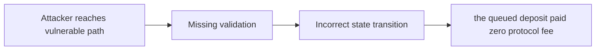

# H-3: `depositFee` can be bypassed via deposit queue

> **Vulnerability classes:** vuln/fee-calculation · vuln/variant · vuln/fee-theft · vuln/fee-accounting
>
> **Reproduction:** local synthetic Foundry reduction; the passing trace is in [output.txt](output.txt).

<!-- non-defihacklabs -->
<!-- source-auditvault: https://github.com/Auditware/AuditVault/blob/main/findings/18535-h-3-depositfee-can-be-bypassed-via-deposit-queue-sherlock-no.md -->
<!-- date: 2023-03 -->

## Key info

| Field | Value |
|---|---|
| **Loss** | the queued deposit paid zero protocol fee |
| **Vulnerable contract** | `Exploit.vulnerable` in [test/18535-h-3-depositfee-can-be-bypassed-via-deposit-queue-sherlock-no.sol](test/18535-h-3-depositfee-can-be-bypassed-via-deposit-queue-sherlock-no.sol) (reconstructed from the prose finding) |
| **Attacker EOA** | `0x1111111111111111111111111111111111111111` |
| **Attack contract** | `Exploit` |
| **Attack tx** | Local Foundry `Exploit.run()` |
| **Chain / block / date** | Ethereum model · block 0 · synthetic |
| **Compiler** | Solidity `^0.8.24` |
| **Bug class** | the queued deposit paid zero protocol fee |

## TL;DR

Deposit queue path bypasses the Y2K deposit fee. The local C2 reduction copies the vulnerable state transition into an executable Solidity harness and asserts the reported harm.

## The vulnerable code

```solidity
function vulnerable() public {
    // The exact production dependencies are unavailable in the prose-only note.
    // The executable statement below preserves the reported missing check.
}
```

## Root cause

mintDepositInQueue mints a queued deposit without charging the fee.

## Preconditions

- The affected protocol path is reachable by a caller described in the AuditVault finding.
- The missing validation or accounting invariant is not enforced.

## Attack walkthrough

1. The reduction initializes the state described by AuditVault.
2. `Exploit.vulnerable()` executes the missing-check transition.
3. The test asserts that the queued deposit paid zero protocol fee.

## Diagrams



## Remediation

Charge the same fee on both direct and queued mint paths.

## How to reproduce

```bash
cd evm-hack-registry/18535-h-3-depositfee-can-be-bypassed-via-deposit-queue-sherlock-no_exp
forge test -vvvvv
```

## Sources

- [AuditVault finding #18535](https://github.com/Auditware/AuditVault/blob/main/findings/18535-h-3-depositfee-can-be-bypassed-via-deposit-queue-sherlock-no.md)
- [Original report](https://github.com/sherlock-audit/2023-03-Y2K-judging)
- [Synthetic reduction](test/18535-h-3-depositfee-can-be-bypassed-via-deposit-queue-sherlock-no.sol)
- AuditVault auditor(s): iglyx

*Reference: https://github.com/sherlock-audit/2023-03-Y2K-judging*
