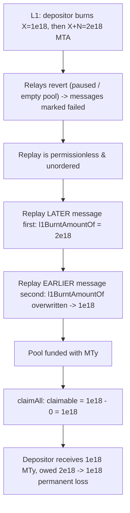
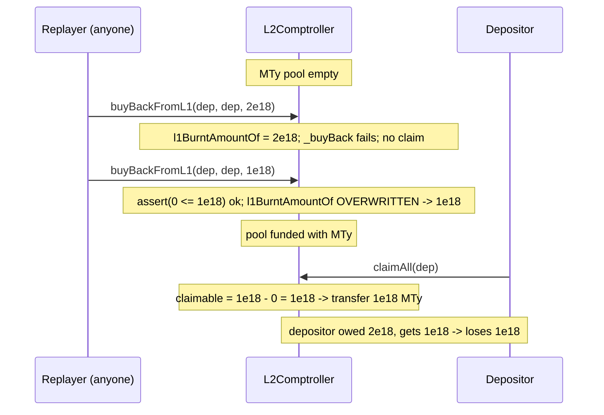

# Dhedge L2Comptroller — user can receive too few tokens when unpaused (cross-domain replay)

> **Vulnerability classes:** vuln/logic/cross-contract-state-consistency · vuln/bridge/message-replay-ordering · vuln/loss-of-funds/under-crediting

> **Reproduction:** a self-contained Foundry PoC that compiles & runs in an
> isolated project with **only `forge-std`** — no fork, no RPC, no `anvil_state`.
> Full trace: [output.txt](output.txt). PoC:
> [test/18772-h-01-user-can-receive-too-few-tokens-when-l2comptroller-is-u_exp.sol](test/18772-h-01-user-can-receive-too-few-tokens-when-l2comptroller-is-u_exp.sol).

<!-- non-defihacklabs -->
<!-- source-auditvault: https://github.com/Auditware/AuditVault/blob/main/findings/18772-h-01-user-can-receive-too-few-tokens-when-l2comptroller-is-u.md -->
<!-- date: 2023-06 -->

**AuditVault taxonomy:** `lang/solidity` · `platform/zachobront` · `has/github` · `has/poc` · `severity/high` · `novelty/variant` · `sector/oracle`
**Genome:** `replay` · `direct-drain` · `bridge-message-validation` · `cross-contract-state-consistency`

---

## Key info

| | |
|---|---|
| **Impact** | **HIGH** — an L1 depositor is permanently under-credited on L2 and receives fewer buy-back tokens (MTy) than they burnt for (MTA), losing the difference forever |
| **Protocol** | [Dhedge](https://dhedge.org) buyback-contract (`L1Comptroller` / `L2Comptroller`) — Optimism cross-domain MTA→MTy buy back |
| **Vulnerable code** | `L2Comptroller.buyBackFromL1` — the credit assignment `l1BurntAmountOf[l1Depositor] = totalAmountBurntOnL1;` with no monotonic-increase guard |
| **Bug class** | Cross-domain message replay + non-monotonic state overwrite: a later, larger credit is clobbered by an out-of-order replay of an earlier, smaller one |
| **Finding** | Zach Obront — Dhedge, 2023-06 · #18772 · H-01 · reporter **Zach Obront (ZachObront)** |
| **Report** | [2023-06-01-Dhedge.md](https://github.com/solodit/solodit_content/blob/main/reports/ZachObront/2023-06-01-Dhedge.md) |
| **Source** | [AuditVault](https://github.com/Auditware/AuditVault/blob/main/findings/18772-h-01-user-can-receive-too-few-tokens-when-l2comptroller-is-u.md) |
| **Status** | Audit finding — caught in review, fixed in [dHEDGE PR #17](https://github.com/dhedge/buyback-contract/pull/17/). Reproduced here as a standalone local PoC. |
| **Compiler** | `^0.8.24` (PoC) |

This is an **audit finding**, not a historical on-chain incident. The PoC keeps the
vulnerable `buyBackFromL1` assignment and the `assert(totalAmountClaimed <= totalAmountBurntOnL1)`
verbatim, and reduces MTA→MTy to a 1:1 buy back so the under-crediting becomes a
measurable token loss. The Optimism `CrossDomainMessenger` is intentionally omitted:
the report establishes that a `failed` message can be replayed by **anyone, in any
order**, so the out-of-order replay is expressed as two direct `buyBackFromL1` calls.

---

## TL;DR

1. When MTA is burnt on L1, a cross-domain message eventually calls
   `L2Comptroller.buyBackFromL1(l1Depositor, receiver, totalAmountBurntOnL1)` on L2,
   crediting the depositor and trying to hand them MTy 1:1.
2. If that relay reverts (contract paused, or the MTy pool is empty), Optimism
   Bedrock marks the message `failed` — and **anyone can replay it later, in any
   order**.
3. `buyBackFromL1` records the credit with a **plain overwrite** and **no
   monotonic-increase check**: `l1BurntAmountOf[l1Depositor] = totalAmountBurntOnL1;`.
4. A depositor with two deposits — an earlier one for `X` and a later one for `X + N`
   — can have the messages replayed out of order: the `X + N` message runs first,
   then the `X` message **overwrites the credit back down to `X`**.
5. When they finally claim (once the pool is funded), they receive only `X` tokens
   instead of `X + N`. In the PoC: **1e18 MTy received vs 2e18 owed — a permanent
   1e18 loss**; the extra 1e18 MTy is left stranded in the comptroller.

---

## The vulnerable code

The credit assignment with no monotonic guard (verbatim, `L2Comptroller.buyBackFromL1`):

```solidity
// `totalAmountClaimed` is of the `tokenToBurn` denomination.
uint256 totalAmountClaimed = claimedAmountOf[l1Depositor];

// The cumulative token amount burnt and claimed against on L2 should never be less than
// what's been burnt on L1. This indicates some serious issues.
assert(totalAmountClaimed <= totalAmountBurntOnL1);

uint256 burnTokenAmount = totalAmountBurntOnL1 - totalAmountClaimed;
if (burnTokenAmount == 0) revert ExceedingClaimableAmount(l1Depositor, 0, 0);

l1BurntAmountOf[l1Depositor] = totalAmountBurntOnL1;   // @> no check that this is monotonically increasing
```

The "try to pay now; do NOT record a claim on failure" behaviour that keeps the
amount claimable (and the message replayable):

```solidity
try this._buyBack(receiver, burnTokenAmount) returns (uint256) {
    claimedAmountOf[l1Depositor] += burnTokenAmount;   // only on success
} catch {
    // pool empty -> leave claimedAmountOf unchanged
}
```

The recommended fix (dHEDGE [PR #17](https://github.com/dhedge/buyback-contract/pull/17/)):

```diff
+   if (totalAmountBurntOnL1 < l1BurntAmountOf[l1Depositor]) {
+       revert DecreasingBurntAmount();
+   }
    l1BurntAmountOf[l1Depositor] = totalAmountBurntOnL1;
```

---

## Root cause

`buyBackFromL1` treats the incoming `totalAmountBurntOnL1` as the authoritative
*current cumulative* value and stores it directly. That is only correct if the
cross-domain messages are delivered **in order**. Optimism's messenger makes no such
guarantee for `failed`/replayed messages — and the report notes the replay is
permissionless. Because `claimedAmountOf` is only advanced when tokens actually move
(the pool must be funded), a depositor can accumulate two un-actioned credits whose
replay order determines the final stored value. Without a monotonic-increase guard, a
smaller value can overwrite a larger one, silently reducing the depositor's
entitlement.

## Preconditions

- The depositor has two (or more) pending L1 burns whose L2 relays reverted (e.g. the
  comptroller was paused, or the MTy pool was empty) and are therefore `failed`/replayable.
- The MTy pool is empty at replay time, so `claimedAmountOf` is not advanced and both
  credits remain "open" (this is the intended graceful-degradation path).
- Anyone (including a griefer) can trigger the replays in the wrong order.

## Attack walkthrough

From [output.txt](output.txt), with a depositor who burnt `X = 1e18` then `X + N = 2e18` on L1:

1. The MTy pool is empty. The **later** message (`totalAmountBurntOnL1 = 2e18`) is
   replayed first → `l1BurntAmountOf = 2e18`, buy back fails (empty pool), no claim recorded.
2. The **earlier** message (`totalAmountBurntOnL1 = 1e18`) is replayed second →
   `assert(0 <= 1e18)` passes, `l1BurntAmountOf` is **overwritten to 1e18**, buy back
   fails again, still no claim recorded.
3. The pool is later funded with plenty of MTy.
4. The depositor calls `claimAll` → claimable `= l1BurntAmountOf − claimedAmountOf =
   1e18 − 0 = 1e18`. They receive **1e18 MTy**.
5. **HARM:** the depositor burnt for **2e18** but receives **1e18** — a permanent
   1e18 shortfall. The other 1e18 MTy stays stranded in the comptroller,
   undistributable to this depositor. A control test confirms the **same two
   messages in the correct order (1e18 then 2e18) yield the full 2e18** — proving the
   loss is specifically an out-of-order-replay artefact.

## Diagrams





## Impact

An honest L1 depositor permanently loses the difference between what they burnt and
the clamped-low credit — here **1e18 MTy on a 2e18 entitlement (50%)**. The loss is
not recoverable through normal claiming because `l1BurntAmountOf` has been reduced to
the smaller value and `claimAll` pays out strictly against it. The forgone tokens sit
idle in the comptroller. Because the replay is permissionless, a griefer can inflict
this on any depositor with two out-of-order-replayable messages; the depositor need
not do anything wrong.

## Remediation

Enforce that `l1BurntAmountOf` is monotonically increasing before storing it, so an
out-of-order (smaller) replay reverts instead of clobbering a larger recorded value:

```solidity
if (totalAmountBurntOnL1 < l1BurntAmountOf[l1Depositor]) revert DecreasingBurntAmount();
l1BurntAmountOf[l1Depositor] = totalAmountBurntOnL1;
```

Fixed exactly this way in dHEDGE [PR #17](https://github.com/dhedge/buyback-contract/pull/17/).

## How to reproduce

```bash
cd ~/RustroverProjects/audits/evm-hack-registry/18772-h-01-user-can-receive-too-few-tokens-when-l2comptroller-is-u_exp
forge test -vvv
# Fully local — no fork, no RPC, no anvil_state required.
# Expected: all three tests PASS:
#   test_exploit                                  (attack: out-of-order replay; depositor gets 1e18, owed 2e18)
#   test_correctOrder_depositorReceivesFullAmount (control: in-order replay yields the full 2e18)
#   test_replayOutOfOrder_isTheOnlyLossPath       (control: only the wrong order clamps the credit low)
```

PoC source: [test/18772-h-01-user-can-receive-too-few-tokens-when-l2comptroller-is-u_exp.sol](test/18772-h-01-user-can-receive-too-few-tokens-when-l2comptroller-is-u_exp.sol)
— the verbatim vulnerable `buyBackFromL1` credit assignment and `assert`, plus the
finding's out-of-order replay expressed as direct calls, and two control tests.

> Note: the 1:1 MTA→MTy buy back and the empty-pool "failed relay" model are
> reduced-model assumptions (real Dhedge uses a `PoolLogic` price and the Optimism
> `CrossDomainMessenger`, both out of scope), so the exact 1e18 / 2e18 magnitudes
> validate the model; the bug class (permissionless out-of-order cross-domain replay
> overwriting a non-monotonic credit → depositor under-credited → permanent token
> loss) and the verbatim vulnerable line are faithful.

---

*Reference: finding **#18772 (H-01)** by **Zach Obront** in the [ZachObront Dhedge review (Jun 2023)](https://github.com/solodit/solodit_content/blob/main/reports/ZachObront/2023-06-01-Dhedge.md) · curated by [AuditVault](https://github.com/Auditware/AuditVault/blob/main/findings/18772-h-01-user-can-receive-too-few-tokens-when-l2comptroller-is-u.md)*
