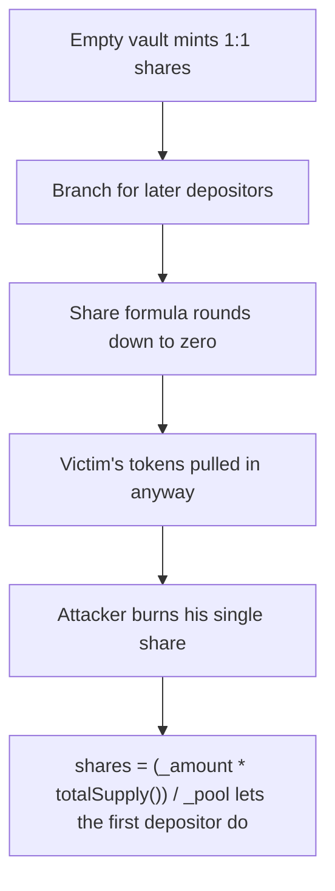

# Yield Ninja: First-depositor share inflation via unrounded share formula

> **Vulnerability classes:** vuln/theft · vuln/unfair-mint
>
> **Reproduction:** a faithful minimal reproduction of the vulnerable finding — the vulnerable function is reproduced **verbatim** (marked `@>`) with faithful minimal doubles; local deploy, no fork.

<!-- source-auditvault: https://github.com/Auditware/AuditVault/blob/main/findings/19124-h-02-first-vault-depositor-can-steal-subsequent-depositors-t.md -->

## Root cause

shares = (_amount * totalSupply()) / _pool lets the first depositor donate to _pool so the next real depositor's shares round to 0; the attacker then redeems the victim's deposit — classic first-depositor theft.

```solidity
        if (totalSupply() == 0) {
            shares = _amount;
        } else {
            shares = (_amount * totalSupply()) / _pool; // @> shares = (_amount * totalSupply()) / _pool;
        }
        token.transferFrom(msg.sender, address(this), _amount);
```

## Why it's exploitable here

First depositor mints 1 wei-share, donates underlying to inflate the pool so Alice's 10e18 deposit mints 0 shares, then withdraws his single share to drain the whole pool — Alice loses 100% of her 10e18 to the attacker EOA.

## Attack path



## Marked-line walkthrough (Playground)

The EVM Playground pins each step to the exact executed source line in `0x671d353a77…`:

1. **L99** — Empty vault mints 1:1 shares: When totalSupply is 0, `shares = _amount` mints 1:1 — the attacker deposits 1 wei to own a single share and become the vault's sole owner.
2. **L100** — Branch for later depositors: Every deposit after the first takes this `else` branch, computing shares from the current pool balance the attacker will inflate.
3. **L101** — Share formula rounds down to zero: Root cause: `shares = (_amount * totalSupply()) / _pool` has no rounding guard, so after the attacker inflates `_pool` a victim's deposit mints 0 shares.
4. **L103** — Victim's tokens pulled in anyway: The victim's `_amount` is transferred into the vault even though they got 0 shares — their funds now silently back the attacker's one share.
5. **L111** — Attacker burns his single share: In withdraw the attacker burns his one share; holding 100% of supply, it redeems the entire pool including the victim's deposit.
6. **L112** — Whole pool paid to attacker: `token.transfer` sends the full computed `_amount` — attacker deposit plus the victim's stranded funds — out to the attacker.
7. **L113** — Return the drained amount: The function returns the withdrawn `_amount`, completing the classic first-depositor theft of the victim's funds.

## PoC

Registry (Foundry, local deploy — verbatim vulnerable source + harm-asserting test + negative control):

```bash
cd 19124-h-02-first-vault-depositor-can-steal-subsequent-depositors-t_exp
forge test -vvv
```

The browser Playground replays the same synthetic opcode-for-opcode and measures the harm: **First depositor mints 1 wei-share, donates underlying to inflate the pool so Alice's 10e18 deposit mints 0 shares, then withdraws his single share to drain the whole pool — Alice loses 100% of her 10e18 to the attacker EOA.**. Both gates are green (registry `forge test` PASS + Playground `_verify-poc` **VERDICT: PASS**).
