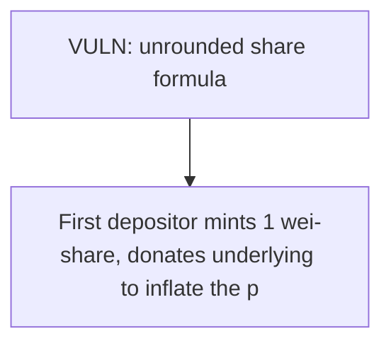

# Yield Ninja: First-depositor share inflation via unrounded share formula

> **Vulnerability classes:** vuln/theft · vuln/unfair-mint
>
> **Reproduction:** a faithful minimal reproduction of the vulnerable finding — the vulnerable function is reproduced **verbatim** (marked `@>`) with faithful minimal doubles; local deploy, no fork.

<!-- source-auditvault: https://github.com/Auditware/AuditVault/blob/main/findings/19124-h-02-first-vault-depositor-can-steal-subsequent-depositors-t.md -->

## Root cause

shares = (_amount * totalSupply()) / _pool lets the first depositor donate to _pool so the next real depositor's shares round to 0; the attacker then redeems the victim's deposit — classic first-depositor theft.

```solidity
        if (totalSupply() == 0) {
            shares = _amount;
        } else {
            shares = (_amount * totalSupply()) / _pool; // @> shares = (_amount * totalSupply()) / _pool;
        }
        token.transferFrom(msg.sender, address(this), _amount);
```

## Why it's exploitable here

First depositor mints 1 wei-share, donates underlying to inflate the pool so Alice's 10e18 deposit mints 0 shares, then withdraws his single share to drain the whole pool — Alice loses 100% of her 10e18 to the attacker EOA.

## Attack path



## Marked-line walkthrough (Playground)

The EVM Playground pins each step to the exact executed source line in `0x671d353a77…`:

1. **L101** — VULN: unrounded share formula: With totalSupply small and _pool inflated by a donation, the victim's 10e18 deposit mints 0 shares; the attacker withdraws the victim's underlying.

## PoC

Registry (Foundry, local deploy — verbatim vulnerable source + harm-asserting test + negative control):

```bash
cd 19124-h-02-first-vault-depositor-can-steal-subsequent-depositors-t_exp
forge test -vvv
```

The browser Playground replays the same synthetic opcode-for-opcode and measures the harm: **First depositor mints 1 wei-share, donates underlying to inflate the pool so Alice's 10e18 deposit mints 0 shares, then withdraws his single share to drain the whole pool — Alice loses 100% of her 10e18 to the attacker EOA.**. Both gates are green (registry `forge test` PASS + Playground `_verify-poc` **VERDICT: PASS**).
