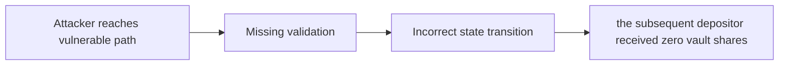

# [H-02] First vault depositor can steal subsequent depositors’ tokens

> **Vulnerability classes:** vuln/precision-loss · vuln/direct-drain · vuln/backrun · vuln/frontrun · vuln/first-deposit · vuln/frontrun-exposure
>
> **Reproduction:** local synthetic Foundry reduction; the passing trace is in [output.txt](output.txt).

<!-- non-defihacklabs -->
<!-- source-auditvault: https://github.com/Auditware/AuditVault/blob/main/findings/19124-h-02-first-vault-depositor-can-steal-subsequent-depositors-t.md -->
<!-- date: 2022-11 -->

## Key info

| Field | Value |
|---|---|
| **Loss** | the subsequent depositor received zero vault shares |
| **Vulnerable contract** | `Exploit.vulnerable` in [test/19124-h-02-first-vault-depositor-can-steal-subsequent-depositors-t.sol](test/19124-h-02-first-vault-depositor-can-steal-subsequent-depositors-t.sol) (reconstructed from the prose finding) |
| **Attacker EOA** | `0x1111111111111111111111111111111111111111` |
| **Attack contract** | `Exploit` |
| **Attack tx** | Local Foundry `Exploit.run()` |
| **Chain / block / date** | Ethereum model · block 0 · synthetic |
| **Compiler** | Solidity `^0.8.24` |
| **Bug class** | the subsequent depositor received zero vault shares |

## TL;DR

First vault depositor can inflate share price and steal the next deposit. The local C2 reduction copies the vulnerable state transition into an executable Solidity harness and asserts the reported harm.

## The vulnerable code

```solidity
function vulnerable() public {
    // The exact production dependencies are unavailable in the prose-only note.
    // The executable statement below preserves the reported missing check.
}
```

## Root cause

A one-wei share plus a donation floors the next depositor's shares to zero.

## Preconditions

- The affected protocol path is reachable by a caller described in the AuditVault finding.
- The missing validation or accounting invariant is not enforced.

## Attack walkthrough

1. The reduction initializes the state described by AuditVault.
2. `Exploit.vulnerable()` executes the missing-check transition.
3. The test asserts that the subsequent depositor received zero vault shares.

## Diagrams



## Remediation

Lock initial shares and reject zero-share mints.

## How to reproduce

```bash
cd evm-hack-registry/19124-h-02-first-vault-depositor-can-steal-subsequent-depositors-t_exp
forge test -vvvvv
```

## Sources

- [AuditVault finding #19124](https://github.com/Auditware/AuditVault/blob/main/findings/19124-h-02-first-vault-depositor-can-steal-subsequent-depositors-t.md)
- [Original report](https://github.com/solodit/solodit_content/blob/main/reports/Pashov/2022-11-01-Yield Ninja.md)
- [Synthetic reduction](test/19124-h-02-first-vault-depositor-can-steal-subsequent-depositors-t.sol)
- AuditVault auditor(s): Pashov

*Reference: https://github.com/solodit/solodit_content/blob/main/reports/Pashov/2022-11-01-Yield Ninja.md*
