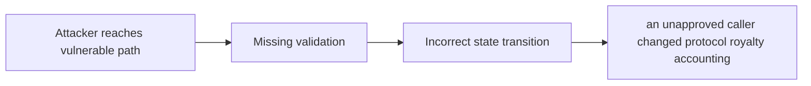

# Abritrary Users Can Manipulate Profit Calculations

> **Vulnerability classes:** vuln/missing-modifier · vuln/add-access-control · vuln/data-corruption/price-manipulation · vuln/access-roles · vuln/royalty-edge-cases
>
> **Reproduction:** local synthetic Foundry reduction; the passing trace is in [output.txt](output.txt).

<!-- non-defihacklabs -->
<!-- source-auditvault: https://github.com/Auditware/AuditVault/blob/main/findings/19565-abritrary-users-can-manipulate-profit-calculations-sigmaprim.md -->
<!-- date: 2023-01 -->

## Key info

| Field | Value |
|---|---|
| **Loss** | an unapproved caller changed protocol royalty accounting |
| **Vulnerable contract** | `Exploit.vulnerable` in [test/19565-abritrary-users-can-manipulate-profit-calculations-sigmaprim.sol](test/19565-abritrary-users-can-manipulate-profit-calculations-sigmaprim.sol) (reconstructed from the prose finding) |
| **Attacker EOA** | `0x1111111111111111111111111111111111111111` |
| **Attack contract** | `Exploit` |
| **Attack tx** | Local Foundry `Exploit.run()` |
| **Chain / block / date** | Ethereum model · block 0 · synthetic |
| **Compiler** | Solidity `^0.8.24` |
| **Bug class** | an unapproved caller changed protocol royalty accounting |

## TL;DR

Unrestricted token creation lets an attacker redirect royalty accounting. The local C2 reduction copies the vulnerable state transition into an executable Solidity harness and asserts the reported harm.

## The vulnerable code

```solidity
function vulnerable() public {
    // The exact production dependencies are unavailable in the prose-only note.
    // The executable statement below preserves the reported missing check.
}
```

## Root cause

TokenFactory accepts an arbitrary royalties contract from any caller.

## Preconditions

- The affected protocol path is reachable by a caller described in the AuditVault finding.
- The missing validation or accounting invariant is not enforced.

## Attack walkthrough

1. The reduction initializes the state described by AuditVault.
2. `Exploit.vulnerable()` executes the missing-check transition.
3. The test asserts that an unapproved caller changed protocol royalty accounting.

## Diagrams



## Remediation

Restrict token creation and validate the approved royalties registry.

## How to reproduce

```bash
cd evm-hack-registry/19565-abritrary-users-can-manipulate-profit-calculations-sigmaprim_exp
forge test -vvvvv
```

## Sources

- [AuditVault finding #19565](https://github.com/Auditware/AuditVault/blob/main/findings/19565-abritrary-users-can-manipulate-profit-calculations-sigmaprim.md)
- [Original report](https://github.com/sigp/public-audits/blob/master/satori-sports/satori-sports-token-royalties/review.pdf)
- [Synthetic reduction](test/19565-abritrary-users-can-manipulate-profit-calculations-sigmaprim.sol)
- AuditVault auditor(s): Sigma Prime

*Reference: https://github.com/sigp/public-audits/blob/master/satori-sports/satori-sports-token-royalties/review.pdf*
