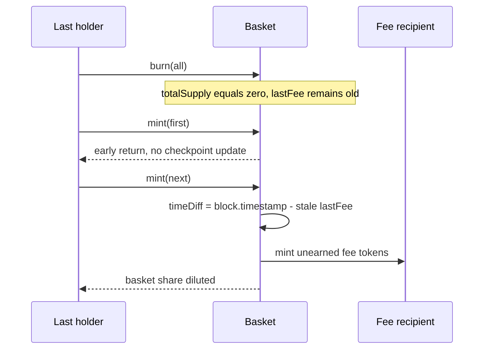

# Kuiper — stale fee checkpoint after `totalSupply` reaches zero

> **Vulnerability classes:** vuln/logic/fee-calculation · vuln/logic/state-update · vuln/arithmetic/precision-loss

> **Reproduction:** local, self-contained synthetic (no fork or RPC). See [output.txt](output.txt) and the byte-identical synthetic/test pair in [test/19837-h-01-wrong-fee-calculation-after-totalsupply-was-0-code4rena.sol](test/19837-h-01-wrong-fee-calculation-after-totalsupply-was-0-code4rena.sol) and [test/19837-h-01-wrong-fee-calculation-after-totalsupply-was-0-code4rena_exp.sol](test/19837-h-01-wrong-fee-calculation-after-totalsupply-was-0-code4rena_exp.sol).

<!-- non-defihacklabs -->
<!-- source-auditvault: https://github.com/Auditware/AuditVault/blob/main/findings/19837-h-01-wrong-fee-calculation-after-totalsupply-was-0-code4rena.md -->
<!-- date: 2021-12 -->

**AuditVault taxonomy:** `lang/solidity` · `platform/code4rena` · `severity/high` · `sector/token` · `vuln/logic/fee-calculation`

## Key info

| | |
|---|---|
| **Loss** | Extra fee tokens are minted after a zero-supply interval, diluting basket holders' underlying share. |
| **Vulnerable contract** | `Basket.handleFees()` (Kuiper `Basket.sol`). |
| **Attacker EOA** | Any participant who resupplies the basket after supply was zero; the synthetic caller is permissionless. |
| **Attack contract** | `Exploit` → `Basket`. |
| **Attack tx** | Burn to zero supply, mint once, then mint again while `lastFee` is stale. |
| **Chain / block / date** | Local synthetic chain · block `0x1181d03` · report 2021-12. |
| **Compiler** | `solc 0.8.24` (Forge uses 0.8.35 compatible compiler). |
| **Bug class** | Fee-accounting state update omitted on the zero-supply branch. |

## TL;DR

`handleFees()` returns immediately when `totalSupply == 0` without advancing `lastFee`. After all holders burn, the first resupply leaves the old timestamp intact; the next mint then mints fees for the entire inactive interval. The fee recipient receives unearned basket tokens and current holders are diluted.

## Background

Kuiper's basket charges a fee proportional to elapsed time and mints the fee tokens to a recipient. `lastFee` is the checkpoint for that elapsed-time calculation. A zero-supply basket cannot charge a fee, but its checkpoint still has to move when the basket resumes.

## The vulnerable code

The report identifies `Basket.sol#L136-L139`. The synthetic preserves the early return and the subsequent calculation:

```solidity
function handleFees() public {
    uint256 startSupply = totalSupply;
    if (startSupply == 0) {
        return; // @> VULN: lastFee is not updated while the basket is empty
        // FIX: set lastFee = block.timestamp before returning.
    }

    uint256 timeDiff = (block.timestamp - lastFee);
    uint256 feeTokens = timeDiff * feeRate;
    balanceOf[feeRecipient] += feeTokens;
    totalSupply += feeTokens;
    lastFee = block.timestamp;
}
```

## Root cause

The zero-supply branch updates neither the fee checkpoint nor a separate “inactive” marker. Consequently, elapsed time is measured from the last non-zero-supply checkpoint instead of from the first resumed supply.

## Preconditions

- All basket tokens are burned, making `totalSupply == 0`.
- `lastFee` predates the empty interval.
- A user mints twice after resupply; the first mint takes the empty branch and the second performs fee accounting.

## Attack walkthrough

1. The last holder burns 1,000 basket tokens; `totalSupply` becomes zero (trace [output.txt:368](output.txt#L368), [output.txt:373](output.txt#L373)).
2. The first 100-token mint calls `handleFees` with zero supply. It returns without minting fees, and supply becomes 100 (trace [output.txt:375](output.txt#L375), [output.txt:380](output.txt#L380)).
3. The next 100-token mint sees non-zero supply and computes `block.timestamp - lastFee` using the stale checkpoint (trace [output.txt:386](output.txt#L386)). In the synthetic, the configured rate mints more than 80,000 fee tokens to `FEE_RECIPIENT`.
4. The extra fee supply is unearned dilution of the live holder's share; the test re-asserts the enlarged total supply (trace [output.txt:399](output.txt#L399), [output.txt:412](output.txt#L412)).

## Diagrams



## Impact

Users who resupply after an empty period are charged fees for time during which no basket tokens existed. A malicious publisher can intentionally create a zero-supply interval and profit from the resulting dilution, while honest depositors receive fewer underlying assets per token.

## Remediation

Set `lastFee = block.timestamp` before returning when `startSupply == 0`, or otherwise checkpoint the first resumed supply before fee calculation. Add a regression test covering burn-to-zero, first mint, and second mint.

## How to reproduce

```text
cd audits/evm-hack-registry/19837-h-01-wrong-fee-calculation-after-totalsupply-was-0-code4rena_exp
forge test -vvvvv
```

The synthetic rate is intentionally high enough to make the accounting error visible even with Foundry's default timestamp; the vulnerable control flow and stale-checkpoint consequence are unchanged.

## Sources

- [AuditVault finding #19837](https://github.com/Auditware/AuditVault/blob/main/findings/19837-h-01-wrong-fee-calculation-after-totalsupply-was-0-code4rena.md)
- [Code4rena 2021-12 defiProtocol report](https://code4rena.com/reports/2021-12-defiProtocol)
- [Kuiper `Basket.sol` vulnerable branch](https://github.com/code-423n4/2021-12-defiprotocol/blob/main/contracts/contracts/Basket.sol#L136-L139)

*Reference: [Code4rena 2021-12 defiProtocol](https://code4rena.com/reports/2021-12-defiProtocol)*
