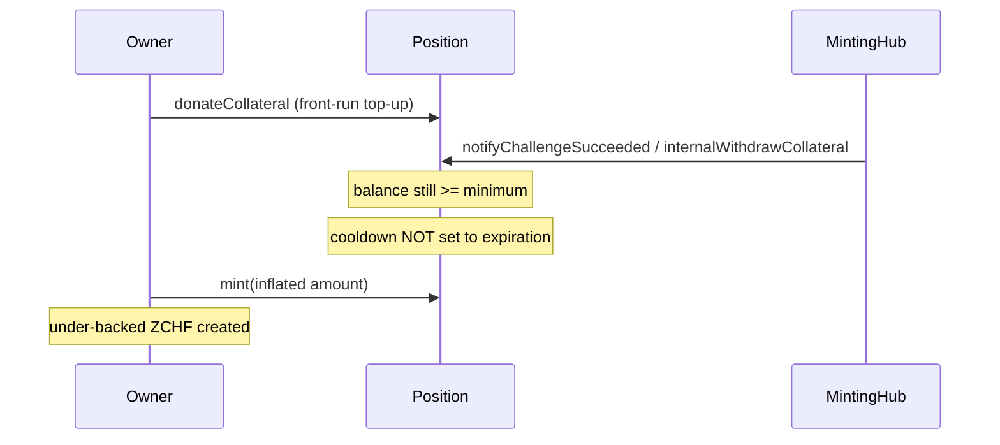

# Frankencoin — Successful challenge + collateral top-up skips cooldown

> **Vulnerability classes:** vuln/wrong-condition · vuln/direct-drain · vuln/frontrun-exposure

> **Reproduction:** self-contained Foundry PoC with **only `forge-std`** — no fork, no RPC.
> Full trace: [output.txt](output.txt). PoC:
> [test/20018-h-03-when-the-challenge-is-successful-the-user-can-send-toke.sol](test/20018-h-03-when-the-challenge-is-successful-the-user-can-send-toke.sol).

<!-- non-defihacklabs -->
<!-- source-auditvault: https://github.com/Auditware/AuditVault/blob/main/findings/20018-h-03-when-the-challenge-is-successful-the-user-can-send-toke.md -->
<!-- date: 2023-04 -->

---

## Key info

| | |
|---|---|
| **Impact** | **HIGH** — after a successful challenge, the position owner front-runs with a collateral top-up so `cooldown` is not extended to `expiration`, then mints at the inflated liquidation price the challenge was meant to lock out |
| **Protocol** | [Frankencoin](https://frankencoin.com) — collateralized ZCHF stablecoin with auction-based challenges |
| **Vulnerable code** | `Position.internalWithdrawCollateral` — only sets `cooldown = expiration` when post-withdraw balance is below `minimumCollateral` |
| **Bug class** | Conditional cooldown gate skipped via front-run deposit |
| **Finding** | Code4rena — Frankencoin, 2023-04 · #20018 · reporter **cccz** |
| **Report** | [code4rena.com/reports/2023-04-frankencoin](https://code4rena.com/reports/2023-04-frankencoin) |
| **Source** | [AuditVault](https://github.com/Auditware/AuditVault/blob/main/findings/20018-h-03-when-the-challenge-is-successful-the-user-can-send-toke.md) |
| **Status** | Audit finding — confirmed by Frankencoin (*"Excellent finding! Will implement 1 day cooldown on successful challenges."*) |
| **Compiler** | `^0.8.24` (PoC) |

---

## TL;DR

1. On a successful challenge, `internalWithdrawCollateral` only extends `cooldown` when remaining collateral is below `minimumCollateral`.
2. The owner MEV-front-runs `end()` by transferring matching collateral into the position.
3. After withdraw, balance is still ≥ minimum → cooldown is **not** extended.
4. Owner immediately mints at the inflated price the challenge was supposed to lock out.

## The vulnerable code

```solidity
function internalWithdrawCollateral(address target, uint256 amount) internal returns (uint256) {
    IERC20(collateral).transfer(target, amount);
    uint256 balance = collateralBalance();
    // @> VULN: cooldown only extended when balance < minimumCollateral
    if (balance < minimumCollateral) {
        cooldown = expiration;
    }
    return balance;
}
```

**Fix:** always extend cooldown on a successful challenge (e.g. 1 day), not only when balance drops below minimum.

## Root cause

The cooldown extension is gated on the **post-withdraw balance** rather than on the fact that a challenge succeeded. Any external ERC20 transfer into the position before `end()` can keep the balance above the threshold and silently disable the intended minting freeze.

## Attack walkthrough

1. Position holds exactly `minimumCollateral` at an inflated `price`.
2. Challenge covers full collateral; period already elapsed.
3. Owner donates `minimumCollateral` into the position (front-run).
4. `end()` withdraws one unit; one unit remains → `if (balance < minimum)` is false.
5. Owner mints `price` ZCHF against the remaining collateral.

## Diagrams



## Impact

A successful challenge no longer freezes minting. The owner can mint large ZCHF against residual minimum collateral at the pre-challenge inflated price — direct under-collateralized debt creation.

## Taxonomy

- genome: wrong-condition, direct-drain, frontrun-exposure
- sector: lending
- severity: high
- platform: code4rena

## Sources

- [AuditVault finding #20018](https://github.com/Auditware/AuditVault/blob/main/findings/20018-h-03-when-the-challenge-is-successful-the-user-can-send-toke.md)
- [Code4rena report 2023-04-frankencoin](https://code4rena.com/reports/2023-04-frankencoin)
- Reduced from [code-423n4/2023-04-frankencoin@1022cb1](https://github.com/code-423n4/2023-04-frankencoin/blob/1022cb106919fba963a89205d3b90bf62543f68f/contracts/Position.sol#L268-L276) (`Position.internalWithdrawCollateral`)
